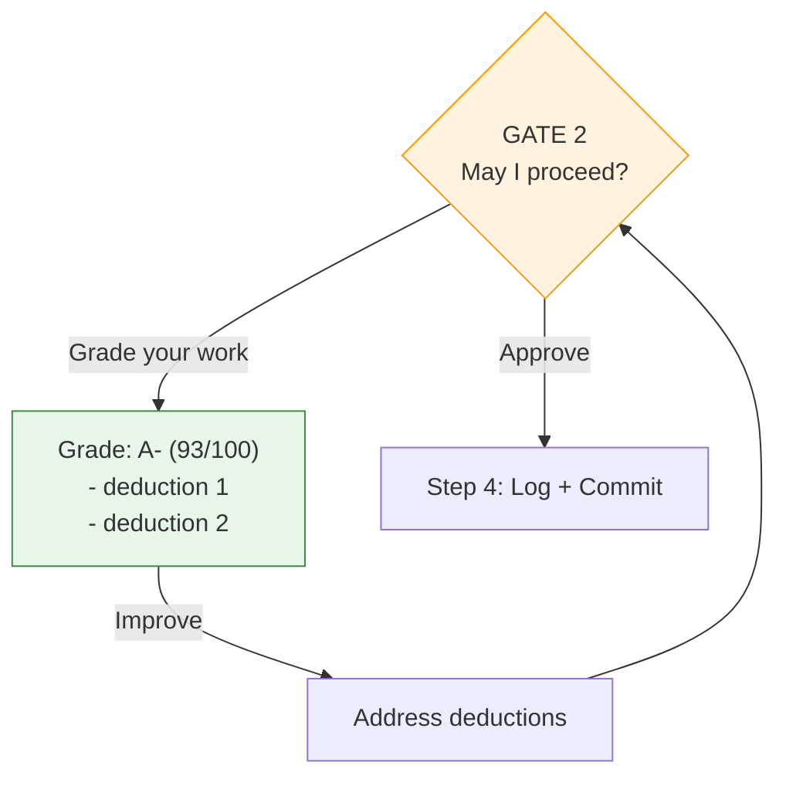
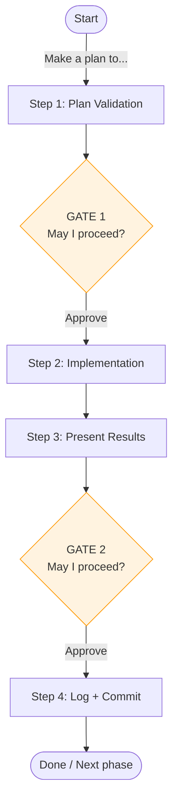

# Advanced Features

## Self-Grading & Improve Cycles

At each approval gate, you can ask Claude to grade its own work before deciding whether to proceed.

The grading cycle works at both gates. Use it for complex or high-stakes work.

## Event Logging

All protocol events are logged directly to `plan-log.md` using timestamped entries:

| Entry Type | When | Example |
|------------|------|---------|
| **Contract** | Step 1d (phase start) | `Contract: Phase 1 - auth \| [ ] middleware, [ ] tests` |
| **Completion** | Results delivered | `Completion: Step 2 \| [x] middleware (auth.go:45)` |
| **Interaction** | User feedback | `Interaction: grade → B/84, missing edge case` |

**Format:** `YYYY-MM-DDTHH:MM:SSZ | Type: description`

The Contract/Completion checkbox pattern ensures criteria verification is explicit - can't claim "3/3 met" without evidence.

## IAPI Cognitive Stages

The protocol uses the IAPI model for cognitive stages:

| Stage | Step | Description |
|-------|------|-------------|
| **I**nvestigate | Plan Mode | Explore codebase, gather context |
| **A**nalyze | 1a-1b | Understand requirements, ask questions |
| **P**lan | 1c-1e | Design approach, get approval |
| **I**mplement | 2 | Execute the work |

Each I/A/P stage can use subagents that read domain guides and return structured output with lessons applied/missed.

## Multi-Phase Projects

For projects spanning multiple sessions or requiring distinct phases:

Each phase follows the same 4-step workflow. Plan files persist across sessions, and the event log maintains continuity.

## Design Philosophy

**Why not Skills?** Skills get summarized during compaction, requiring refresh.

**Why not Hooks?** Session-start hooks don't solve mid-session compliance drift.

**Why not full protocol in command?** Heavy reproduction wastes tokens; protocol is already in context.

**Why this approach?** Combines best of all:
- Protocol in CLAUDE.md (always available via @reference)
- Lightweight activation on demand
- Repeated emphasis maintains compliance
