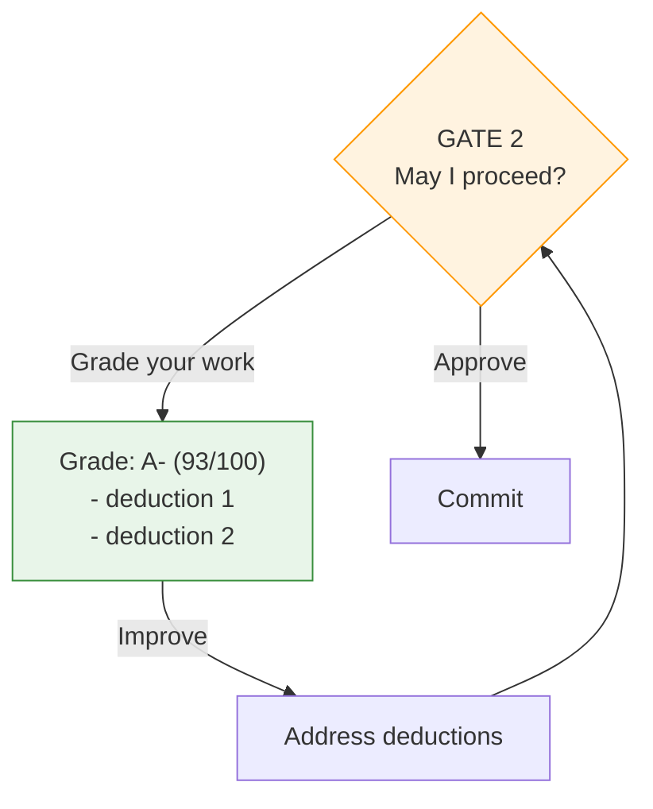
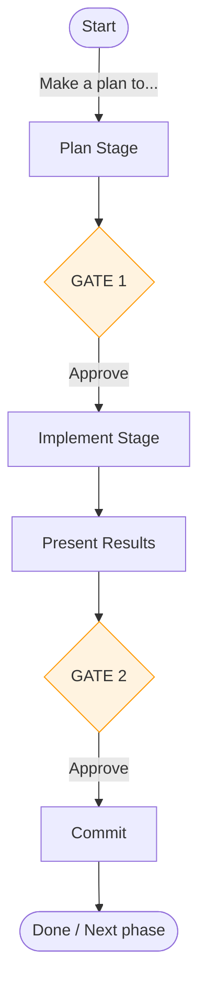

# Advanced Features

## Self-Grading & Improve Cycles

At each approval gate, you can ask Claude to grade its own work before deciding whether to proceed.



The grading cycle works at both gates. Use it for complex or high-stakes work.

## Lesson Capture

As you work, the protocol captures lessons learned and routes them to guides:

| Guide | Focus | Example Lessons |
|-------|-------|-----------------|
| `planning-guide.md` | Exploration, understanding, design | Search patterns, assumptions, success criteria |
| `protocol-guide.md` | Meta | Protocol improvements, process fixes |

Lessons accumulate across sessions, so Claude gets better at your specific project over time.

## Event Logging

All protocol events are logged directly to `plan-log.md` using timestamped entries:

| Entry Type | When | Example |
|------------|------|---------|
| **Contract** | Gate 1 approval | `Contract: Phase 1 - auth \| [ ] middleware, [ ] tests` |
| **Completion** | Gate 2 approval | `Completion: Phase 1 \| [x] middleware (auth.go:45)` |
| **Interaction** | User feedback | `Interaction: grade -> B/84, missing edge case` |

**Format:** `YYYY-MM-DDTHH:MM:SSZ | Type: description`

The Contract/Completion checkbox pattern ensures criteria verification is explicit.

## PI Cognitive Model

The protocol uses the PI model for cognitive stages:

| Stage | What Happens | Gate |
|-------|--------------|------|
| **Plan** | Explore, understand, ask questions, design | Gate 1 |
| **Implement** | Execute, present results | Gate 2 |

Each stage can use subagents that read domain guides and return structured output with lessons applied/missed.

## Multi-Phase Projects

For projects spanning multiple sessions or requiring distinct phases:



Each phase follows the same PI workflow. Plan files persist across sessions, and the event log maintains continuity.

## Compliance Model

The protocol achieves reliability through a two-part model:

### Baseline + Recovery

| Component | Compliance | How |
|-----------|------------|-----|
| **Baseline** | ~80% | Protocol in CLAUDE.md via @reference |
| **Recovery** | Works reliably | `/tandem` command when drift occurs |
| **Gate logging** | 100% | Bash heredocs (executable, not descriptive) |

This is intentional. Chasing 100% initial compliance requires complex setup. Instead:

```
~80% baseline + /tandem recovery = viable workflow
```

### Why Gates Are 100% Reliable

Gate actions use **bash heredocs** - executable syntax that Claude runs directly:

```bash
cat >> plan-log.md << 'EOF'
2026-02-08T12:00:00Z | Contract: Phase 1 | [ ] criterion
EOF
```

This works because:
- It's code Claude executes, not instructions Claude interprets
- No decision point - it's part of "run the gate actions" workflow
- Syntax triggers execution; descriptions don't

### Why Baseline Is ~80%

Behavioral instructions like "quote the plan VERBATIM" require Claude to choose compliance. Testing showed:
- Moving instructions between config files doesn't help
- Only executable syntax achieves 100%
- ~80% is the practical ceiling for descriptive guidance

### Recovery with `/tandem`

When you notice drift (implementation without approval, missing logs, skipped gates):

1. Run `/tandem` with context about current state
2. Protocol awareness returns
3. Continue with gates and logging

Tested: 5/5 recovery scenarios passed. Works for initial drift, mid-session drift, and repeated recovery cycles.

## Design Philosophy

**Why not Skills?** Skills get summarized during compaction, requiring refresh.

**Why not Hooks?** Session-start hooks don't solve mid-session compliance drift.

**Why not full protocol in command?** Heavy reproduction wastes tokens; protocol is already in context.

**Why this approach?** Combines best of all:
- Protocol in CLAUDE.md (always available via @reference)
- Lightweight `/tandem` for recovery
- Bash heredocs at gates for 100% reliable logging
- Accepts ~80% baseline, relies on recovery mechanism
