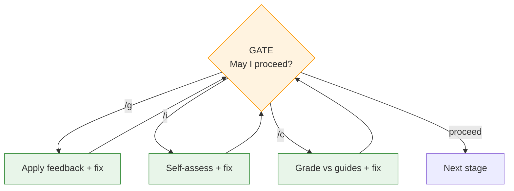
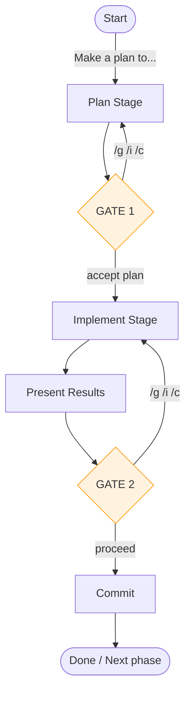

# Advanced Features

## Grading Cycles

At either gate, run grading cycles before approving. Each cycle returns to the preceding stage's presentation step (1d or 3b) after making fixes.


```mermaid
flowchart TD
    GATE{"GATE<br/>May I proceed?"} -->|"/g"| EXTERN["Apply feedback + fix"]
    EXTERN --> GATE
    GATE -->|"/i"| IMPROVE["Self-assess + fix"]
    IMPROVE --> GATE
    GATE -->|"/c"| COMPLY["Grade vs guides + fix"]
    COMPLY --> GATE
    GATE -->|"proceed"| NEXT["Next stage"]

    style GATE fill:#fff3e0,stroke:#ff9800
    style IMPROVE fill:#e8f5e9,stroke:#388e3c
    style COMPLY fill:#e8f5e9,stroke:#388e3c
    style EXTERN fill:#e8f5e9,stroke:#388e3c
```

**Typical sequence:**
1. Auto `/i` cycles (up to 3, before initial presentation)
2. `/g` external review (once, at initial gate presentation — calibrated projects only)
3. Manual `/i` cycles until self-assessment finds nothing more
4. `/c` to check compliance against project guides
5. Accept plan (Gate 1) or `proceed` (Gate 2) to advance

`/i` is the workhorse — up to 3 auto-cycles run before initial presentation, and manual `/i` remains available at the gate.

## Lesson Capture

As you work, the protocol captures lessons learned and routes them to guides:

| Guide | Focus | Example Lessons |
|-------|-------|-----------------|
| `planning-guide.md` | Exploration, understanding, design | Search patterns, assumptions, success criteria |
| `protocol-guide.md` | Meta | Protocol improvements, process fixes |

Lessons accumulate across sessions, so Claude gets better at your specific project over time.

## Event Logging

All protocol events are logged directly to `plan-log.md` using timestamped entries:

| Entry Type | When | Example |
|------------|------|---------|
| **Contract** | Gate 1 approval | `Contract: Phase 1 - auth \| [ ] middleware, [ ] tests` |
| **Completion** | Gate 2 approval | `Completion: Phase 1 \| [x] middleware (auth.go:45)` |
| **Interaction** | User feedback | `Interaction: /i -> found edge case, added handling` |

**Format:** `YYYY-MM-DDTHH:MM:SSZ | Type: description`

The Contract/Completion checkbox pattern ensures criteria verification is explicit.

Gate events are also published to Era streams via `mk task`/`mk done`, enabling orchestrators and other sessions to detect gate crossings without parsing `plan-log.md`.

## PI Cognitive Model

The protocol uses the PI model for cognitive stages:

| Stage | What Happens | Gate |
|-------|--------------|------|
| **Plan** | Explore, understand, ask questions, design | Gate 1 |
| **Implement** | Execute, present results | Gate 2 |

Each stage can use subagents that read domain guides and return structured output with lessons applied/missed.

## Multi-Phase Projects

For projects spanning multiple sessions or requiring distinct phases:


```mermaid
flowchart TD
    START(["Start"]) -->|"Make a plan to..."| PLAN["Plan Stage"]
    PLAN --> G1{"GATE 1"}
    G1 -->|"/g /i /c"| PLAN
    G1 -->|"accept plan"| IMPL["Implement Stage"]
    IMPL --> PRESENT["Present Results"]
    PRESENT --> G2{"GATE 2"}
    G2 -->|"/g /i /c"| IMPL
    G2 -->|"proceed"| COMMIT["Commit"]
    COMMIT --> DONE(["Done / Next phase"])

    style G1 fill:#fff3e0,stroke:#ff9800
    style G2 fill:#fff3e0,stroke:#ff9800
```

Each phase follows the same PI workflow. Plan files persist across sessions, and the event log maintains continuity.

## Compliance Model

The protocol achieves reliability through a two-part model:

### Baseline + Recovery

| Component | Compliance | How |
|-----------|------------|-----|
| **Baseline** | ~80% | Protocol in CLAUDE.md via @reference |
| **Recovery** | Works reliably | `/q` command when drift occurs |
| **Gate logging** | 100% | Bash heredocs (executable, not descriptive) |

This is intentional. Chasing 100% initial compliance requires complex setup. Instead:

```
~80% baseline + /q recovery = viable workflow
```

### Why Gates Are 100% Reliable

Gate actions use **bash heredocs** - executable syntax that Claude runs directly:

```bash
cat >> plan-log.md << EOF
$(date -u +%Y-%m-%dT%H:%M:%SZ) | Contract: Phase 1 | [ ] criterion
EOF
```

This works because:
- It's code Claude executes, not instructions Claude interprets
- No decision point - it's part of "run the gate actions" workflow
- Syntax triggers execution; descriptions don't

### Why Baseline Is ~80%

Behavioral instructions like "quote the plan VERBATIM" require Claude to choose compliance. Testing showed:
- Moving instructions between config files doesn't help
- Only executable syntax achieves 100%
- ~80% is the practical ceiling for descriptive guidance

### Recovery with `/q`

When you notice drift (implementation without approval, missing logs, skipped gates):

1. Run `/q` to quote the current protocol step
2. Protocol awareness returns
3. Continue with gates and logging

## Design Philosophy

**Why not Skills?** Skills get summarized during compaction, requiring refresh.

**Why not Hooks?** Session-start hooks don't solve mid-session compliance drift.

**Why not full protocol in command?** Heavy reproduction wastes tokens; protocol is already in context.

**Why this approach?** Combines best of all:
- Protocol in CLAUDE.md (always available via @reference)
- Lightweight `/q` for recovery
- Bash heredocs at gates for 100% reliable logging
- Accepts ~80% baseline, relies on recovery mechanism

## Testing

```bash
# Quick infrastructure check
bash tests/integration/smoke-test.sh

# Individual use case tests
bash tests/integration/uc7-event-logging.sh    # Contract/Completion/Interaction
bash tests/integration/uc3-plan-entry-sequence.sh  # Plan mode compliance

# Recovery mechanism validation
bash tests/integration/tandem-recovery.sh      # /q drift recovery

# Full test suite
for t in tests/integration/*.sh; do bash "$t"; done
```

See `tests/integration/` for all behavioral compliance tests.
