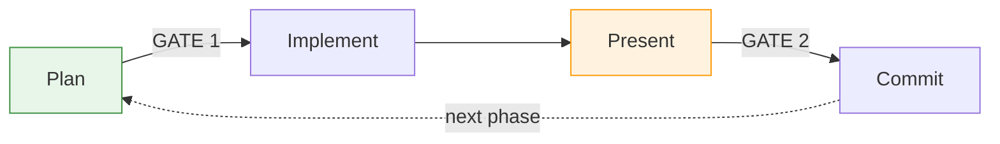
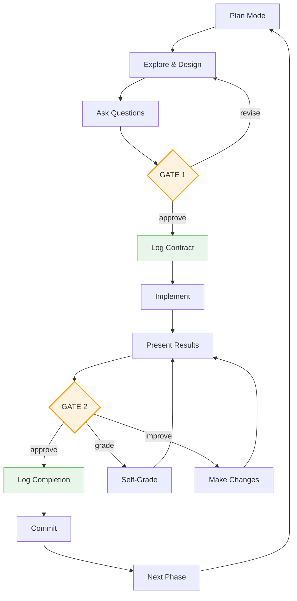

# Tandem Protocol

**Checkpoints and self-improvement for Claude Code sessions.**

## Why?

Without structure, Claude Code sessions can feel chaotic:
- Plans get forgotten or half-implemented
- No checkpoints to catch issues before they compound
- No way to consistently improve work quality

## What You Get

- **Approval gates** - You decide when to proceed, not Claude
- **Self-grading** - Ask Claude to evaluate and improve its own work
- **Lesson capture** - Claude learns your project's patterns as you work
- **Event logging** - Audit trail of what was agreed and delivered
- **Multi-phase support** - Structure for projects spanning multiple sessions

The `/tandem` command re-activates the protocol when compliance drifts.

## Installation

### Quick Install (Recommended)

```bash
bash <(curl -fsSL https://codeberg.org/binaryphile/tandem-protocol/raw/branch/main/install.sh)
```

This clones to `~/tandem-protocol` and creates the `/tandem` command. Then add to your project's CLAUDE.md:

```markdown
# Tandem Protocol
@~/tandem-protocol/README.md
```

### Manual Install

If you prefer manual setup:

```bash
# 1. Clone to home directory
cd ~ && git clone https://codeberg.org/binaryphile/tandem-protocol.git

# 2. Create command symlink
mkdir -p ~/.claude/commands
ln -sf ~/tandem-protocol/tandem.md ~/.claude/commands/tandem.md

# 3. Add to your project's CLAUDE.md
echo "" >> CLAUDE.md
echo "# Tandem Protocol" >> CLAUDE.md
echo "@~/tandem-protocol/README.md" >> CLAUDE.md
```

**Verify:** Start Claude Code, then run `/tandem`

**For custom locations:**
Install anywhere, then reference with tilde or absolute path in your project's CLAUDE.md:
`@~/your/path/README.md`

## Usage

### When to use `/tandem`

Invoke 1-2 times early in your session, or whenever you notice protocol drift:

- At session start (before planning): `/tandem make a plan to...`
- When Claude skips steps or you've lost track of the current step
- After context compaction

### How it works

The protocol lives in your CLAUDE.md (via @reference), so it's always in context. The `/tandem` command reinforces attention to it when Claude starts drifting.

## The Flow



At each gate, you can **approve**, **request a grade**, or **ask for improvements**.

## Example

```
You:    /tandem refactor the payment module into separate services
Claude: [explores codebase, presents plan] May I proceed?
You:    proceed                              <- GATE 1
Claude: [implements] May I proceed?
You:    grade your work
Claude: B+ (87/100) - OrderService still coupled to PaymentGateway
You:    improve
Claude: [extracts interface, re-presents] May I proceed?
You:    proceed                              <- GATE 2
Claude: [commits, sets up next phase]
```

## Learn More

See [FEATURES.md](FEATURES.md) for details on:
- **Self-grading cycles** - Grade and improve work before committing
- **Lesson capture** - Route learnings to guides for future sessions
- **Event logging** - Audit trail with Contract/Completion/Interaction entries
- **PI cognitive stages** - Structured thinking for complex tasks
- **Multi-phase projects** - Maintain coherence across sessions

## Testing

Run `for t in tests/uc*.sh; do bash "$t"; done` to verify protocol compliance patterns.

---

# The Protocol

## Protocol Flow



## PI Model

| Stage | What Happens | Gate |
|-------|--------------|------|
| **Plan** | Explore, understand, ask questions, design | Gate 1: approve plan |
| **Implement** | Execute, present results | Gate 2: approve results |

**Before Gate 1: MUST verify plan includes TaskAPI and Log instructions at each gate.**

Checklist before requesting approval:
- [ ] "At Gate 1 Approval" section with TaskCreate, TaskUpdate, Log Contract
- [ ] "At Gate 2 Approval" section with TaskUpdate (delete), Log Completion
- [ ] Tasks JSON for TaskCreate calls

Do not request "May I proceed?" without these sections in the plan file.

## Event Logging

All events logged to `plan-log.md`:

| Entry | When | Format |
|-------|------|--------|
| Contract | Gate 1 approval | `TIMESTAMP \| Contract: Phase N - objective \| [ ] criterion1, [ ] criterion2` |
| Completion | Gate 2 approval | `TIMESTAMP \| Completion: Phase N \| [x] criterion1 (evidence), [x] criterion2 (evidence)` |
| Interaction | Any grade/improve | `TIMESTAMP \| Interaction: grade -> B+/88, reason` |

## Plan File Template

Plan files live in `~/.claude/plans/`. **Explicit admin instructions at trigger points:**

```markdown
# [Phase Name] Plan

## Objective
[1-2 sentence summary]

## Success Criteria
- [ ] [Criterion 1]
- [ ] [Criterion 2]

## Changes
[What files change, with line references]

## Tasks
[Copy to TaskCreate calls after Gate 1 approval]

    [
      {"subject": "Task 1", "description": "...", "activeForm": "Working on task 1"},
      {"subject": "Task 2", "description": "...", "activeForm": "Working on task 2"}
    ]

## At Gate 1 Approval
- Log Contract entry to plan-log.md
- TaskCreate for each task above
- TaskUpdate first task to in_progress
- Telescope: expand Implement children

## At Gate 2 Approval
- Log Completion entry with evidence
- Telescope: delete phase tasks
- Commit deliverable + plan-log.md
- Route lessons to guides

## Verification
[Commands to verify success criteria]
```

## Tasks API Telescoping

Manage task hierarchy as you progress:

| Event | Action |
|-------|--------|
| Enter phase | Create tasks, set first in_progress |
| Complete task | Mark completed, set next in_progress |
| Exit phase | Delete phase tasks (clean slate for next) |

```
[in_progress] Phase 1 Task A
[pending] Phase 1 Task B
[pending] Phase 2              <- collapsed, expand when reached
```

## Protocol Principles

**Two gates, explicit approval:**
- Gate 1: Approve plan before implementation
- Gate 2: Approve results before commit
- Never proceed without "proceed"/"yes"/"approved"

**User controls scope:**
- User MAY defer work to future phases
- Claude MAY NOT unilaterally defer
- Claude MAY suggest deferring by asking

**Feedback loops:**
- "grade" → self-assess, re-present
- "improve" → fix issues, re-present
- Scope changes → return to Plan stage

**Behavioral logging:**
- Contract at Gate 1 (what we agreed)
- Completion at Gate 2 (what we delivered)
- Interaction on any grade/improve cycle

**Plan files guide execution:**
- Include explicit admin instructions at trigger points
- Tasks JSON defined during planning, not improvised
- Telescope tasks as phases complete
