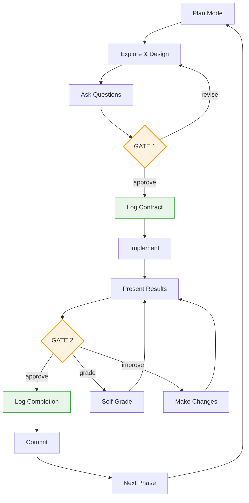

# Tandem Protocol

Structured checkpoints for Claude Code. You approve each step, Claude grades its own work.

**Try it:**
```bash
cd ~ && git clone https://codeberg.org/binaryphile/tandem-protocol.git
mkdir -p ~/.claude/commands && ln -sf ~/tandem-protocol/tandem.md ~/.claude/commands/tandem.md
echo -e "\n# Tandem Protocol\n@~/tandem-protocol/README.md" >> your-project/CLAUDE.md
```

## Example Session

```
You:    /tandem add a config file loader to the CLI
Claude: Questions before planning:
        - YAML, JSON, or TOML?
        - Missing config: error or defaults?
You:    YAML, defaults

Claude: [creates plan] May I proceed?
You:    proceed

Claude: [logs to plan-log.md]
        2024-01-15T10:00:00Z | Contract: Config loader | [ ] YAML parsing, [ ] default fallback

        [implements]

        Done. May I proceed?
You:    proceed
```

Use `/tandem` anytime to refocus when things drift.

## Usage

### When to use `/tandem`

- At session start: `/tandem make a plan to...`
- When Claude skips steps or scope changes
- Anytime things feel off track

## Learn More

See [FEATURES.md](FEATURES.md) for details on:
- **Self-grading cycles** - Grade and improve work before committing
- **Lesson capture** - Route learnings to guides for future sessions
- **Event logging** - Audit trail with Contract/Completion/Interaction entries
- **PI cognitive stages** - Structured thinking for complex tasks
- **Multi-phase projects** - Maintain coherence across sessions

---

# The Protocol

## Protocol Flow



## PI Model

| Stage | What Happens | Gate |
|-------|--------------|------|
| **Plan** | Explore, understand, ask questions, design | Implementation Gate: approve plan |
| **Implement** | Execute, present results | Completion Gate: approve results |

## Plan Mode Entry

Enter plan mode at the start of each phase. When entering with an existing plan:
1. Quote the existing plan VERBATIM (no summarizing)
2. Grade analysis FIRST: "Do I understand this?"
3. Grade plan quality: "Is this sound?"
4. BLOCKING: wait for user direction before proceeding

On "improve": Address ALL deductions from both grades, then re-present.

On approval: Exit plan mode, then execute Implementation Gate actions.

**Before Implementation Gate: MUST verify plan includes bash blocks at each gate.**

Checklist before requesting approval:
- [ ] "At Implementation Gate Approval" section with bash block (Contract + task creation)
- [ ] "At Completion Gate Approval" section with bash block (Completion + task deletion + commit)

Do not request "May I proceed?" without these executable bash blocks in the plan file.

**GATE 1 ACTIONS** (when user says "proceed"):

Execute the bash block from the plan file's "At Implementation Gate Approval" section. This MUST log the Contract AND create tasks in one atomic operation.

**STOP: Do not implement until the Implementation Gate bash block has been executed.**

**GATE 2 ACTIONS** (when user approves results):

Execute the bash block from the plan file's "At Completion Gate Approval" section. This marks tasks complete, logs Completion, deletes tasks, and commits.

## Event Logging

All events logged to `plan-log.md` via append:

**On "grade"** (log immediately, then re-present):
```bash
cat >> plan-log.md << 'EOF'
2026-02-08T12:10:00Z | Interaction: grade -> B+/88, missing edge case
EOF
```

**On "improve"** (log immediately, then make changes):
```bash
cat >> plan-log.md << 'EOF'
2026-02-08T12:15:00Z | Interaction: improve -> added edge case handling
EOF
```

| Entry | When | Format |
|-------|------|--------|
| Contract | Implementation Gate approval | `TIMESTAMP \| Contract: Phase N - objective \| [ ] criterion1, [ ] criterion2` |
| Completion | Completion Gate (copy criteria verbatim from Contract) | `TIMESTAMP \| Completion: Phase N \| [x] criterion1 (evidence), [x] criterion2 (evidence)` |
| Interaction | Any grade/improve | `TIMESTAMP \| Interaction: [action] -> [outcome]` |
| Lesson | Non-actionable gap (actionability test: "Can I fix this now?" - don't deduct, capture instead) | `TIMESTAMP \| Lesson: [title] -> [guide] \| [context]` |

## TaskAPI at Gates

TaskAPI is manipulated via direct file writes to `~/.claude/tasks/{session-id}/`. This is 100% reliable (bash syntax-triggered, not model-dependent).

| Gate | What Happens |
|------|--------------|
| Implementation Gate | Log Contract + Create task files + Set first to in_progress |
| Completion Gate | Mark complete + Log Completion + Delete task files + Commit |

**Discovery:** Tasks are stored at `~/.claude/tasks/{session-id}/{task-id}.json`. Writing directly to these files works - Claude Code reads from the filesystem.

## Plan File Template

Plan files live in `~/.claude/plans/`. The plan file contains HOW (approach, methodology); the Contract entry contains WHAT (scope, deliverables). Gate sections contain **literal bash blocks** to execute:

```markdown
# [Phase Name] Plan

## Objective
[1-2 sentence summary]

## Success Criteria
- [ ] [Criterion 1]
- [ ] [Criterion 2]

## Changes
[What files change, with line references. Note: line numbers shift after edits - verify before presenting results.]

## At Implementation Gate Approval

    ```bash
    # Log Contract + Create Tasks (execute this entire block)
    touch plan-log.md  # Ensure exists before append
    cat >> plan-log.md << 'EOF'
    2026-02-08T12:00:00Z | Contract: Phase 1 - objective | [ ] criterion1, [ ] criterion2
    EOF

    # Create tasks via direct file write
    S=$(ls -t ~/.claude/tasks/ | head -1)
    M=$(ls ~/.claude/tasks/$S/*.json 2>/dev/null | xargs -I{} basename {} .json | sort -n | tail -1 || echo 0)
    T1=$((M+1)); T2=$((M+2))

    cat > ~/.claude/tasks/$S/$T1.json << TASK
    {"id": "$T1", "subject": "Task 1", "description": "...", "activeForm": "Working on task 1", "status": "in_progress", "blocks": [], "blockedBy": []}
    TASK

    cat > ~/.claude/tasks/$S/$T2.json << TASK
    {"id": "$T2", "subject": "Task 2", "description": "...", "activeForm": "Working on task 2", "status": "pending", "blocks": [], "blockedBy": []}
    TASK
    ```

## At Completion Gate Approval

    ```bash
    # Mark complete + Log + Delete + Commit (execute this entire block)
    S=$(ls -t ~/.claude/tasks/ | head -1)

    # Mark tasks completed then delete files
    for f in ~/.claude/tasks/$S/*.json; do
      [ -f "$f" ] && rm "$f"
    done

    cat >> plan-log.md << 'EOF'
    2026-02-08T12:30:00Z | Completion: Phase 1 | [x] criterion1 (evidence), [x] criterion2 (evidence)
    EOF

    git add -A && git commit -m "Phase 1 complete

    Co-Authored-By: Claude <noreply@anthropic.com>"
    ```

## Verification
[Commands to verify success criteria]
```

## Tasks API Telescoping

The plan file is the source of truth. Expand the current phase with deliverables; collapse completed phases to single lines.

Three-level hierarchy: Phase → Stage → Task

| Level | What | When Visible |
|-------|------|--------------|
| Phase | From plan file | Always (future phases as skeletons) |
| Stage | Plan, Implement | Current phase only |
| Task | Deliverables | Current stage only |

**Plan file structure:**
```
[x] Phase 1: Auth middleware        <- collapsed
[ ] Phase 2: Event logging          <- current phase
    [x] Plan                        <- completed stage
    [ ] Implement                   <- current stage (expanded)
        [ ] Add middleware
        [ ] Update tests
[ ] Phase 3: Future work            <- skeleton
```

**Tasks API mirrors current stage only:**
```
[in_progress] Add middleware
[pending] Update tests
```

| Event | Action |
|-------|--------|
| Enter phase | Add Plan/Implement stages to plan file |
| Implementation Gate | Mark Plan `[x]`, expand Implement tasks, TaskCreate for each, first `in_progress` |
| Task done | Mark `[x]` in plan, TaskUpdate `completed`, next `in_progress` |
| Completion Gate | Mark Implement `[x]`, collapse phase, TaskUpdate `deleted` for all |

## Protocol Principles

**Two gates, explicit approval:**
- Implementation Gate: Approve plan before implementation
- Completion Gate: Approve results before commit
- Never proceed without "proceed"/"yes"/"approved"

**User controls scope:**
- User MAY defer work to future phases
- Claude MAY NOT unilaterally defer
- Claude MAY suggest deferring by asking

**Feedback loops:**
- "grade" → self-assess, re-present
- "improve" → fix issues, re-present
- Scope changes → return to Plan stage

**Behavioral logging:**
- Contract at Implementation Gate (what we agreed)
- Completion at Completion Gate (what we delivered)
- Interaction on any grade/improve cycle

**Plan files guide execution:**
- Include explicit admin instructions at trigger points
- Tasks JSON defined during planning, not improvised
- Telescope tasks as phases complete
