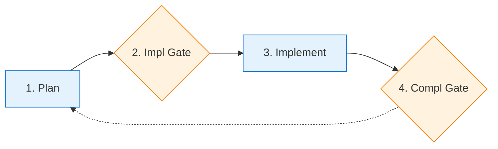

# Tandem Protocol

 Structured checkpoints for Claude Code. You approve each step, Claude grades its own work.

**Try it:**
```bash
cd ~ && git clone https://codeberg.org/binaryphile/tandem-protocol.git
mkdir -p ~/.claude/commands && ln -sf ~/tandem-protocol/tandem.md ~/.claude/commands/tandem.md
echo -e "\n# Tandem Protocol\n@~/tandem-protocol/README.md" >> your-project/CLAUDE.md
```

## Example Session

```
You:    /tandem add a config file loader to the CLI
Claude: Questions before planning:
        - YAML, JSON, or TOML?
        - Missing config: error or defaults?
You:    YAML, defaults

Claude: [creates plan] May I proceed?
You:    proceed

Claude: [logs to plan-log.md]
        2024-01-15T10:00:00Z | Contract: Config loader | [ ] YAML parsing, [ ] default fallback

        [implements]

        Done. May I proceed?
You:    proceed
```

Use `/tandem` anytime to refocus when things drift.

## Usage

### When to use `/tandem`

- At session start: `/tandem make a plan to...`
- When Claude skips steps or scope changes
- Anytime things feel off track

## Learn More

See [FEATURES.md](FEATURES.md) for details on:
- **Self-grading cycles** - Grade and improve work before committing
- **Lesson capture** - Route learnings to guides for future sessions
- **Event logging** - Audit trail with Contract/Completion/Interaction entries
- **PI cognitive stages** - Structured thinking for complex tasks
- **Multi-phase projects** - Maintain coherence across sessions

---

# The Protocol

## Overview



## 1. Plan

### 1a. Explore
Read codebase, identify affected files, note line references (will shift after edits).

### 1b. Ask
Clarify requirements before designing.

### 1c. Design
Create plan file with gate bash blocks:
- `## At Implementation Gate` section with bash block
- `## At Completion Gate` section with bash block

### 1d. Present
Verify plan has both gate sections, then ask "May I proceed?"

**STOP: Do not proceed without user approval.**

## 2. Implementation Gate

**On "proceed":** Execute the plan file's Implementation Gate bash block:
```bash
touch plan-log.md
cat >> plan-log.md << 'EOF'
2026-02-08T12:00:00Z | Contract: Phase N - objective | [ ] criterion1, [ ] criterion2
EOF

# Create tasks
S=$(ls -t ~/.claude/tasks/ | head -1)
cat > ~/.claude/tasks/$S/1.json << 'TASK'
{"id": "1", "subject": "Task 1", "status": "in_progress", "blocks": [], "blockedBy": []}
TASK
```

**On "revise":** Return to 1a.

**STOP: Do not implement until bash block executed.**

## 3. Implement

### 3a. Execute
Work through tasks, marking each in_progress → completed.

### 3b. Present
Show results, verification commands. Ask "May I proceed?"

## 4. Completion Gate

**On "grade":** Log immediately, then self-assess and re-present:
```bash
cat >> plan-log.md << 'EOF'
2026-02-08T12:10:00Z | Interaction: grade -> B+/88, missing edge case
EOF
```

**On "improve":** Log immediately, then make changes and re-present:
```bash
cat >> plan-log.md << 'EOF'
2026-02-08T12:15:00Z | Interaction: improve -> added edge case handling
EOF
```

**On "proceed":** Execute the plan file's Completion Gate bash block:
```bash
cat >> plan-log.md << 'EOF'
2026-02-08T12:30:00Z | Completion: Phase N | [x] criterion1 (evidence), [x] criterion2 (evidence)
EOF

# Cleanup tasks
S=$(ls -t ~/.claude/tasks/ | head -1)
rm ~/.claude/tasks/$S/*.json 2>/dev/null

git add -A && git commit -m "Phase N complete

Co-Authored-By: Claude <noreply@anthropic.com>"
```

## Plan File Template

```markdown
# [Phase Name] Plan

## Objective
[1-2 sentences]

## Success Criteria
- [ ] [Criterion 1]
- [ ] [Criterion 2]

## Changes
[files + line refs]

## At Implementation Gate
    ```bash
    # Contract + tasks (see step 2 for full example)
    ```

## At Completion Gate
    ```bash
    # Completion + cleanup + commit (see step 4 for full example)
    ```
```

## Tasks API Telescoping

The plan file is the source of truth. Expand the current phase with deliverables; collapse completed phases to single lines.

Three-level hierarchy: Phase → Stage → Task

| Level | What | When Visible |
|-------|------|--------------|
| Phase | From plan file | Always (future phases as skeletons) |
| Stage | Plan, Implement | Current phase only |
| Task | Deliverables | Current stage only |

**Plan file structure:**
```
[x] Phase 1: Auth middleware        <- collapsed
[ ] Phase 2: Event logging          <- current phase
    [x] Plan                        <- completed stage
    [ ] Implement                   <- current stage (expanded)
        [ ] Add middleware
        [ ] Update tests
[ ] Phase 3: Future work            <- skeleton
```

**Tasks API mirrors current stage only:**
```
[in_progress] Add middleware
[pending] Update tests
```

| Event | Action |
|-------|--------|
| Enter phase | Add Plan/Implement stages to plan file |
| Implementation Gate | Mark Plan `[x]`, expand Implement tasks, TaskCreate for each, first `in_progress` |
| Task done | Mark `[x]` in plan, TaskUpdate `completed`, next `in_progress` |
| Completion Gate | Mark Implement `[x]`, collapse phase, TaskUpdate `deleted` for all |

## Protocol Principles

**Two gates, explicit approval:**
- Implementation Gate: Approve plan before implementation
- Completion Gate: Approve results before commit
- Never proceed without "proceed"/"yes"/"approved"

**User controls scope:**
- User MAY defer work to future phases
- Claude MAY NOT unilaterally defer
- Claude MAY suggest deferring by asking

**Feedback loops:**
- "grade" → self-assess, re-present
- "improve" → fix issues, re-present
- Scope changes → return to Plan stage

**Behavioral logging:**
- Contract at Implementation Gate (what we agreed)
- Completion at Completion Gate (what we delivered)
- Interaction on any grade/improve cycle

**Plan files guide execution:**
- Include explicit admin instructions at trigger points
- Tasks JSON defined during planning, not improvised
- Telescope tasks as phases complete
