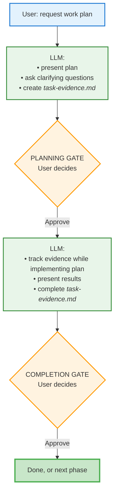
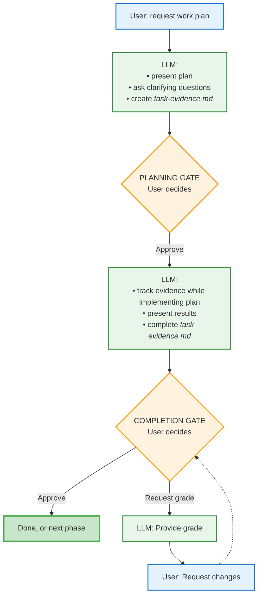
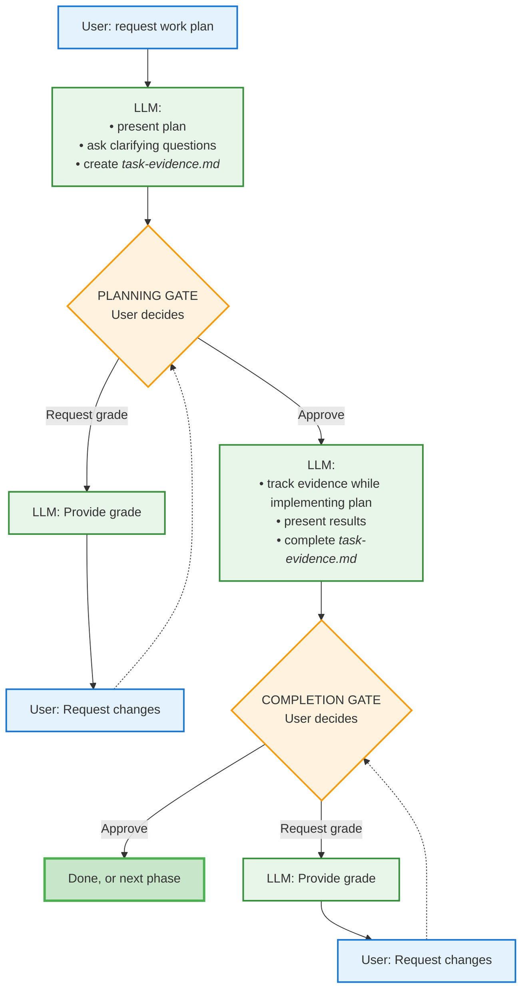

# Tandem Protocol

A lightweight protocol reminder system for maintaining multi-phase project discipline across context compactions.

## What Is This?

The **Tandem Protocol** is a 5-step workflow for complex, multi-phase projects with approval checkpoints. It ensures:

- Plans are validated before implementation
- Work is documented with evidence files
- User approval gates critical transitions
- Completion is properly logged and committed

This implementation uses **attention activation** - the protocol is always in context (via CLAUDE.md @reference), and the `/tandem` command serves as a lightweight memory jogger when protocol compliance drifts.

## Choosing a Version

Two versions are available - choose based on your preference:

**Full Protocol** (`tandem-protocol.md`) - ~1,700 lines
- Complete explanations of why each step exists
- Detailed examples (good and bad patterns)
- Common failure modes and how to avoid them
- Extensive background and design rationale
- Best for: Learning the protocol, understanding the "why"

**Concise Protocol** (`tandem-protocol-concise.md`) - ~600 lines
- Mechanically prescriptive quick reference
- Mermaid flowchart + step-by-step pseudo-code
- Actual tool syntax (TodoWrite, AskUserQuestion)
- Verification templates with bash commands
- Platform-flexible (web UI, CLI tools, non-Claude agents)
- Best for: Daily use, quick lookups, minimal token usage

Both versions cover the same 5-step workflow. Choose the one that fits your needs, or switch between them anytime.

## Installation

### Quick Install (Recommended)

```bash
bash <(curl -fsSL https://raw.githubusercontent.com/YOUR_ORG/tandem-protocol/main/install.sh)
```

This clones to `~/tandem-protocol` and creates the `/tandem` command. Then add to your project's CLAUDE.md:

```markdown
# Tandem Protocol (choose one)

# Full version - with background & examples:
@~/tandem-protocol/tandem-protocol.md

# Concise version - mechanics only:
@~/tandem-protocol/tandem-protocol-concise.md
```

### Manual Install

If you prefer manual setup:

```bash
# 1. Clone to home directory
cd ~ && git clone https://github.com/YOUR_ORG/tandem-protocol.git

# 2. Create command symlink
mkdir -p ~/.claude/commands
ln -sf ~/tandem-protocol/tandem.md ~/.claude/commands/tandem.md

# 3. Add to your project's CLAUDE.md (choose one version)

# Full version:
echo "" >> CLAUDE.md
echo "# Tandem Protocol" >> CLAUDE.md
echo "@~/tandem-protocol/tandem-protocol.md" >> CLAUDE.md

# OR Concise version:
echo "" >> CLAUDE.md
echo "# Tandem Protocol" >> CLAUDE.md
echo "@~/tandem-protocol/tandem-protocol-concise.md" >> CLAUDE.md
```

**Verify:** Start Claude Code, then run `/tandem`

### Alternative Installations

**For teams** (version-controlled with project):
```bash
git submodule add https://github.com/YOUR_ORG/tandem-protocol.git vendor/tandem-protocol

# Choose one version in CLAUDE.md:
echo "@vendor/tandem-protocol/tandem-protocol.md" >> CLAUDE.md
# OR
echo "@vendor/tandem-protocol/tandem-protocol-concise.md" >> CLAUDE.md
```

**For custom locations:**
Install anywhere, then reference with tilde or absolute path in CLAUDE.md:
- Full: `@~/your/path/tandem-protocol.md`
- Concise: `@~/your/path/tandem-protocol-concise.md`

**Advanced:** See [ADVANCED.md](./ADVANCED.md) for Docker, CI/CD, Windows WSL, monorepos, and more.

## Usage

### When to use `/tandem`

Invoke 1-2 times early in your session, or whenever you notice protocol drift:

- At session start (before planning)
- When about to implement without approval
- When uncertain about current step
- After context compaction
- When approaching approval boundaries

### How it works

The command doesn't reproduce the protocol - it **activates your attention** to the protocol already in context:

1. Full protocol is in CLAUDE.md (via @reference)
2. CLAUDE.md doesn't get compacted (always available)
3. `/tandem` reminds you to check the protocol
4. Repeated emphasis beats the attention curve

### Usage Patterns

The protocol has two checkpoint gates where you control the workflow:
- **GATE 1**: Plan approval (after Step 1)
- **GATE 2**: Work approval (after Step 4)

At each gate, you can:
- **Approve** - Allow work to continue
- **Request grade** - Ask for self-evaluation before deciding
- **Provide feedback** - Request improvements or corrections

**Choose your thoroughness level based on task complexity:**
The three patterns below show different levels of quality assurance. Use simpler patterns for straightforward tasks, more thorough patterns for complex or critical work.

### Understanding Evidence Files

**Evidence files** (e.g. `task-evidence.md`) are working, temporary documentation that the **LLM creates and maintains** automatically - you don't have to do this laborious work. They track each phase and don't degrade with compaction.

**What's the difference between plan and evidence?**
- **Plan:** "I will do X using approach Y" (LLM writes this in Step 1, before work starts)
- **Evidence:** "I did X using approach Y, results were A/B/C, grade: B+" (LLM updates this in Step 3-5, after work completes)

**Why use evidence files?**
They create an audit trail showing what was promised vs. delivered, force explicit self-evaluation, and provide a quality checkpoint before finalizing work.  To put it simply, LLMs hold themselves more accountable when they are forced to first call their shots, then being required to measure their completion by explicitly acknowledging results.  A standard self-evaluation (after work completion) in the evidence file requires genuine LLM engagement, reinforcing accountability.

**The evidence file evolves incrementally:**
1. **Created** (Step 1): Success criteria and approach defined, then frozen pending approval
2. **Completed** (Step 3): Actual results and self-assessment added, then frozen pending approval
3. **Finalized** (Step 5): Marked approved and committed to git

#### Pattern 1: Happy Path (Simple Tasks)

For straightforward work where you trust the approach. Simply approve at both gates.  Even though these approvals may seem like no-ops, as complexity rises, the simple act of generating a plan and evidence files results in higher quality outcomes and fewer planning gaps than with a non-planned work session.



#### Pattern 2: Quality Check (Moderate Complexity)

For work requiring validation. Request self-evaluation after completion, then decide whether to approve or request changes.



#### Pattern 3: Enhanced QA (Complex/Critical Work)

For complex or high-stakes work. Request self-evaluation at both plan and completion stages to ensure quality throughout.



### Example: Pattern 2 in Action

Here's a realistic conversation showing Pattern 2 (Quality Check):

> **You:** Make a plan to add input validation to the `calculate_discount` function
>
> **Claude:** I understand the plan as: Add input validation to the `calculate_discount` function to check for valid input types and ranges.
>
> Target file: `src/pricing.py` (line 45)
> Approach: Add type checking and range validation before calculation logic
>
> Evidence file created: `validation-evidence.md`
> Success criteria: 3 items
> Estimated effort: 500-700 tokens
>
> **I have a few clarifying questions:**
> - Should validation throw exceptions or return error objects?
> - What should the valid range be for discount percentages (0-100)?
> - Should we validate data types strictly or coerce when possible?
>
> **Upon your approval, I will:**
> 1. Remove "⏸️ AWAITING STEP 1 APPROVAL" footer from evidence
> 2. Proceed to Step 2 (implement validation)
> 3. Update TodoWrite
>
> May I proceed?
>
> **You:** Throw exceptions, yes 0-100 is correct, and validate strictly. Proceed.
>
> **Claude:** *[Implements validation, updates evidence]*
>
> ## Validation Implementation Complete
>
> **Deliverable:** Updated `calculate_discount` function with input validation
> **Evidence:** validation-evidence.md
>
> Key highlights:
> - Added type checking for amount and percentage parameters
> - Added range validation (0-100 for percentage)
> - Added error messages for invalid inputs
>
> **Upon your approval, I will:**
> 1. Mark evidence as APPROVED
> 2. Commit changes to git
> 3. Update TodoWrite
>
> May I proceed?
>
> **You:** grade your work
>
> **Claude:** **Self-Grade: B+ (88/100)**
>
> What went well:
> - Type checking implemented correctly
> - Range validation works for percentage
> - Clear error messages
>
> Deductions:
> - -12: Didn't validate for negative amounts (oversight)
>
> **You:** improve your work
>
> **Claude:** *[Adds negative amount check, updates evidence]*
>
> Updated validation to reject negative amounts. Re-presenting:
>
> **Upon your approval, I will:**
> 1. Mark evidence as APPROVED
> 2. Commit changes to git
> 3. Update TodoWrite
>
> May I proceed?
>
> **You:** proceed
>
> **Claude:** *[Commits changes and completes phase]*

---

**Multi-phase projects**: For projects with multiple implementation phases, this pattern repeats for each phase (Step 5d loops back to Step 0).

## The 5 Steps (Quick Reference)

0. **Evidence cleanup** (new planning sessions only)
1. **Plan validation + approval** (never skip!)
2. **Implementation** (actual work)
3. **Checkpoint preparation** (update evidence, add AWAITING footer)
4. **Present and WAIT** (explicit approval required)
5. **Post-approval** (evidence → commit)

## Design Philosophy

**Why not Skills?** Skills get summarized during compaction, requiring refresh.

**Why not Hooks?** Session-start hooks don't solve mid-session compaction drift.

**Why not full protocol in command?** Heavy reproduction wastes tokens; protocol is already in context.

**Why this approach?** Combines best of all:
- Protocol survives compaction (in CLAUDE.md)
- Lightweight activation on demand
- Repeated emphasis maintains compliance

## Testing

This repository includes automated tests to verify installation and migration scripts work correctly.

### Run All Tests

```bash
bash tests/run_all.sh
```

### What's Tested

- ✅ URL validation (no placeholder URLs)
- ✅ Migration script (from env vars to tilde paths)
- ✅ Manual installation steps
- ✅ Quick install script

See [tests/README.md](./tests/README.md) for details.
