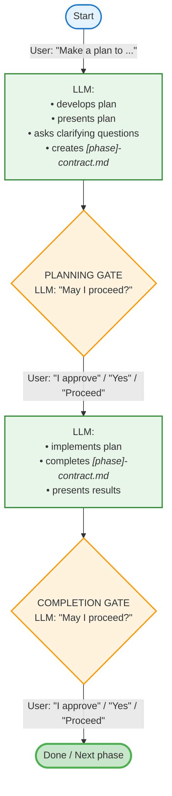
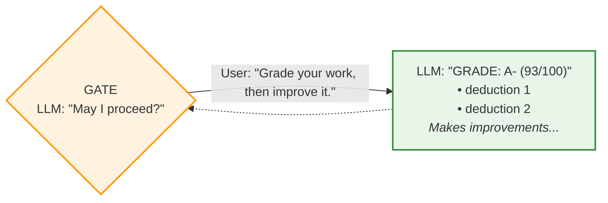
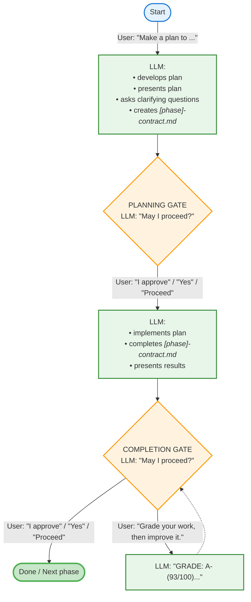

# Tandem Protocol

A lightweight protocol system for maintaining multi-phase project discipline across context compactions.

## What Is This?

The **Tandem Protocol** is a 5-step workflow for complex, multi-phase projects with approval checkpoints. It ensures:

- Plans are validated before implementation
- Work is documented with deliverable contracts
- Gates provide the user the opportunity for feedback at decision points
- Completion is properly logged and committed

This implementation uses **attention activation** - the protocol is always in context (via CLAUDE.md @reference), and the `/tandem` command serves as a lightweight memory jogger when protocol compliance drifts.

## Installation

### Quick Install (Recommended)

```bash
bash <(curl -fsSL https://raw.githubusercontent.com/YOUR_ORG/tandem-protocol/main/install.sh)
```

This clones to `~/tandem-protocol` and creates the `/tandem` command. Then add to your project's CLAUDE.md:

```markdown
# Tandem Protocol
@~/tandem-protocol/tandem-protocol.md
```

### Manual Install

If you prefer manual setup:

```bash
# 1. Clone to home directory
cd ~ && git clone https://github.com/YOUR_ORG/tandem-protocol.git

# 2. Create command symlink
mkdir -p ~/.claude/commands
ln -sf ~/tandem-protocol/tandem.md ~/.claude/commands/tandem.md

# 3. Add to your project's CLAUDE.md
echo "" >> CLAUDE.md
echo "# Tandem Protocol" >> CLAUDE.md
echo "@~/tandem-protocol/tandem-protocol.md" >> CLAUDE.md
```

**Verify:** Start Claude Code, then run `/tandem`

**For custom locations:**
Install anywhere, then reference with tilde or absolute path in your project's CLAUDE.md:
`@~/your/path/tandem-protocol.md`

**Advanced:** See [ADVANCED.md](./ADVANCED.md) for Docker, CI/CD, Windows WSL, monorepos, and more.

## Usage

### When to use `/tandem`

Invoke 1-2 times early in your session, or whenever you notice protocol drift:

- At session start (before planning)
- When the LLM skips steps or doesn't adhere to the presentation formats (e.g., doesn't specifically ask "May I proceed?")
- When you have lost track of the current step
- After context compaction
- When approaching approval boundaries

### How it works

The command doesn't reproduce the protocol - it **activates the LLM's attention** to the protocol already in context.  This takes up less context than reinserting the full protocol details.

1. Full protocol is in CLAUDE.md (via @reference)
2. CLAUDE.md doesn't get compacted (always available)
3. `/tandem` reminds you to check the protocol
4. Repeated emphasis beats the attention curve

### Usage Patterns

The protocol has two checkpoint gates where you control the workflow:
- **GATE 1**: Plan approval (after Step 1)
- **GATE 2**: Work approval (after Step 4)

At each gate, you can:
- **Approve** - Allow work to continue
- **Request grade** - Ask for self-evaluation before deciding
- **Provide feedback** - Request improvements or corrections

**Choose your thoroughness level based on task complexity:**
The three patterns below show different levels of quality assurance. Use simpler patterns for straightforward tasks, more thorough patterns for complex or critical work.

### Understanding Deliverable Contracts

**Deliverable contracts** (e.g. `[phase]-contract.md`) are working, temporary documentation that the **LLM creates and maintains** automatically - you don't have to do this laborious work. They track each phase and don't degrade with compaction.

**What's the difference between plan and contract?**
- **Plan:** "I will do X using approach Y" (LLM writes this in Step 1, before work starts)
- **Contract:** "I did X using approach Y, results were A/B/C, grade: B+" (LLM updates this in Step 3-5, after work completes)

**Why use deliverable contracts?**
They create an audit trail showing what was promised vs. delivered, force explicit self-evaluation, and provide a quality checkpoint before finalizing work.  To put it simply, LLMs hold themselves more accountable when they are forced to first name their deliverables, and are then required to measure their completion by acknowledging each result explicitly and individually.

The protocol's built-in self-evaluation as part of the contract generation process requires genuine LLM engagement, reinforcing accountability.

**The deliverable contract evolves incrementally:**
1. **Created** (Step 1): Success criteria and approach defined, then frozen pending approval
2. **Completed** (Step 3): Actual results and self-assessment added, then frozen pending approval
3. **Finalized** (Step 5): Marked approved and committed to git

#### Pattern 1: Happy Path (Simple Tasks)

For straightforward work where you trust the approach. Simply approve at both gates.  Even though these approvals may seem like no-ops, as complexity rises, the simple act of generating a plan and deliverable contracts results in higher quality outcomes and fewer planning gaps than with a non-planned work session.

Note: this is a simplified view of the protocol.



#### The Grading Cycle

At any gate, instead of approving immediately, you can ask the LLM to grade its own work and improve it. This creates a feedback loop that catches issues before they compound. The LLM provides a letter grade with specific deductions, then automatically addresses those gaps.

Note that I usually do "grade your work" and "improve your work" as separate prompts.  Anecdotally, I feel like I get better results with separate prompts, but the jury is still out on that.  I have strong reason to believe that bundled prompts like this render different results than unbundled prompts.  I encourage you to try it both ways, "Grade your work, then improve it", vs "Grade your work", then "Improve your work" after getting a response.



This works at both the Planning Gate (to refine the plan) and the Completion Gate (to polish the deliverable).

You can repeat this cycle, although you'll usually get better quality by add a grading cycle at the other gate instead, if you haven't already.  It is subject to strongly diminishing returns on the same gate, usually, although occasionally multiple grading cycles can reveal cracks in the plan if the LLM doesn't come to equilibrium on its grading (bounces between grades forever).  Usually that only happens with complex issues.
#### Pattern 2: With Grading Cycle

For work requiring validation. Request self-evaluation after completion, then decide whether to approve or request changes.



**Pattern 3 (Enhanced QA)** would be to add a grading cycle at the Planning Gate as well—useful for complex or high-stakes work where you want to validate the approach before implementation begins. This is generally preferable to multiple grading cycles on a single gate.

### Example: Pattern 2 in Action

Here's a realistic conversation showing Pattern 2 (Quality Check):

> **You:** Make a plan to add input validation to the `calculate_discount` function
>
> **Claude:** I understand the plan as: Add input validation to the `calculate_discount` function to check for valid input types and ranges.
>
> Target file: `src/pricing.py` (line 45)
> Approach: Add type checking and range validation before calculation logic
>
> Deliverable contract created: `validation-contract.md`
> Success criteria: 3 items
> Estimated effort: 500-700 tokens
>
> **I have a few clarifying questions:**
> - Should validation throw exceptions or return error objects?
> - What should the valid range be for discount percentages (0-100)?
> - Should we validate data types strictly or coerce when possible?
>
> **Upon your approval, I will:**
> 1. Remove "⏸️ AWAITING STEP 1 APPROVAL" footer from contract
> 2. Proceed to Step 2 (implement validation)
> 3. Update TodoWrite
>
> May I proceed?
>
> **You:** Answers: Throw exceptions, yes 0-100 is correct, and validate strictly. Proceed.
>
> **Claude:** *[Implements validation, updates contract]*
>
> ## Validation Implementation Complete
>
> **Deliverable:** Updated `calculate_discount` function with input validation
> **Deliverable contract:** validation-contract.md
>
> Key highlights:
> - Added type checking for amount and percentage parameters
> - Added range validation (0-100 for percentage)
> - Added error messages for invalid inputs
>
> **Upon your approval, I will:**
> 1. Mark contract as APPROVED
> 2. Commit changes to git
> 3. Update TodoWrite
>
> May I proceed?
>
> **You:** grade your work
>
> **Claude:** **Self-Grade: B+ (88/100)**
>
> What went well:
> - Type checking implemented correctly
> - Range validation works for percentage
> - Clear error messages
>
> Deductions:
> - -12: Didn't validate for negative amounts (oversight)
>
> **You:** improve your work
>
> **Claude:** *[Adds negative amount check, updates contract]*
>
> Updated validation to reject negative amounts. Re-presenting:
>
> **Upon your approval, I will:**
> 1. Mark contract as APPROVED
> 2. Commit changes to git
> 3. Update TodoWrite
>
> May I proceed?
>
> **You:** proceed
>
> **Claude:** *[Commits changes and completes phase]*

---

**Multi-phase projects**: For projects with multiple implementation phases, this pattern repeats for each phase (Step 5d loops back to Step 0).

## The 5 Steps (Quick Reference)

0. **Contract cleanup** (new planning sessions only)
1. **Plan validation + approval** (never skip!)
2. **Implementation** (actual work)
3. **Checkpoint preparation** (update contract, add AWAITING footer)
4. **Present and WAIT** (explicit approval required)
5. **Post-approval** (contract → commit)

## Design Philosophy

**Why not Skills?** Skills get summarized during compaction, requiring refresh.

**Why not Hooks?** Session-start hooks don't solve mid-session compaction drift.

**Why not full protocol in command?** Heavy reproduction wastes tokens; protocol is already in context.

**Why this approach?** Combines best of all:
- Protocol survives compaction (in CLAUDE.md)
- Lightweight activation on demand
- Repeated emphasis maintains compliance

## Testing

This repository includes automated tests to verify installation and migration scripts work correctly.

### Run All Tests

```bash
bash tests/run_all.sh
```

### What's Tested

- ✅ URL validation (no placeholder URLs)
- ✅ Migration script (from env vars to tilde paths)
- ✅ Manual installation steps
- ✅ Quick install script

See [tests/README.md](./tests/README.md) for details.
