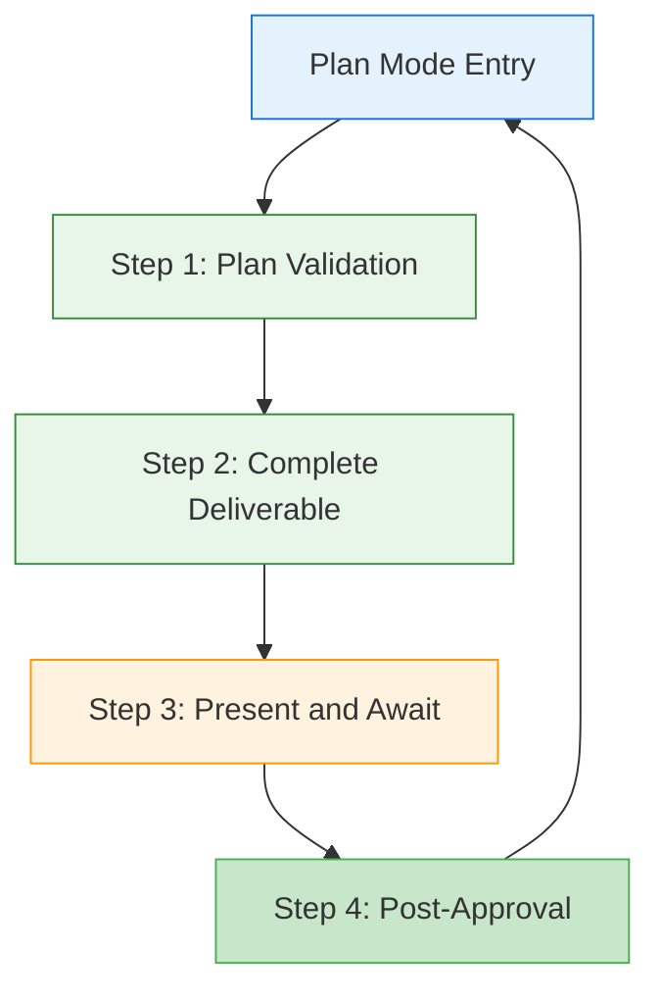
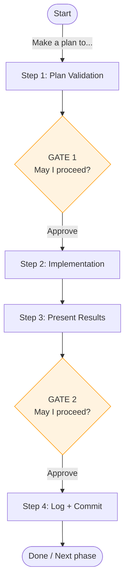
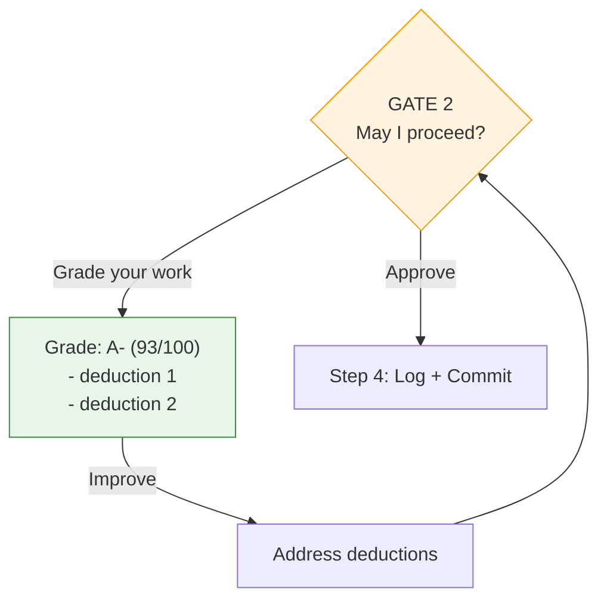

# Tandem Protocol

A lightweight protocol system for maintaining multi-phase project discipline across context compactions.

## What Is This?

The **Tandem Protocol** is a 4-step workflow for complex, multi-phase projects with approval checkpoints. It ensures:

- Plans are validated before implementation
- Work is documented with event logging
- Gates provide the user the opportunity for feedback at decision points
- Completion is properly logged and committed

This implementation uses **attention activation** - the protocol is always in context (via CLAUDE.md @reference), and the `/tandem` command serves as a lightweight memory jogger when protocol compliance drifts.

## Installation

### Quick Install (Recommended)

```bash
bash <(curl -fsSL https://codeberg.org/binaryphile/tandem-protocol/raw/branch/main/install.sh)
```

This clones to `~/tandem-protocol` and creates the `/tandem` command. Then add to your project's CLAUDE.md:

```markdown
# Tandem Protocol
@~/tandem-protocol/tandem-protocol.md
```

### Manual Install

If you prefer manual setup:

```bash
# 1. Clone to home directory
cd ~ && git clone https://codeberg.org/binaryphile/tandem-protocol.git

# 2. Create command symlink
mkdir -p ~/.claude/commands
ln -sf ~/tandem-protocol/tandem.md ~/.claude/commands/tandem.md

# 3. Add to your project's CLAUDE.md
echo "" >> CLAUDE.md
echo "# Tandem Protocol" >> CLAUDE.md
echo "@~/tandem-protocol/tandem-protocol.md" >> CLAUDE.md
```

**Verify:** Start Claude Code, then run `/tandem`

**For custom locations:**
Install anywhere, then reference with tilde or absolute path in your project's CLAUDE.md:
`@~/your/path/tandem-protocol.md`

## Usage

### When to use `/tandem`

Invoke 1-2 times early in your session, or whenever you notice protocol drift:

- At session start (before planning): `/tandem make a plan to...`
- When the LLM skips steps or doesn't adhere to the presentation formats
- When you have lost track of the current step
- After context compaction
- When approaching approval boundaries

### How it works

The command doesn't reproduce the protocol - it **activates the LLM's attention** to the protocol already in context.

1. Full protocol is in CLAUDE.md (via @reference)
2. CLAUDE.md doesn't get compacted (always available)
3. `/tandem` reminds you to check the protocol
4. Repeated emphasis beats the attention curve

## The 4 Steps



| Step | Purpose | Gate |
|------|---------|------|
| **Step 1** | Plan validation + approval | GATE 1: "May I proceed?" |
| **Step 2** | Implementation (actual work) | - |
| **Step 3** | Present and await approval | GATE 2: "May I proceed?" |
| **Step 4** | Post-approval (log, commit, next phase) | - |

### Two Checkpoint Gates

- **GATE 1** (Step 1): Plan approval - validates approach before work begins
- **GATE 2** (Step 3): Work approval - validates results before finalizing

At each gate, you can:
- **Approve** - Allow work to continue
- **Request grade** - Ask for self-evaluation before deciding
- **Provide feedback** - Request improvements or corrections

## Event Logging

All protocol events are logged directly to `plan-log.md` using timestamped entries:

| Entry Type | When | Example |
|------------|------|---------|
| **Contract** | Step 1d (phase start) | `Contract: Phase 1 - auth \| [ ] middleware, [ ] tests` |
| **Completion** | Results delivered | `Completion: Step 2 \| [x] middleware (auth.go:45)` |
| **Interaction** | User feedback | `Interaction: grade → B/84, missing edge case` |

**Format:** `YYYY-MM-DDTHH:MM:SSZ | Type: description`

The Contract/Completion checkbox pattern ensures criteria verification is explicit - can't claim "3/3 met" without evidence.

## IAPI Stage Model

The protocol uses the IAPI model for cognitive stages:

| Stage | Step | Description |
|-------|------|-------------|
| **I**nvestigate | Plan Mode | Explore codebase, gather context |
| **A**nalyze | 1a-1b | Understand requirements, ask questions |
| **P**lan | 1c-1e | Design approach, get approval |
| **I**mplement | 2 | Execute the work |

Each I/A/P stage can use subagents that read domain guides and return structured output with lessons applied/missed.

## Usage Patterns

### Pattern 1: Happy Path (Simple Tasks)

For straightforward work. Simply approve at both gates.



### Pattern 2: With Grading Cycle

For work requiring validation. Request self-evaluation after completion.



The grading cycle works at both gates. Add grading at both gates for complex or high-stakes work.

## Example Conversation

> **You:** Make a plan to add input validation to the `calculate_discount` function
>
> **Claude:** I understand the plan as: Add input validation to check for valid input types and ranges.
>
> Target file: `src/pricing.py` (line 45)
> Approach: Add type checking and range validation before calculation logic
> Success criteria: 3 items
>
> **Clarifying questions:**
> - Should validation throw exceptions or return error objects?
> - What should the valid range be for discount percentages?
>
> **Upon your approval, I will:**
> 1. Log Contract entry capturing this scope
> 2. Log Completion entry for Step 1
> 3. Proceed to Step 2 (implementation)
>
> May I proceed?
>
> **You:** Throw exceptions, 0-100 range. Proceed.
>
> **Claude:** *[Implements validation]*
>
> ## Implementation Complete
>
> Key highlights:
> - Added type checking for amount and percentage parameters
> - Added range validation (0-100 for percentage)
> - Added error messages for invalid inputs
>
> **Upon your approval, I will:**
> 1. Log Completion entry for Step 3
> 2. Step 4a: Log phase approval
> 3. Step 4b: Commit deliverable + plan-log.md
> 4. Step 4c: Setup next phase
>
> May I proceed?
>
> **You:** Grade your work
>
> **Claude:** **Self-Grade: B+ (88/100)**
>
> What went well:
> - Type checking implemented correctly
> - Range validation works for percentage
>
> Deductions:
> - -12: Didn't validate for negative amounts
>
> **You:** Improve
>
> **Claude:** *[Adds negative amount check, re-presents]*
>
> May I proceed?
>
> **You:** Proceed

## Design Philosophy

**Why not Skills?** Skills get summarized during compaction, requiring refresh.

**Why not Hooks?** Session-start hooks don't solve mid-session compaction drift.

**Why not full protocol in command?** Heavy reproduction wastes tokens; protocol is already in context.

**Why this approach?** Combines best of all:
- Protocol survives compaction (in CLAUDE.md)
- Lightweight activation on demand
- Repeated emphasis maintains compliance

## Testing

This repository includes use case tests (`tests/uc*.sh`) that verify protocol compliance patterns:

```bash
# Run a specific test
bash tests/uc1-step1b.sh

# Run all UC tests
for t in tests/uc*.sh; do bash "$t"; done
```

Tests verify: Step 1b sequencing, plan mode handling, phase transitions, interaction logging, and IAPI stages.
