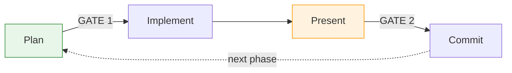

# Tandem Protocol

**Checkpoints and self-improvement for Claude Code sessions.**

## Why?

Without structure, Claude Code sessions can feel chaotic:
- Plans get forgotten or half-implemented
- No checkpoints to catch issues before they compound
- No way to consistently improve work quality

## What You Get

- **Approval gates** - You decide when to proceed, not Claude
- **Self-grading** - Ask Claude to evaluate and improve its own work
- **Event logging** - Audit trail of what was agreed and delivered
- **Multi-phase support** - Structure for projects spanning multiple sessions

The `/tandem` command re-activates the protocol when compliance drifts.

## Installation

### Quick Install (Recommended)

```bash
bash <(curl -fsSL https://codeberg.org/binaryphile/tandem-protocol/raw/branch/main/install.sh)
```

This clones to `~/tandem-protocol` and creates the `/tandem` command. Then add to your project's CLAUDE.md:

```markdown
# Tandem Protocol
@~/tandem-protocol/tandem-protocol.md
```

### Manual Install

If you prefer manual setup:

```bash
# 1. Clone to home directory
cd ~ && git clone https://codeberg.org/binaryphile/tandem-protocol.git

# 2. Create command symlink
mkdir -p ~/.claude/commands
ln -sf ~/tandem-protocol/tandem.md ~/.claude/commands/tandem.md

# 3. Add to your project's CLAUDE.md
echo "" >> CLAUDE.md
echo "# Tandem Protocol" >> CLAUDE.md
echo "@~/tandem-protocol/tandem-protocol.md" >> CLAUDE.md
```

**Verify:** Start Claude Code, then run `/tandem`

**For custom locations:**
Install anywhere, then reference with tilde or absolute path in your project's CLAUDE.md:
`@~/your/path/tandem-protocol.md`

## Usage

### When to use `/tandem`

Invoke 1-2 times early in your session, or whenever you notice protocol drift:

- At session start (before planning): `/tandem make a plan to...`
- When Claude skips steps or you've lost track of the current step
- After context compaction

### How it works

The protocol lives in your CLAUDE.md (via @reference), so it's always in context. The `/tandem` command reinforces attention to it when Claude starts drifting.

## The Flow



At each gate, you can **approve**, **request a grade**, or **ask for improvements**.

## Example

```
You:    /tandem refactor the payment module into separate services
Claude: [explores codebase, presents plan] May I proceed?
You:    proceed                              ← GATE 1
Claude: [implements] May I proceed?
You:    grade your work
Claude: B+ (87/100) - OrderService still coupled to PaymentGateway
You:    improve
Claude: [extracts interface, re-presents] May I proceed?
You:    proceed                              ← GATE 2
Claude: [commits, sets up next phase]
```

## Learn More

See [FEATURES.md](FEATURES.md) for details on:
- **Self-grading cycles** - Grade and improve work before committing
- **Event logging** - Audit trail with Contract/Completion/Interaction entries
- **IAPI cognitive stages** - Structured thinking for complex tasks
- **Multi-phase projects** - Maintain coherence across sessions

## Testing

Run `for t in tests/uc*.sh; do bash "$t"; done` to verify protocol compliance patterns.
