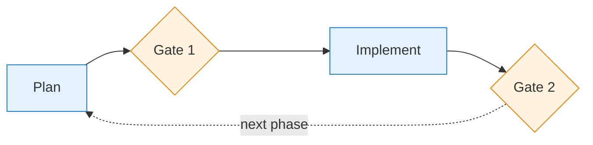
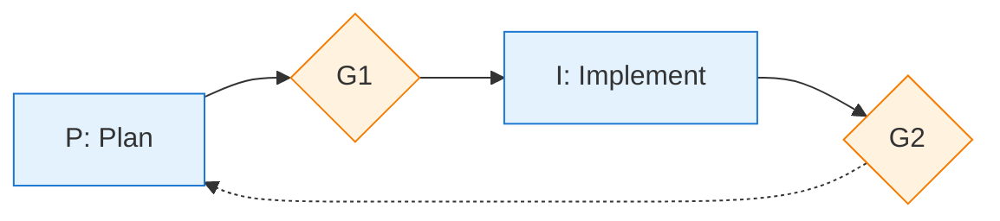

# Tandem Protocol

Structured checkpoints for Claude Code. You approve each step, Claude grades its own work.

**Try it:**
```bash
cd ~ && git clone https://codeberg.org/binaryphile/tandem-protocol.git
mkdir -p ~/.claude/commands && ln -sf ~/tandem-protocol/tandem.md ~/.claude/commands/tandem.md
echo -e "\n# Tandem Protocol\n@~/tandem-protocol/README.md" >> your-project/CLAUDE.md
```

## Example Session

```
You:    /tandem add a config file loader to the CLI
Claude: Questions before planning:
        - YAML, JSON, or TOML?
        - Missing config: error or defaults?
You:    YAML, defaults

Claude: [creates plan] May I proceed?
You:    proceed

Claude: [logs to plan-log.md]
        2024-01-15T10:00:00Z | Contract: Config loader | [ ] YAML parsing, [ ] default fallback

        [implements]

        Done. May I proceed?
You:    proceed
```

Use `/tandem` anytime to refocus when things drift.

## Usage

### When to use `/tandem`

- At session start: `/tandem make a plan to...`
- When Claude skips steps or scope changes
- Anytime things feel off track

## The Flow



At each gate, you can **approve**, **request a grade**, or **ask for improvements**.

## Learn More

See [FEATURES.md](FEATURES.md) for details on:
- **Self-grading cycles** - Grade and improve work before committing
- **Lesson capture** - Route learnings to guides for future sessions
- **Event logging** - Audit trail with Contract/Completion/Interaction entries
- **PI cognitive stages** - Structured thinking for complex tasks
- **Multi-phase projects** - Maintain coherence across sessions

---

# The Protocol

## Overview



## P: Plan

```python
def plan():
    P1_explore()      # read code, understand context
    P2_ask()          # clarifying questions
    P3_design()       # create plan file with gate blocks
    P4_present()      # "May I proceed?"
```

### P1: Explore

```python
read(codebase)
identify(affected_files)
note(line_references)  # will shift after edits
```

### P2: Ask

```python
for uncertainty in requirements:
    ask(user, uncertainty)
    wait(response)
```

### P3: Design

```python
plan_file = create("~/.claude/plans/{name}.md")
plan_file.write("""
    ## Objective
    ## Success Criteria
    ## Changes
    ## At Gate 1 Approval   # bash block: log + tasks
    ## At Gate 2 Approval   # bash block: complete + commit
""")
```

### P4: Present

```python
assert plan_file.has("At Gate 1 Approval")  # with bash block
assert plan_file.has("At Gate 2 Approval")  # with bash block
ask("May I proceed?")
block()  # STOP until user approves
```

## G1: Gate 1

```python
def gate1(user_response):
    if user_response in ["proceed", "yes", "approved"]:
        G1a_log_contract()
        G1b_create_tasks()
        # then continue to I: Implement
    elif user_response == "revise":
        return P1_explore()  # back to planning
```

### G1a: Log Contract

```bash
touch plan-log.md
cat >> plan-log.md << 'EOF'
2026-02-08T12:00:00Z | Contract: Phase N - objective | [ ] criterion1, [ ] criterion2
EOF
```

### G1b: Create Tasks

```bash
S=$(ls -t ~/.claude/tasks/ | head -1)
M=$(ls ~/.claude/tasks/$S/*.json 2>/dev/null | xargs -I{} basename {} .json | sort -n | tail -1 || echo 0)
T1=$((M+1))

cat > ~/.claude/tasks/$S/$T1.json << TASK
{"id": "$T1", "subject": "Task 1", "status": "in_progress", "blocks": [], "blockedBy": []}
TASK
```

## I: Implement

```python
def implement():
    I1_execute()      # make changes
    I2_present()      # "May I proceed?"
```

### I1: Execute

```python
for task in tasks:
    task.status = "in_progress"
    execute(task)
    task.status = "completed"
```

### I2: Present

```python
show(results)
show(verification_commands)
ask("May I proceed?")
block()  # STOP until user approves
```

## G2: Gate 2

```python
def gate2(user_response):
    if user_response in ["proceed", "yes", "approved"]:
        G2a_log_completion()
        G2b_cleanup_tasks()
        G2c_commit()
    elif user_response == "grade":
        log_interaction("grade", self_assess())
        return I2_present()
    elif user_response == "improve":
        log_interaction("improve", changes)
        return I1_execute()
```

### G2a: Log Completion

```bash
cat >> plan-log.md << 'EOF'
2026-02-08T12:30:00Z | Completion: Phase N | [x] criterion1 (evidence), [x] criterion2 (evidence)
EOF
```

### G2b: Cleanup Tasks

```bash
S=$(ls -t ~/.claude/tasks/ | head -1)
for f in ~/.claude/tasks/$S/*.json; do
    [ -f "$f" ] && rm "$f"
done
```

### G2c: Commit

```bash
git add -A && git commit -m "Phase N complete

Co-Authored-By: Claude <noreply@anthropic.com>"
```

## Log Entries

| Entry | When | Format |
|-------|------|--------|
| Contract | G1 | `TS \| Contract: Phase N - obj \| [ ] c1, [ ] c2` |
| Completion | G2 | `TS \| Completion: Phase N \| [x] c1 (evidence)` |
| Interaction | grade/improve | `TS \| Interaction: action -> outcome` |

## Plan File Template

```markdown
# [Phase Name] Plan

## Objective
[1-2 sentences]

## Success Criteria
- [ ] [Criterion 1]
- [ ] [Criterion 2]

## Changes
[files + line refs]

## At Gate 1 Approval
    ```bash
    # G1a + G1b combined
    ```

## At Gate 2 Approval
    ```bash
    # G2a + G2b + G2c combined
    ```
```

## Principles

```python
# approval required at gates
assert user_response in ["proceed", "yes", "approved"]

# user controls scope
user.may(defer_to_future_phase=True)
claude.may_not(unilaterally_defer=True)
claude.may(suggest_deferring=True)  # by asking

# feedback loops
on("grade"):  self_assess(); re_present()
on("improve"): fix_issues(); re_present()
on("scope_change"): return P1_explore()
```
