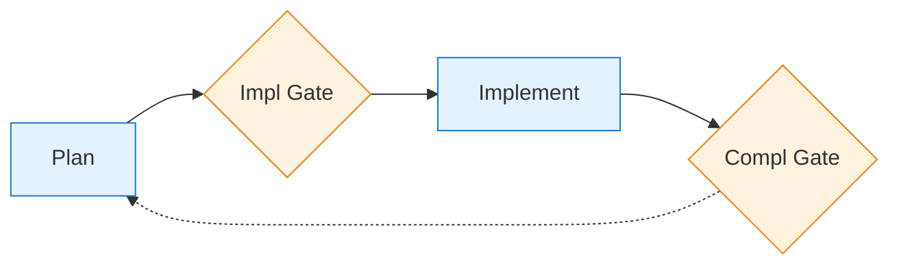
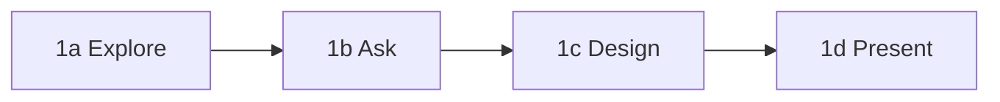
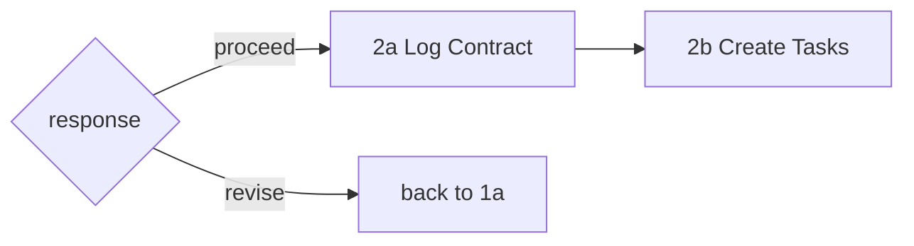
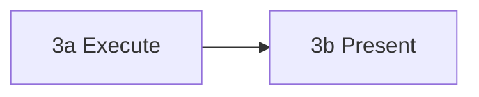
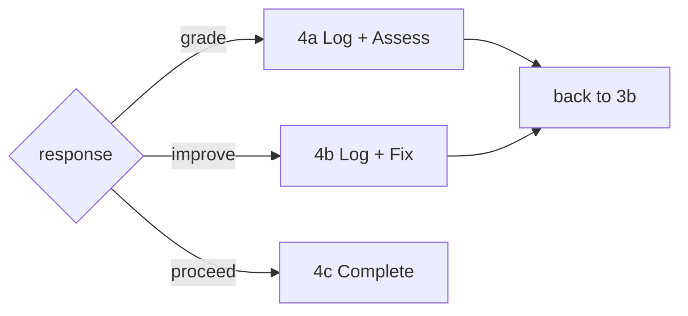

# Tandem Protocol

 Structured checkpoints for Claude Code. You approve each step, Claude checks in along the way to stay in sync with the developer's intention.

**Try it:**
```bash
cd ~ && git clone https://codeberg.org/binaryphile/tandem-protocol.git
mkdir -p ~/.claude/commands && ln -sf ~/tandem-protocol/tandem.md ~/.claude/commands/tandem.md
echo -e "\n# Tandem Protocol\n@~/tandem-protocol/README.md" >> your-project/CLAUDE.md
```

## Example Session

```
You:    /tandem add a config file loader to the CLI
Claude: Questions before planning:
        - YAML, JSON, or TOML?
        - Missing config: error or defaults?
You:    YAML, defaults

Claude: [creates plan] May I proceed?
You:    proceed

Claude: [logs to plan-log.md]
        2024-01-15T10:00:00Z | Contract: Config loader | [ ] YAML parsing, [ ] default fallback

        [implements]

        Done. May I proceed?
You:    proceed
```

Use `/tandem` anytime to refocus when things drift.

## Usage

### When to use `/tandem`

- At session start: `/tandem make a plan to...`
- When Claude skips steps or scope changes
- Anytime things feel off track

## Learn More

See [FEATURES.md](FEATURES.md) for details on:
- **Self-grading cycles** - Grade and improve work before committing
- **Lesson capture** - Route learnings to guides for future sessions
- **Event logging** - Audit trail with Contract/Completion/Interaction entries
- **PI cognitive stages** - Structured thinking for complex tasks
- **Multi-phase projects** - Maintain coherence across sessions

---

# The Protocol

## Overview



## 1. Plan



### 1a: Explore

```bash
read_codebase
identify_affected_files
note_line_refs  # will shift after edits
```

### 1b: Ask

```bash
for question in $uncertainties; do
    ask_user "$question"
    wait_response
done
```

### 1c: Design

```bash
cat > plan.md << 'PLAN'
## Objective
## Success Criteria
## At Implementation Gate   # bash block
## At Completion Gate       # bash block
PLAN
```

### 1d: Present

```bash
grep -q "At Implementation Gate" plan.md || exit 1
grep -q "At Completion Gate" plan.md || exit 1
ask "May I proceed?"
wait  # STOP until approved
```

## 2. Implementation Gate



### 2a: Log Contract

```bash
touch plan-log.md
cat >> plan-log.md << 'EOF'
2026-02-08T12:00:00Z | Contract: Phase N - objective | [ ] criterion1, [ ] criterion2
EOF
```

### 2b: Create Tasks

```bash
S=$(ls -t ~/.claude/tasks/ | head -1)
cat > ~/.claude/tasks/$S/1.json << 'TASK'
{"id": "1", "subject": "Task 1", "status": "in_progress", "blocks": [], "blockedBy": []}
TASK
# STOP: do not implement until executed
```

## 3. Implement



### 3a: Execute

```bash
for task in $tasks; do
    set_status "$task" "in_progress"
    execute "$task"
    set_status "$task" "completed"
done
```

### 3b: Present

```bash
show_results
show_verification_commands
ask "May I proceed?"
wait  # STOP until approved
```

## 4. Completion Gate



### 4a: On grade

```bash
cat >> plan-log.md << 'EOF'
2026-02-08T12:10:00Z | Interaction: grade -> B+/88, missing edge case
EOF
self_assess
# back to 3b
```

### 4b: On improve

```bash
cat >> plan-log.md << 'EOF'
2026-02-08T12:15:00Z | Interaction: improve -> added edge case handling
EOF
make_changes
# back to 3b
```

### 4c: On proceed

```bash
cat >> plan-log.md << 'EOF'
2026-02-08T12:30:00Z | Completion: Phase N | [x] criterion1 (evidence), [x] criterion2 (evidence)
EOF

S=$(ls -t ~/.claude/tasks/ | head -1)
rm ~/.claude/tasks/$S/*.json 2>/dev/null

git add -A && git commit -m "Phase N complete

Co-Authored-By: Claude <noreply@anthropic.com>"
```

## Plan File Template

```markdown
# [Phase Name] Plan

## Objective
[1-2 sentences]

## Success Criteria
- [ ] [Criterion 1]
- [ ] [Criterion 2]

## Changes
[files + line refs]

## At Implementation Gate
    ```bash
    # Contract + tasks (see step 2 for full example)
    ```

## At Completion Gate
    ```bash
    # Completion + cleanup + commit (see step 4 for full example)
    ```
```

## Tasks API Telescoping

The plan file is the source of truth. Expand the current phase with deliverables; collapse completed phases to single lines.

Three-level hierarchy: Phase → Stage → Task

| Level | What | When Visible |
|-------|------|--------------|
| Phase | From plan file | Always (future phases as skeletons) |
| Stage | Plan, Implement | Current phase only |
| Task | Deliverables | Current stage only |

**Plan file structure:**
```
[x] Phase 1: Auth middleware        <- collapsed
[ ] Phase 2: Event logging          <- current phase
    [x] Plan                        <- completed stage
    [ ] Implement                   <- current stage (expanded)
        [ ] Add middleware
        [ ] Update tests
[ ] Phase 3: Future work            <- skeleton
```

**Tasks API mirrors current stage only:**
```
[in_progress] Add middleware
[pending] Update tests
```

| Event | Action |
|-------|--------|
| Enter phase | Add Plan/Implement stages to plan file |
| Implementation Gate | Mark Plan `[x]`, expand Implement tasks, TaskCreate for each, first `in_progress` |
| Task done | Mark `[x]` in plan, TaskUpdate `completed`, next `in_progress` |
| Completion Gate | Mark Implement `[x]`, collapse phase, TaskUpdate `deleted` for all |

## Protocol Principles

**Two gates, explicit approval:**
- Implementation Gate: Approve plan before implementation
- Completion Gate: Approve results before commit
- Never proceed without "proceed"/"yes"/"approved"

**User controls scope:**
- User MAY defer work to future phases
- Claude MAY NOT unilaterally defer
- Claude MAY suggest deferring by asking

**Feedback loops:**
- "grade" → self-assess, re-present
- "improve" → fix issues, re-present
- Scope changes → return to Plan stage

**Behavioral logging:**
- Contract at Implementation Gate (what we agreed)
- Completion at Completion Gate (what we delivered)
- Interaction on any grade/improve cycle

**Plan files guide execution:**
- Include explicit admin instructions at trigger points
- Tasks JSON defined during planning, not improvised
- Telescope tasks as phases complete
