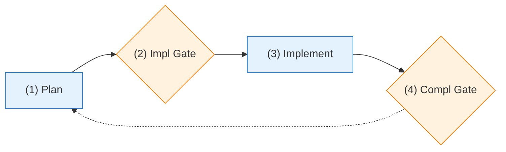
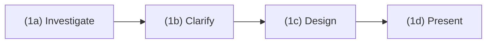
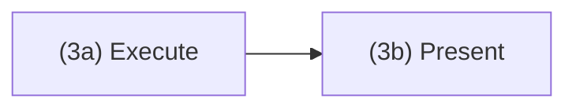

# Tandem Protocol

 Structured checkpoints for Claude Code. You approve each step, Claude checks in along the way to stay in sync with the developer's intention.

**Try it:**

```bash
cd ~ && git clone https://codeberg.org/binaryphile/tandem-protocol.git
mkdir -p ~/.claude/commands && ln -sf ~/tandem-protocol/tandem.md ~/.claude/commands/tandem.md
echo -e "\n# Tandem Protocol\n@~/tandem-protocol/README.md" >> your-project/CLAUDE.md
```

## Example Session

```
You:    /tandem add a config file loader to the CLI
Claude: Questions before planning:                           # ← (1) Plan
        - YAML, JSON, or TOML?
        - Missing config: error or defaults?
You:    YAML, defaults

Claude: [creates plan] May I proceed?
You:    proceed                                              # ← (2) Impl Gate

Claude: [logs to plan-log.md]
        2024-01-15T10:00:00Z | Contract: Config loader
        [ ] YAML parsing
        [ ] default fallback

        [implements]                                         # ← (3) Implement

        Done. May I proceed?
You:    proceed                                              # ← (4) Compl Gate
```

Use `/tandem` anytime to refocus when things drift.

## Usage

### When to use `/tandem`

- At session start: `/tandem make a plan to...`
- When Claude skips steps or scope changes
- Anytime things feel off track

## Learn More

See [FEATURES.md](FEATURES.md) for details on:
- **Self-grading cycles** - Grade and improve work before committing
- **Lesson capture** - Route learnings to guides for future sessions
- **Event logging** - Audit trail with Contract/Completion/Interaction entries
- **PI cognitive stages** - Structured thinking for complex tasks
- **Multi-phase projects** - Maintain coherence across sessions

---

# The Protocol

## Overview



**Before Gate 1: MUST verify plan includes bash blocks at each gate.**

Checklist before requesting approval:
- [ ] "At Implementation Gate" section with bash block (Contract + task creation)
- [ ] "At Completion Gate" section with bash block (Completion + task deletion + commit)

Do not request "May I proceed?" without these executable bash blocks in the plan file.

## 1. Plan



**Substeps (1a-1d):**

### 1a: Investigate

```bash
read_codebase
identify_affected_files
note_line_refs              # will shift after edits
mcp__memory__memory_search  # check memory for relevant context
web_search                  # find resources for unfamiliar patterns
```

### 1b: User Clarification

```bash
for question in $uncertainties; do
    AskUserQuestion "$question"
done
# User controls scope - Claude MAY suggest deferring, MAY NOT unilaterally defer
```

### 1c: Design

```bash
EnterPlanMode  # creates ~/.claude/plans/<name>.md
```

**Plan template** (gate sections contain literal bash blocks to execute):

```markdown
# [Phase Name] Plan

## Objective
[1-2 sentences]

## Success Criteria
- [ ] criterion1
- [ ] criterion2

## Changes
[files + line refs]

## At Implementation Gate

    ```bash
    # Log Contract + Create Tasks (execute this entire block)
    touch plan-log.md
    cat >> plan-log.md << 'EOF'
    2026-02-08T12:00:00Z | Contract: Phase 1 - objective
    [ ] criterion1
    [ ] criterion2
    EOF

    # Create tasks via direct file write
    S=$(ls -t ~/.claude/tasks/ | head -1)
    cat > ~/.claude/tasks/$S/1.json << TASK
    {"id": "1", "subject": "Task 1", "status": "in_progress", "blocks": [], "blockedBy": []}
    TASK
    ```

## At Completion Gate

    ```bash
    # Log + Delete + Commit (execute this entire block)
    cat >> plan-log.md << 'EOF'
    2026-02-08T12:30:00Z | Completion: Phase 1
    [x] criterion1 (evidence)
    [x] criterion2 (evidence)
    EOF

    # Delete task files
    S=$(ls -t ~/.claude/tasks/ | head -1)
    rm ~/.claude/tasks/$S/*.json 2>/dev/null

    # Remove plan file (single-phase) or edit to remove completed phase
    rm /home/ted/.claude/plans/<name>.md

    git add -A && git commit -m "Phase 1 complete

    Co-Authored-By: Claude <noreply@anthropic.com>"
    ```

## Verification
[Commands to verify success criteria]
```

### 1d: Present

```bash
# Validate plan file exists and has gate blocks
PLAN=/home/ted/.claude/plans/<name-from-plan-mode>.md
test -f "$PLAN" || exit 1
grep -q "At Implementation Gate" "$PLAN" || exit 1
grep -q "At Completion Gate" "$PLAN" || exit 1

AskUserQuestion "May I proceed?"
# STOP until approved
```

## 2. Implementation Gate

**GATE 1 ACTIONS** (when user says "proceed"):

Execute the bash block from the plan file's "At Implementation Gate" section. This logs the Contract AND creates tasks in one atomic operation.

**STOP: Do not implement until the Gate 1 bash block has been executed.**

## 3. Implement



**Substeps (3a-3b):**

### 3a: Execute

```bash
for criterion in $contract_criteria; do
    implement "$criterion"
done
# Progress logged as single Completion entry at gate (not incrementally)
```

### 3b: Present

```bash
show_results
for criterion in $contract_criteria; do
    show_verification "$criterion"  # how user can verify
done
AskUserQuestion "May I proceed?"
# STOP until approved
```

## 4. Completion Gate

**On "grade"** (log immediately, then self-assess and re-present):
```bash
cat >> plan-log.md << 'EOF'
2026-02-08T12:10:00Z | Interaction: grade -> B+/88, missing edge case
EOF
```

**On "improve"** (log immediately, then make changes and re-present):
```bash
cat >> plan-log.md << 'EOF'
2026-02-08T12:15:00Z | Interaction: improve -> added edge case handling
EOF
```

**GATE 2 ACTIONS** (when user says "proceed"):

Execute the bash block from the plan file's "At Completion Gate" section. This logs Completion with evidence, deletes tasks, and commits.

