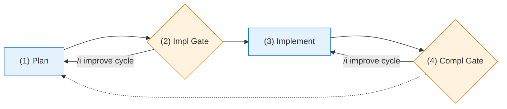
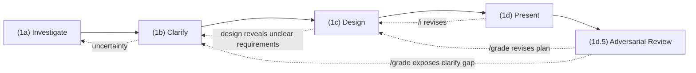
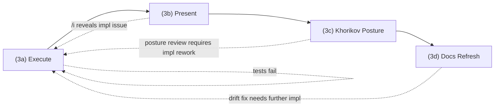

# Tandem Protocol v0.14

Structured checkpoints for Claude Code. You approve each step, Claude checks in along the way.

## Slash Commands

On any invocation, locate your current protocol stage and act within it.

- `/begin` — start planning
- `/i` — "improve" - self-assess + fix
- `/grade` — adversarial review
- `/c` — compliance with guidelines

---

# The Protocol


```mermaid
flowchart LR
    S1["(1) Plan"] --> S2{"(2) Impl Gate"}
    S2 -->|"/i improve cycle"| S1
    S2 --> S3["(3) Implement"]
    S3 --> S4{"(4) Compl Gate"}
    S4 -->|"/i improve cycle"| S3
    S4 -.-> S1

    style S1 fill:#e3f2fd,stroke:#1976d2
    style S3 fill:#e3f2fd,stroke:#1976d2
    style S2 fill:#fff3e0,stroke:#f57c00
    style S4 fill:#fff3e0,stroke:#f57c00
```

Before `ExitPlanMode`, the plan must have:
- Executable bash at **At Implementation Gate**: `evtctl contract`, `evtctl plan`, `evtctl task` (if new), `evtctl claim`, `era store`
- A **Phase 3c Khorikov Posture** checkpoint after 3b Present: review the cycle's tests/code through Khorikov's classical-school lens, refactor if needed (see §3).
- A **Phase 3d Documentation Refresh** checkpoint after 3c: re-read affected normative docs, amend any drift, commit + push amendments BEFORE attestation. Evidence on the `docs refreshed` criterion is one of the literal forms `docs drift detected: yes (<SHA>[, <SHA>...])` / `no (reviewed: ...)` / `not applicable (internal refactor)` / `not applicable (docs-only cycle)` / `deferred (task #<N>)`.
- A mandatory **🛑 GATE C STOP stanza** directly above `## At Completion Gate` (handshake to halt execution before the gate bash runs).
- Executable bash at **At Completion Gate**: `evtctl complete`, `evtctl done`, `era store`, `git commit`. (Docs-review now lives in Phase 3d, not embedded in this gate bash.)
- For changes affecting **user-visible behavior or operator workflow**: a `docs refreshed` entry in the contract criteria list (evidence per the literal forms above; the evidence must also cite the governing use case(s) by `docs/use-cases.md` path or `UC-N` identifier so the linkage is stream-visible). If a UC doesn't yet exist, Commit 1 (WHAT — use case) in Phase 3a creates it under that identifier.

Do not exit plan mode without the gate sections, the GATE C STOP stanza, the Phase 3c Khorikov checkpoint, and the Phase 3d docs-review checkpoint when applicable.

**Doc-level WHAT/HOW separation.** Use cases describe **WHAT** (behavioral contracts, observable postconditions, stakeholder interests). Design docs describe **HOW** (mechanisms, wire formats, parse-loop patterns, retry strategies, REST endpoint specifics). Keep design-level details out of use cases — they drift faster than UCs do, and a UC's contract should survive a re-implementation. If a UC needs a "technology variation" with concrete details, the variation belongs in design, not in the UC body.

## Stream as source of truth

Streams are append-only journals of what happened. Plans and attestations
**reference** stream-derived ids (event ids, task ids, commit SHAs) but
must **not memoize** payload content. The stream is the record. Two
implications for plan authoring:

### Do not copy payloads into plans

A plan that restates a contract, an attestation, or an interaction's
content drifts from the stream the moment either side is edited. Quote
the event id; let the reader run `evtctl` against the stream to fetch
the current payload.

### Use bash substitution to enforce adherence at gate time

LLMs can write declarative plans that diverge from reality. Plans
*can't* diverge from a `$(...)` substitution that runs in the gate
bash — the substitution evaluates against the current stream, not
against what the plan claims. This is the same trick
`validate-attestation` uses at the Completion Gate; it generalizes.

Concrete patterns (output formats verified live):

- **Planning stage 1a**: surface what's already pending so it gets considered:
  ```bash
  OPEN=$(evtctl open)
  [[ -z $OPEN ]] || cat <<<"$OPEN"
  ```
- **Implementation Gate**: refuse double-claim on a task already claimed
  by another agent. `evtctl claims` (delegating to `task-audit claims`)
  prints lines `#<id>  <date>  <claimer>  <desc>` or the literal
  `no active claims`:
  ```bash
  evtctl claims | grep -qE "^#$TASK_ID\b" && {
    echo "task $TASK_ID already claimed; resolve before claiming"; exit 1
  }
  ```
- **Completion Gate**: confirm the task being closed is in fact open.
  `evtctl open` prints `#<id>  <date>  task  <desc>`:
  ```bash
  evtctl open | grep -qE "^#$TASK_ID\b" || {
    echo "task $TASK_ID not in open list"; exit 1
  }
  ```

Plans should include such substitutions wherever the LLM's claim could
diverge from stream state. The cost is a few lines of bash; the
benefit is enforcement that doesn't depend on attestation prose.

### Reconciliation audit

Periodically (or when a session asks "what's unfinished?"), audit each
project's stream for **contracts without a satisfying completion**. The
canonical join is criterion-name string-equality between
`contract.criteria[]` and `complete.criteria[].name`: a contract is
satisfied when some later completion event's name-set is a superset of
the contract's criteria.

Counting raw `contract` vs `complete` events per stream is **not** a
substitute — completions can carry added criteria, supersede earlier
contracts, or be republished, so the counts diverge in both directions
without indicating WIP.

The join, expressed as one `era query` + `jq` per stream:

```bash
contracts=$(era query "tasks.$PROJECT" 'type = "contract"' --json)
completes=$(era query "tasks.$PROJECT" 'type = "complete"' --json)
jq -n --argjson C "$contracts" --argjson D "$completes" '
  def parse_contract: {id, created: .created_at,
    criteria: (try (.payload|fromjson|.criteria // []) catch [])};
  def parse_complete: {id, created: .created_at,
    names: (try (.payload|fromjson|.criteria // []|map(.name)) catch [])};
  ($C|map(parse_contract)) as $cs |
  ($D|map(parse_complete)) as $ds |
  $cs | map(. as $c |
    ($ds | map(select(.created > $c.created
                   and (.names as $n | $c.criteria|length > 0
                        and ($c.criteria|all(. as $k | ($n|index($k))!=null)))))
        | first) as $m |
    {contract:$c.id, matched:($m.id // null), criteria:$c.criteria})
  | map(select(.matched == null))'
```

An unmatched contract is a *candidate* for WIP, not a confirmation —
historical reasons it appears unmatched include criterion-rename
supersedure (see "Criterion names are the join key" in §3b), early
bootstrap contracts that predate strict attestation, and spurious
publishes with empty `criteria`. Reconcile each unmatched contract
against: (i) a later contract on the same topic with renamed criteria;
(ii) commits that delivered the named work without a `complete` event;
(iii) `era search` for memories recording the cycle's outcome. The
audit narrows the search space; the operator decides.

## 1. Plan


```mermaid
flowchart LR
    A["(1a) Investigate"] --> B["(1b) Clarify"] --> C["(1c) Design"] --> D["(1d) Present"] --> E["(1d.5) Adversarial Review"]
    B -.->|"uncertainty"| A
    C -.->|"design reveals unclear requirements"| B
    D -.->|"/i revises"| C
    E -.->|"/grade revises plan"| C
    E -.->|"/grade exposes clarify gap"| B
```

*Diagram shows standard-tier flow. Trivial-tier cycles collapse 1a/1b and skip 1d/1d.5/3c. High-risk-tier cycles run the same flow plus per-phase-entry `evtctl interaction` events.*

**Phase regression is normal.** Real cycles loop: 1b->1a when clarify-answers surface new uncertainty; 1c->1b when design reveals unclear requirements; 1d->1c when /i reveals plan issue; 1d.5->1c when /grade reveals plan issue; 1d.5->1b when /grade exposes a clarification gap (deeper than 1c can fix); 3a->3a when tests fail and need re-edits; 3b->3a when /i reveals an impl issue; 3c->3a when posture review requires impl rework; 3d->3a when drift fix requires further implementation. Log each regression via `evtctl interaction "/loopback <from>-><to>: <reason>"` so the cycle's plan->event chain captures the real shape, not the linear ideal.

**1a Investigate:** Read codebase, identify affected files, note line refs, `era search` for prior context, web search if needed. **Verify load-bearing static-analysis findings with a runtime experiment** before designing on them (static reads have false-positive and false-negative rates a discriminating experiment doesn't). For debugging/issue investigation, first perform a complete differential diagnosis — enumerate every actor in the failing flow (client process, OS service, browser cookie jar, identity provider, network path, server policy, your own recent commits) and treat each as a candidate cause until evidence rules it out. **If it's not in the differential, it can't be in the diagnosis.** Adversarial review narrows the differential; it does not expand it — when review keeps confirming the same conclusion across rounds, the differential is suspect, not the testing.

**Scope check.** If 1a investigation reveals work below Tandem's ceremony floor — single-function fix, ~< 100 LOC, no UC implications, no architectural consequence — propose **dropping the cycle** rather than proceeding to 1c Design. Direct commit + one `evtctl interaction` event is the appropriate substitute. Signal: when adversarial /grade reviewers converge across iteration rounds on "plan too large for fix," the redirect is ceremony-is-wrong-framing, not "the plan needs more polish." Empirical anchor: era #4997 (two /grade rounds at C+/B− both flagged disproportionate ceremony; dropped Tandem on the third round; shipped as direct commit `0b94ed0`, 66-line diff, 6 tests).

**Tier classification.** After Scope check (if the cycle isn't dropped), classify the cycle into one of three tiers; agent self-classifies based on the eligibility rules below; user can override at 1b. **Tier may escalate mid-cycle** when a high-risk predicate (multi-repo / public API change / data migration) is discovered post-classification — log `evtctl interaction "/tier-escalate <from>-><to>: <reason>"` and apply the new tier's scaffolding from that point. **Downgrade is forbidden** mid-cycle (prevents ceremony gaming).

| Tier | Eligibility (apply first matching from top) | Scaffolding |
|---|---|---|
| **Drop** | (Scope check above; below ceremony floor) | Cycle dropped; direct commit + interaction event |
| **Trivial** | single-file diff ≤20 lines AND no API contract change | 1a/1b collapsed into one quick step; `/i` at 1d exempted; `/grade` at 1d.5 exempted; minimum plan sections only (Contract + Impl Gate bash + Completion Gate bash + Verification — no Context, no /i log, no scope justification) |
| **Standard** | (default — everything not matching the above or below) | Current full ceremony: 1a/1b/1c/1d/1d.5 as documented; `/i` per Gate Grading rule; `/grade` required at 1d.5; 3c Khorikov posture; 3d docs refresh |
| **High-risk** | multi-repo OR public API change OR data migration (any one) | All standard ceremony PLUS: stream-based evidence ledger via granular `evtctl interaction` events at each phase entry (`/phase 1a entered`, `/phase 1b entered`, ...) and at each major decision point (`/decision: X chosen over Y because Z`). No new file types; the event stream IS the ledger. (#3881 will decide separately about plan.md content cleanup.) |

Waterfall: apply the first matching tier from least to most ceremony (drop → trivial → standard → high-risk). When work qualifies for multiple tiers (e.g., a 15-line single-function fix qualifies for both drop and trivial), pick the one with less ceremony. See `design.md` for tier-mechanics detail.

**1b Clarify:** Ask user about uncertainties. User controls scope — Claude MAY suggest deferring, MAY NOT unilaterally defer. Claude MAY also suggest **dropping** the cycle entirely when 1a's scope check identifies the work as below-floor. Tier classification from §1a can also be overridden at 1b (user controls ceremony level). You MUST ask at least one question.

**1c Design:** `EnterPlanMode`. If existing plan found: quote verbatim, grade analysis ("Do I understand this?"), grade quality ("Is this sound?"), STOP for user direction. Otherwise create new plan:

Plan = HOW (approach, changes). Contract = WHAT (criteria, published via `evtctl contract` at gate).
Substitute `<plan-name>` and `<task-id>` with actual values. Do NOT use `ls -t` to find plans.

```markdown
# [Project Name]

## Changes
[files + approach]

## At Implementation Gate

    ```bash
    evtctl contract <<'EOF'
    {"phase":"objective","criteria":["criterion1","criterion2","docs refreshed"]}
    EOF
    evtctl plan ~/.claude/plans/<plan-name>.md
    # <task-id>: originating task ID if continuing existing task, or empty to create new
    TASK_ID=<task-id>
    if [ -z "$TASK_ID" ]; then
      TASK_ID=$(evtctl task "objective")
    fi
    evtctl claim "$TASK_ID" claude
    era store --type session -t "<project-basename>,plan" <<'MEMO'
    <1-3 sentences: objective and key design decisions>
    MEMO
    ```

**🛑 GATE C — Before executing the bash block below:**

1. Update `<compose>` placeholder with the actual attestation JSON
   (criterion name + status + evidence + SHAs from the impl phase).
2. Update `<MEMO>` placeholder with the composed session memory.
3. Replace `git add file1.go file2.go` with the actual files changed.
4. Confirm Phase 3c Khorikov posture review has been performed
   (tests output-based / state-based via captured stdout; mocks at
   inter-system boundary only; refactor logged via /i if applied).
5. Confirm Phase 3d Documentation Refresh has been performed
   (all affected normative docs re-read; drift amended + committed
   + pushed BEFORE this gate; evidence form set on
   `docs refreshed` criterion: `docs drift detected: yes (<SHA>[, <SHA>...])`
   or `no (reviewed: ...)` or `not applicable (internal refactor)`
   or `not applicable (docs-only cycle)` or `deferred (task #<N>)`).
6. Print this updated plan file to the user.
7. Show the completion-gate bash block as it now reads.
8. Ask "May I proceed?" and **wait for explicit approval** before
   executing.

The stanza is a behavioral safeguard, not a mechanical enforcement
mechanism — its purpose is execution-time locality: the halt
instruction sits adjacent to the executable bash in the artifact
the agent traverses. Mechanical enforcement (validate-plan) is
deferred (#3883). Backward compatibility: legacy plans without the
stanza or without the 3c/3d checkpoints are valid for in-flight
cycles already past 1d; new plans MUST include them.

## At Completion Gate

    ```bash
    # Phase 3c (Khorikov posture review) and Phase 3d (docs refresh)
    # have completed before this gate. Docs-drift evidence is already
    # set; amendments (if any) already committed and pushed.

    # Every contract criterion must appear: "delivered"+evidence, "dropped"+reason, or "added"+evidence.
    evtctl complete <<'EOF'
    <compose: {"criteria":[{"name":"...","status":"...","evidence":"..."},...]}>
    EOF
    # <task-id>: originating task ID if continuing existing task, or ID from evtctl task if created new
    evtctl done <task-id> "complete"
    era store --type session -t "<project-basename>,completion" <<'MEMO'
    <what delivered/dropped, /i lessons, technical insights, decision points and rationales>
    MEMO
    git add file1.go file2.go  # actual files at completion time
    git commit -m "description

    Co-Authored-By: Claude <noreply@anthropic.com>"
    ```

## Verification
[commands to verify]
```

**1d Present:** Auto `/i` (≥2 passes; exceed 3 only while finding new defect classes; log each; see Gate Grading; waived for trivial-tier cycles). Validate plan file (`~/.claude/plans/<plan-name>.md`) has both gate sections with required executable commands.

**1d.5 Adversarial Review (required for standard / high-risk; waived for trivial-tier cycles):** Invoke `/grade` (no argument; grades the current plan as work product). The skill composes a self-contained, staff-level adversarial grading request and copies it to the clipboard via `wl-copy`. **Paste to a fresh model context** to avoid frame-expansion (era memory `088bf6c5c08a`: same-frame graders confirm rather than challenge). Paste the grader's response back. Absorb findings via `/i` (per Gate Grading rule). Re-grade if absorption changed *substantive content* — any semantic change affecting gates, topology, evidence forms, or workflow semantics (typos and pure wording polish do not count). Exit the loop when (a) grader's verdict approves OR (b) successive rounds plateau on novelty OR (c) **hard cap: 5 rounds reached** (circuit breaker — if neither (a) nor (b) fires by round 5, log `evtctl interaction "/loopback 1d.5->1c: review unbounded"` and return to 1c for plan rework; the cycle is wrong-sized or the grader is uncalibrated, parallel to §1a Scope check's "ceremony-is-wrong-framing" signal from era #4997). Log each round: `evtctl interaction "/grade r<N>: <letter>, <findings count>, <verdict-summary>"`. Required grader-response shape (prescribed for deterministic parsing): three labeled sections — `Grade: <letter from A/A−/B+/.../F>`; `Findings: <numbered list, each tagged with probe id (P1, P2, ... or "new") + line refs>`; `Verdict: <one paragraph whose first sentence begins with one of APPROVE / SEND BACK / GAP REMAINS, followed by reasoning>`. The agent parses the verdict's first sentence for loop exit. After loop exit: `ExitPlanMode`. Then surface the plan file and impl-gate bash. Ask "May I proceed?" **STOP until approved.**

**Attestation payload shape.** For single-line or single-criterion evidence, inline `<<'EOF' ... EOF` is fine. For multi-criterion or multi-paragraph evidence, prefer composing the JSON in a file and publishing with `evtctl complete --from-file path.json` — pure JSON proofreads more reliably than JSON mixed with shell heredoc indentation, and parse errors point at the actual offending line. Discovered during era task #4052: a missing closing `}` inside an inline heredoc surfaced as a misleading "expected }" error at the wrong line.

## Gate Grading

At either gate if there are guides for compliance, issue a single `/c` for compliance first and fix, prior to doing the current presentation step (1d or 3b).

- `/i`: find opportunities to improve and execute on them. `/i` passes remain useful while each surfaces a materially new defect class. **Run at least two passes. Three is the normal cap; exceed it only when each additional pass finds genuinely new issues.** When passes mostly reshuffle previously-identified feedback, stop iterating and proceed.
- `/c`: grade vs guides + fix; ask "Can I fix this now?" — yes → fix, no → capture in guide
- `/grade`: invoke at any gate to compose a grading request (clipboard via `wl-copy`); mandatory at §1d.5 before `ExitPlanMode`.
- Log: `evtctl interaction "/X -> what found and fixed"`

## 2. Implementation Gate

**On user acceptance:** execute the "At Implementation Gate" executable bash block from the plan file.

**STOP: do not implement until the gate bash block has executed.**

## 3. Implement


```mermaid
flowchart LR
    A["(3a) Execute"] --> B["(3b) Present"] --> C["(3c) Khorikov Posture"] --> D["(3d) Docs Refresh"]
    A -.->|"tests fail"| A
    B -.->|"/i reveals impl issue"| A
    C -.->|"posture review requires impl rework"| A
    D -.->|"drift fix needs further impl"| A
```

*Diagram shows standard-tier flow. Trivial-tier cycles collapse 1a/1b and skip 1d/1d.5/3c. High-risk-tier cycles run the same flow plus per-phase-entry `evtctl interaction` events.*

**3a Execute:** Implement each contract criterion, **docs-first**.

Cycles that add or change user-visible behavior land doc commits BEFORE code commits within Phase 3a:

1. **Commit 1 (WHAT — use case):** add or amend the affected use case in `docs/use-cases.md` (Cockburn shape: scope, level, primary actor, stakeholders, postconditions, minimal guarantee, main scenario, extensions, framing). The use case names the behavioral contract the cycle is about to deliver — it's the canonical statement of WHAT, not HOW. Per the doc-level WHAT/HOW separation rule earlier in this README, keep technology/mechanism specifics out of the UC body; cite the design doc for them.

2. **Commit 2 (HOW — design doc):** add or amend the design.md (and any project-specific design docs like design-events.md) with the mechanism: data shape, algorithms, thresholds, schemas, error semantics, operational unit details. The design doc names HOW the use case is delivered.

3. **Commit 3 (operator-facing surface, when applicable):** README.md operational-surface pointers and CLAUDE.md workflow sections — anything that helps an operator find and use the new capability.

4. **Commit 4..N (implementation):** code and tests, evaluated against the WHAT and HOW just landed. Each commit references the UC number where relevant. For new behavioral surface (not refactors, not observability-only, not docs-only), test-first (TDD red→green) is recommended — write the failing test before the implementation that makes it pass; the moment of seeing red confirms the test exercises the absent behavior. Project conventions in the consuming repo's CLAUDE.md decide whether to enforce it.

Rationale: docs land first so the contract criteria (already published at the impl gate) can be evaluated against doc artifacts at impl-review time, not against still-being-typed code. Reviewers reading the diff see the contract → use case → design → code chain, in that order. Drift between code and docs caught during 3a folds into Commit N+1 (still docs-first within the cycle); drift caught at 3d folds in there.

Internal refactors with no user-visible behavior change skip the doc commits and proceed straight to code — Phase 3d still re-reads to catch latent drift, but evidence form `docs refreshed: not applicable (internal refactor)` applies.

**3b Present:** Auto `/i` (≥2 passes; exceed 3 only while finding new defect classes; log each; see Gate Grading). Show results + verification per criterion. Update plan file (`~/.claude/plans/<plan-name>.md`):
- Replace `git add` with actual files changed
- Compose attestation JSON (each criterion + status + evidence)
- Compose session memory (delivered/dropped, /i lessons, insights, decision points and rationales)

**Criterion names are the join key.** `validate-attestation` matches completion → contract by string-equality on criterion names: contract publishes `criteria: ["name1", "name2", ...]`; completion publishes `criteria: [{"name": "name1", ...}, ...]`. Names must match exactly — at validate time *and* at after-the-fact audit time (see "Reconciliation audit" below). Diverging names produce `info: no matching contract found in stream, skipping validation` at completion, and they leave a permanent unmatched contract in the stream that audits cannot tell apart from genuinely-unfinished work.

If `/i` reveals a criterion needs renaming, prefer **(b) publish a corrected contract before completion** over (a) keeping the attestation's name verbatim with an evidence note. Republishing leaves an explicit contract→contract chain in the stream (the later contract supersedes the earlier); verbatim-preservation hides the divergence in evidence prose, which audits and graders cannot parse. The cost of republishing is one extra `evtctl contract` event; the cost of verbatim-with-prose is that future cross-stream reconciliation has to do payload archaeology to decide whether an unmatched contract is WIP, superseded, or abandoned. Republish.

**3c Khorikov Posture (rebalance / refactor; intensified for high-risk-tier; N/A for trivial-tier):** review the cycle's code through Khorikov's classical-school testing lens before committing to attestation. Concretely:
- **Quadrant**: classify each new SUT — Domain Model, Controller, Algorithm, or Overcomplicated. CLI command functions usually classify as Controllers (low domain complexity, many collaborators via subprocesses and external API calls). Domain logic that grew inside a controller may want to be extracted.
- **Style**: tests should be output-based (or, for bash CLI controllers, state-based via captured stdout — Khorikov's strict "output-based" requires pure-function returns, which `cmd.X` writes-to-stdout simulates via `$()`).
- **Mock boundary**: mocks live at the inter-system edge only (REST helpers, external binaries via bash function-redef). Internal helpers are NOT mocked — they're exercised through the public interface.
- **Granularity**: integration tests on the controller; per Khorikov §6275, "test controllers briefly as part of a much smaller set of the overarching integration tests."
- **FAIL-stub-as-assertion**: communication-based assertion is reserved for "this collaborator MUST NOT be called" — a mock that errors if reached.
- **Refactor opportunities**: extract semantic helpers when structural reuse hides opposite intent (e.g., a parse loop that collects positionals vs one that rejects them — name the helper `rejectAllPositionals`, not `parseFlags`).
- **Don't pin known-broken behavior in tests.** A test that asserts "this bug currently does X" violates Khorikov's resistance-to-refactoring pillar — it fails when someone correctly fixes the bug. Mark `xfail`/pending, or document as an explicit compatibility contract with rationale; do not bake the wrong answer into the assertion.

If the review surfaces structural issues, refactor before 3d. Log a `/i` entry: `evtctl interaction "/i 3c Khorikov: <finding + fix>"`.

**3d Documentation Refresh:** re-read every normative doc affected by this cycle's changes; amend any drift; commit + push the amendments BEFORE the attestation publishes. The `docs refreshed` contract criterion's evidence MUST be one of these literal forms (UC11 verbatim):
- `docs drift detected: yes (<SHA>[, <SHA>...])` — amendments landed; one or more SHAs, comma-separated (precedent era #3826)
- `docs drift detected: no (reviewed: <doc-list>)` — all docs re-read; no drift
- `docs refreshed: not applicable (internal refactor)` — pure refactor; no user-visible change
- `docs refreshed: not applicable (docs-only cycle)` — cycle was planned as docs-only at 1a (see design.md for plan-time-intent semantics and the incidental-fix boundary)
- `docs drift detected: deferred (task #<N>)` — drift acknowledged; deferred

Review covers: README, use-cases.md, design.md (and project-specific design docs like design-events.md), plus any CLAUDE.md imports the cycle touched. Re-read means actually reading the affected sections, not grep + spot-check (the latter catches arg-form residue and stale syntax but misses semantic drift). Log: `evtctl interaction "/i 3d docs-refresh: <evidence-form>"`.

After 3d: print plan file, show the completion bash block. Ask "May I proceed?" **STOP until approved.**

## 4. Completion Gate

**On "proceed":** execute the "At Completion Gate" executable bash block from the plan file.

## Install

```bash
cd ~ && git clone https://codeberg.org/binaryphile/tandem-protocol.git
mkdir -p ~/.claude/commands && ln -sf ~/tandem-protocol/commands/*.md ~/.claude/commands/
```

This README is the protocol.  That's it.  Add `@~/tandem-protocol/README.md` to your project's CLAUDE.md.

## Compliance references

The protocol relies on several external guides for cycle discipline. For details on how to apply each, see:

- **Cockburn — Use Cases:** [www.binaryphile.com/.../cockburn-use-cases-guide](https://www.binaryphile.com/software-engineering/requirements/use-cases/2026/05/10/cockburn-use-cases-guide.html) — template, goal levels (Boss/EBP tests), 12 step-writing guidelines, stakeholder-interest discipline. Use for `use-cases.md` shape and `docs refreshed` compliance.
- **Khorikov — Unit Testing:** [www.binaryphile.com/.../khorikov-unit-testing-guide](https://www.binaryphile.com/testing/go/software-engineering/2026/01/07/khorikov-unit-testing-guide.html) — classical-school posture, quadrants (Domain Model / Controller / Algorithm / Overcomplicated), mock-at-boundary, four pillars (resistance to refactoring, protection against regressions, fast feedback, maintainability). Use in Phase 3c.
- **Shostack — Threat Modeling:** [www.binaryphile.com/.../shostack-threat-modeling-guide](https://www.binaryphile.com/security/software-engineering/threat-modeling/2026/05/10/shostack-threat-modeling-guide.html) — STRIDE, data flow diagrams, four-question framework. Use when a cycle touches a security boundary.
- **Ousterhout — Software Design:** [www.binaryphile.com/.../ousterhout-software-design-guide](https://www.binaryphile.com/2026/01/09/ousterhout-software-design-guide.html) — deep modules, complexity-as-cost, design discipline.
- **Tran — Functional Programming:** [www.binaryphile.com/.../tran-functional-programming-guide](https://www.binaryphile.com/functional-programming/go/software-engineering/2026/01/09/tran-functional-programming-guide.html) — Calculations / Actions / Data separation, used for `/c` compliance grading.
- **Bash Style Guide:** [www.binaryphile.com/.../bash-style-guide](https://www.binaryphile.com/2026/02/27/bash-style-guide.html) — IFS+noglob discipline, naming, quoting, `(( ))` vs `[[ ]]`. Use for bash-touching cycles. **Note**: the published mirror may lag the canonical version at `~/projects/jeeves/guides/bash-style-guide.md`; consult the canonical source when authoring against this protocol.
