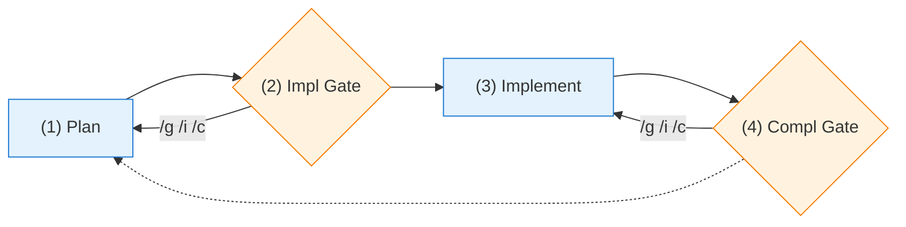
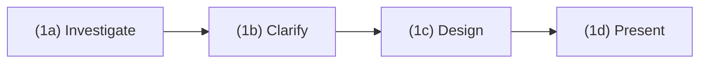
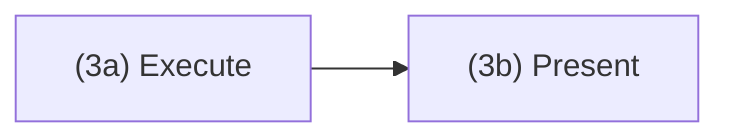

# Tandem Protocol v0.14

Structured checkpoints for Claude Code. You approve each step, Claude checks in along the way.

## Slash Commands

On any invocation, locate your current protocol stage and act within it.

- `/begin` — start planning
- `/i` — self-assess + fix
- `/pr` — proceed past gate
- `/q` — quote current step
- `/g` — adversarial review
- `/c` — compliance vs guides
- `/p` — grade plan
- `/w` — grade results
- `/a` — grade analysis
- `/s` — skeptical review

---

# The Protocol


```mermaid
flowchart LR
    S1["(1) Plan"] --> S2{"(2) Impl Gate"}
    S2 -->|"/g /i /c"| S1
    S2 --> S3["(3) Implement"]
    S3 --> S4{"(4) Compl Gate"}
    S4 -->|"/g /i /c"| S3
    S4 -.-> S1

    style S1 fill:#e3f2fd,stroke:#1976d2
    style S3 fill:#e3f2fd,stroke:#1976d2
    style S2 fill:#fff3e0,stroke:#f57c00
    style S4 fill:#fff3e0,stroke:#f57c00
```

Before `ExitPlanMode`, the plan must have executable bash under both gate sections:
- **At Implementation Gate**: `evtctl contract`, `evtctl plan`, `evtctl task`, `evtctl claim`, `era store`
- **At Completion Gate**: `evtctl complete`, `evtctl done`, `era store`, `git commit`

Do not exit plan mode without both.

## 1. Plan


```mermaid
flowchart LR
    A["(1a) Investigate"] --> B["(1b) Clarify"] --> C["(1c) Design"] --> D["(1d) Present"]
```

**1a Investigate:** Read codebase, identify affected files, note line refs, `mcp__era__search` for prior context, web search if needed.

**1b Clarify:** Ask user about uncertainties. User controls scope — Claude MAY suggest deferring, MAY NOT unilaterally defer.

**1c Design:** `EnterPlanMode`. If existing plan found: quote verbatim, grade analysis ("Do I understand this?"), grade quality ("Is this sound?"), STOP for user direction. Otherwise create new plan:

Plan = HOW (approach, changes). Contract = WHAT (criteria, published via `evtctl contract` at gate).
Substitute `<plan-name>` and `<task-id>` with actual values. `<task-id>` comes from `evtctl task` at Impl Gate — record it, use in Completion Gate `evtctl done`. Do NOT use `ls -t` to find plans.

```markdown
# [Project Name]

## Changes
[files + approach]

## At Implementation Gate

    ```bash
    evtctl contract '{"phase":"objective","criteria":["criterion1","criterion2"]}'
    evtctl plan ~/.claude/plans/<plan-name>.md
    evtctl task "objective"
    # Note task ID from output, then:
    evtctl claim <task-id> claude
    era store --type session -t "<project-basename>,plan" "$(cat <<'MEMO'
    <1-3 sentences: objective and key design decisions>
    MEMO
    )"
    ```

## At Completion Gate

    ```bash
    # Every contract criterion must appear: "delivered"+evidence, "dropped"+reason, or "added"+evidence
    evtctl complete '<compose: {"criteria":[{"name":"...","status":"...","evidence":"..."},...]}'
    evtctl done <task-id> "complete"
    era store --type session -t "<project-basename>,completion" "$(cat <<'MEMO'
    <what delivered/dropped, /i lessons, technical insights>
    MEMO
    )"
    git add file1.go file2.go  # actual files at completion time
    git commit -m "description

    Co-Authored-By: Claude <noreply@anthropic.com>"
    ```

## Verification
[commands to verify]
```

**1d Present:** Auto `/i` (max 3, log each, stop when exhausted). Validate plan from 1c has both gate sections with required executable commands. `ExitPlanMode`. **STOP until user accepts.**

## Gate Grading

At either gate, `/g` `/i` `/c` fix then return to current presentation step (1d or 3b).

- `/g`: external review + fix (once at initial presentation, calibrated projects only)
- `/i`: self-assess + fix, re-present (repeat until exhausted)
- `/c`: grade vs guides + fix (after `/i` plateau); ask "Can I fix this now?" — yes → fix, no → capture in guide
- Log: `evtctl interaction "/X -> what found and fixed"`

## 2. Implementation Gate

**On user acceptance:** execute the "At Implementation Gate" executable bash block from the plan file.

**STOP: do not implement until the gate bash block has executed.**

## 3. Implement


```mermaid
flowchart LR
    A["(3a) Execute"] --> B["(3b) Present"]
```

**3a Execute:** Implement each contract criterion.

**3b Present:** Auto `/i` (max 3, log each, stop when exhausted). Show results + verification per criterion. Update plan file from 1c:
- Replace `git add` with actual files changed
- Compose attestation JSON (each criterion + status + evidence)
- Compose session memory (delivered/dropped, /i lessons, insights)

Print plan file, show the completion bash block. Ask "May I proceed?" **STOP until approved.**

## 4. Completion Gate

**On "proceed":** execute the "At Completion Gate" executable bash block from the plan file.

## Install

```bash
cd ~ && git clone https://codeberg.org/binaryphile/tandem-protocol.git
mkdir -p ~/.claude/commands && ln -sf ~/tandem-protocol/commands/*.md ~/.claude/commands/
```

Add `@~/tandem-protocol/README.md` to your project's CLAUDE.md.
