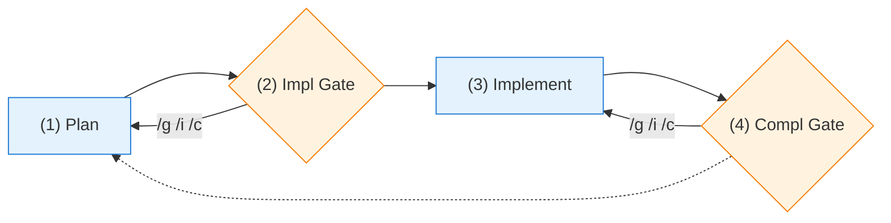
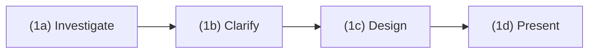
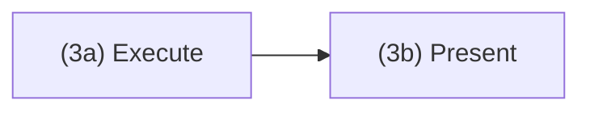

# Tandem Protocol v0.14

 Structured checkpoints for Claude Code. You approve each step, Claude checks in along the way to stay in sync with the developer's intention.

**Try it:**

```bash
cd ~ && git clone https://codeberg.org/binaryphile/tandem-protocol.git
mkdir -p ~/.claude/commands && ln -sf ~/tandem-protocol/commands/*.md ~/.claude/commands/
echo -e "\n# Tandem Protocol\n@~/tandem-protocol/README.md" >> your-project/CLAUDE.md
```

## Example Session

```
You:    /begin add a config file loader to the CLI
Claude: Questions before planning:                           # ← (1) Plan
        - YAML, JSON, or TOML?
        - Missing config: error or defaults?
You:    YAML, defaults

Claude: [creates plan, presents for review]
You:    [accept plan]                                        # ← (2) Impl Gate

Claude: [publishes contract and plan to Era]

        [implements]                                         # ← (3) Implement

        Done. May I proceed?
You:    /i                                                   # ← improve cycle
Claude: [self-assesses, finds missing validation, fixes]
        Done. May I proceed?
You:    proceed                                              # ← (4) Compl Gate
```

## Slash Commands

All slash commands are protocol interactions. On any invocation, locate your
current protocol stage and act within it.

| Command | Action |
|---------|--------|
| `/begin` | Start planning a task (step 1) |
| `/i` | Self-assess + fix current stage's work |
| `/pr` | Proceed past gate |
| `/q` | Quote current protocol step (recovery) |
| `/g` | Copy adversarial review request to clipboard |
| `/c` | Grade compliance against project guides |
| `/p` | Grade the plan |
| `/w` | Grade final results |
| `/a` | Grade your analysis |
| `/s` | Skeptical review |

## Learn More

See [FEATURES.md](FEATURES.md) for details on:
- **Grading cycles** - Iterative `/g`, `/i`, `/c` improvement before committing
- **Lesson capture** - Route learnings to guides for future sessions
- **Event logging** - Audit trail with Contract/Completion/Interaction entries
- **PI cognitive stages** - Structured thinking for complex tasks
- **Multi-phase projects** - Maintain coherence across sessions

---

# The Protocol

## Overview


```mermaid
flowchart LR
    S1["(1) Plan"] --> S2{"(2) Impl Gate"}
    S2 -->|"/g /i /c"| S1
    S2 --> S3["(3) Implement"]
    S3 --> S4{"(4) Compl Gate"}
    S4 -->|"/g /i /c"| S3
    S4 -.-> S1

    style S1 fill:#e3f2fd,stroke:#1976d2
    style S3 fill:#e3f2fd,stroke:#1976d2
    style S2 fill:#fff3e0,stroke:#f57c00
    style S4 fill:#fff3e0,stroke:#f57c00
```

**Before Implementation Gate: MUST verify plan includes bash blocks at each gate.**

Checklist before exiting plan mode:
- [ ] "At Implementation Gate" section with bash block (evtctl contract + evtctl plan + evtctl task + evtctl claim)
- [ ] "At Completion Gate" section with bash block (evtctl complete + evtctl done + commit)

Do not exit plan mode without these executable bash blocks in the plan file.

## 1. Plan


```mermaid
flowchart LR
    A["(1a) Investigate"] --> B["(1b) Clarify"] --> C["(1c) Design"] --> D["(1d) Present"]
```

**Substeps (1a-1d):**

### 1a: Investigate

```bash
read_codebase
identify_affected_files
note_line_refs              # will shift after edits
mcp__era__search  # check memory for relevant context
web_search                  # find resources for unfamiliar patterns
```

### 1b: User Clarification

```bash
for question in $uncertainties; do
    AskUserQuestion "$question"
done
# User controls scope - Claude MAY suggest deferring, MAY NOT unilaterally defer
```

### 1c: Design

```bash
EnterPlanMode  # creates ~/.claude/plans/<name>.md
```

**If existing plan found** (system-reminder shows plan content):
1. Quote plan verbatim (no summarizing)
2. Grade analysis: "Do I understand this?"
3. Grade plan quality: "Is this sound?"
4. Wait for user direction before proceeding

**Otherwise, create new plan:**

**Plan template** (gate sections contain literal bash blocks to execute).
Plan file = HOW (approach, changes). Contract = WHAT (criteria) — published to Era via `evtctl contract` at the gate, not stored in the plan file.
When writing a plan, substitute `<plan-name>` and `<task-id>` with actual values. `<task-id>` is the era event ID returned by `evtctl task` at the Implementation Gate — record it then, substitute into the Completion Gate's `evtctl done` call. Do NOT use `ls -t` to find plans at execution time — multiple may coexist and `ls -t` will pick the wrong one.

```markdown
# [Project Name]

## Changes
[files + approach]

## At Implementation Gate

    ```bash
    evtctl contract << 'JSONL'
    {"phase":"objective"}
    {"name":"criterion1"}
    {"name":"criterion2"}
    JSONL
    evtctl plan ~/.claude/plans/<plan-name>.md
    evtctl task "objective"
    # Note the task ID from output, then:
    evtctl claim <task-id> claude
    # <task-id> also needed for Completion Gate evtctl done command
    ```

## At Completion Gate

    ```bash
    # Compose attestation JSONL — every contract criterion must appear:
    #   status: "delivered" + evidence, "dropped" + reason, "added" + evidence
    evtctl complete << 'JSONL'
    <compose from contract criteria at completion time>
    JSONL
    evtctl done <task-id> "complete"

    # Stage files changed (write actual list at completion time, not planning time)
    git add file1.go file2.go
    git commit -m "description

    Co-Authored-By: Claude <noreply@anthropic.com>"
    ```

## Verification
[Commands to verify]
```

### 1d: Present

```bash
# Auto-improve: self-assess and fix until exhausted (max 3 cycles)
for round in 1 2 3; do
    improvements=$(self_assess_plan)
    if [ -z "$improvements" ]; then break; fi
    fix_issues "$improvements"
    log_interaction "auto /i -> $improvements"
done

# Validate plan file (use the known plan filename from step 1c)
PLAN=~/.claude/plans/<plan-name>.md
test -f "$PLAN" || exit 1
grep -q "At Implementation Gate" "$PLAN" || exit 1
grep -q "At Completion Gate" "$PLAN" || exit 1

ExitPlanMode  # user acceptance = Implementation Gate "proceed"
# STOP until accepted
```

## 2. Implementation Gate

Grading cycles happen during plan review (before user accepts):

| Command | Action | When |
|---------|--------|------|
| `/g` | Apply external review feedback + fix | Once, at initial plan presentation (calibrated projects only) |
| `/i` | Self-assess plan + fix, re-present at 1d | Repeated until exhausted |
| `/c` | Grade plan against project guides + fix | After `/i` cycles plateau |

**On `/g`** (once at plan presentation — log, apply external feedback + fix, re-present at step 1d):
```bash
evtctl interaction "/g -> reviewer noted Y, addressed"
```

**On `/i`** (log, improve plan, re-present at step 1d):
```bash
evtctl interaction "/i -> found gap in plan, addressed"
```

**On `/c`** (log, grade plan against guides + fix, re-present at step 1d):
```bash
evtctl interaction "/c -> plan non-compliant with X guide, fixed"
# Before deducting: "Can I fix this now?" YES → deduction, NO → capture in guide
```

**IMPLEMENTATION GATE ACTIONS** (when user accepts the plan):

Execute the bash block from the plan file's "At Implementation Gate" section. This publishes the Contract and plan to Era, creates tasks, and claims them in one atomic operation.

**STOP: Do not implement until the Implementation Gate bash block has been executed.**

## 3. Implement


```mermaid
flowchart LR
    A["(3a) Execute"] --> B["(3b) Present"]
```

**Substeps (3a-3b):**

### 3a: Execute

```bash
for criterion in $contract_criteria; do
    implement "$criterion"
done
# Progress logged as single Completion entry at gate (not incrementally)
```

### 3b: Present

```bash
# Auto-improve: self-assess and fix until exhausted (max 3 cycles)
for round in 1 2 3; do
    improvements=$(self_assess_implementation)
    if [ -z "$improvements" ]; then break; fi
    fix_issues "$improvements"
    log_interaction "auto /i -> $improvements"
done

show_results
for criterion in $contract_criteria; do
    show_verification "$criterion"  # how user can verify
done

# Update the plan's git add line with actual files changed during implementation
# (the plan template has placeholders — replace with real file list now)
PLAN=~/.claude/plans/<plan-name>.md
update_git_add_in "$PLAN"

# Compose attestation JSONL in plan file's Completion Gate:
# Copy each criterion from contract, add status + evidence/reason
# evtctl complete validates coverage — missing criteria trigger warnings
update_completion_attestation_in "$PLAN"

cat "$PLAN"  # puts bash block back in context

# Show what will execute on approval
echo "On 'proceed', I will execute the At Completion Gate bash block above"
AskUserQuestion "May I proceed?"

# STOP until approved
# On "proceed": execute the At Completion Gate bash block from $PLAN
```

## 4. Completion Gate

Grading cycles at the gate (until "proceed"):

| Command | Action | When |
|---------|--------|------|
| `/g` | Apply external review feedback + fix | Once, at initial gate presentation (calibrated projects only) |
| `/i` | Self-assess + fix, re-present at 3b | Repeated until exhausted |
| `/c` | Grade against project guides + fix | After `/i` cycles plateau |

**On `/g`** (once at gate entry — log, apply external feedback + fix, re-present at step 3b):
```bash
evtctl interaction "/g -> reviewer noted Y, addressed"
```

**On `/i`** (log, improve, re-present at step 3b):
```bash
evtctl interaction "/i -> found edge case, added handling"
```

**On `/c`** (log, grade against guides + fix, re-present at step 3b):
```bash
evtctl interaction "/c -> non-compliant with X guide, fixed"
# Before deducting: "Can I fix this now?" YES → deduction, NO → capture in guide
```

**COMPLETION GATE ACTIONS** (when user says "proceed"):

Execute the Completion Gate bash block from the plan file. This publishes Completion to Era, deletes tasks, and commits.

