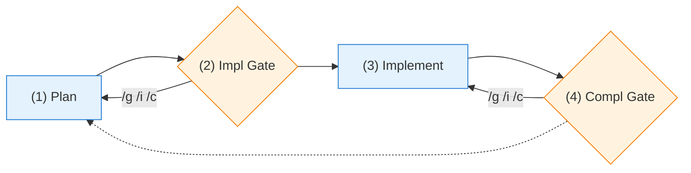
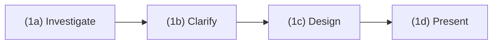
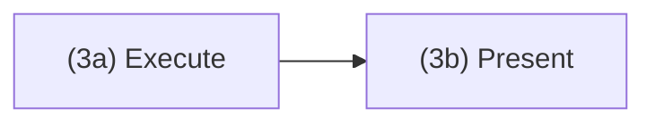

# Tandem Protocol v0.10

 Structured checkpoints for Claude Code. You approve each step, Claude checks in along the way to stay in sync with the developer's intention.

**Try it:**

```bash
cd ~ && git clone https://codeberg.org/binaryphile/tandem-protocol.git
mkdir -p ~/.claude/commands && ln -sf ~/tandem-protocol/tandem.md ~/.claude/commands/tandem.md
echo -e "\n# Tandem Protocol\n@~/tandem-protocol/README.md" >> your-project/CLAUDE.md
```

## Example Session

```
You:    /tandem add a config file loader to the CLI
Claude: Questions before planning:                           # ← (1) Plan
        - YAML, JSON, or TOML?
        - Missing config: error or defaults?
You:    YAML, defaults

Claude: [creates plan, presents for review]
You:    [accept plan]                                        # ← (2) Impl Gate

Claude: [logs to plan-log.md]
        2024-01-15T10:00:00Z | Contract: Config loader
        [ ] YAML parsing
        [ ] default fallback

        [implements]                                         # ← (3) Implement

        Done. May I proceed?
You:    /i                                                   # ← improve cycle
Claude: [self-assesses, finds missing validation, fixes]
        Done. May I proceed?
You:    proceed                                              # ← (4) Compl Gate
```

Use `/tandem` anytime to refocus when things drift.

## Usage

### When to use `/tandem`

- At session start: `/tandem make a plan to...`
- When Claude skips steps or scope changes
- Anytime things feel off track

## Learn More

See [FEATURES.md](FEATURES.md) for details on:
- **Grading cycles** - Iterative `/g`, `/i`, `/c` improvement before committing
- **Lesson capture** - Route learnings to guides for future sessions
- **Event logging** - Audit trail with Contract/Completion/Interaction entries
- **PI cognitive stages** - Structured thinking for complex tasks
- **Multi-phase projects** - Maintain coherence across sessions

---

# The Protocol

## Overview


```mermaid
flowchart LR
    S1["(1) Plan"] --> S2{"(2) Impl Gate"}
    S2 -->|"/g /i /c"| S1
    S2 --> S3["(3) Implement"]
    S3 --> S4{"(4) Compl Gate"}
    S4 -->|"/g /i /c"| S3
    S4 -.-> S1

    style S1 fill:#e3f2fd,stroke:#1976d2
    style S3 fill:#e3f2fd,stroke:#1976d2
    style S2 fill:#fff3e0,stroke:#f57c00
    style S4 fill:#fff3e0,stroke:#f57c00
```

**Before Implementation Gate: MUST verify plan includes bash blocks at each gate.**

Checklist before exiting plan mode:
- [ ] "At Implementation Gate" section with bash block (Contract + task creation)
- [ ] "At Completion Gate" section with bash block (Completion + task deletion + commit)

Do not exit plan mode without these executable bash blocks in the plan file.

## 1. Plan


```mermaid
flowchart LR
    A["(1a) Investigate"] --> B["(1b) Clarify"] --> C["(1c) Design"] --> D["(1d) Present"]
```

**Substeps (1a-1d):**

### 1a: Investigate

```bash
read_codebase
identify_affected_files
note_line_refs              # will shift after edits
mcp__era__search  # check memory for relevant context
web_search                  # find resources for unfamiliar patterns
```

### 1b: User Clarification

```bash
for question in $uncertainties; do
    AskUserQuestion "$question"
done
# User controls scope - Claude MAY suggest deferring, MAY NOT unilaterally defer
```

### 1c: Design

```bash
EnterPlanMode  # creates ~/.claude/plans/<name>.md
```

**Plan template** (gate sections contain literal bash blocks to execute).
When writing a plan, substitute `<plan-name>`, `<session-dir>`, and `<task-id>` with actual values. `<task-id>` is the era event ID returned by `mk task` at the Implementation Gate — record it then, substitute into the Completion Gate's `mk done` call. Do NOT use `ls -t` to find plans/sessions at execution time — multiple may coexist and `ls -t` will pick the wrong one.

**Multi-phase plans:**
1. **Initial planning**: Plan current phase fully; list future phases at end (no skeletons).
2. **When phase becomes current**: Plan that phase. Remove it from future phases list.
3. **On phase completion**: Remove that phase's section from the plan file.
4. **When last phase completes**: Delete the plan file.

```markdown
# [Project Name] - Phased Implementation

## Context
1. **Phase 1: [Name]** ← CURRENT
2. **Phase 2: [Name]**
3. **Phase 3: [Name]**

---

# Phase 1: [Name]

## Objective
[1-2 sentences]

## Success Criteria
- [ ] criterion1
- [ ] criterion2

## Changes
[files + line refs]

## At Implementation Gate

    ```bash
    # Log Contract + Create Tasks (execute this entire block)
    touch plan-log.md
    cat >> plan-log.md << EOF
    $(date -u +%Y-%m-%dT%H:%M:%SZ) | Contract: Phase 1 - objective
    [ ] criterion1
    [ ] criterion2
    EOF

    mk task "Phase 1 - objective"
    # Note the task ID from output for the Completion Gate mk done command

    # Create tasks via direct file write (use actual session dir name)
    cat > ~/.claude/tasks/<session-dir>/1.json << TASK
    {"id": "1", "subject": "Task 1", "status": "in_progress", "blocks": [], "blockedBy": []}
    TASK
    ```

## At Completion Gate

    ```bash
    # Log + Delete + Commit (execute this entire block)
    cat >> plan-log.md << EOF
    $(date -u +%Y-%m-%dT%H:%M:%SZ) | Completion: Phase 1
    [x] criterion1 (evidence)
    [x] criterion2 (evidence)
    EOF

    mk done <task-id> "Phase 1 complete"

    # Delete task files (use actual session dir name)
    rm ~/.claude/tasks/<session-dir>/*.json 2>/dev/null

    # Single-phase: delete plan file by explicit name
    # Multi-phase: (1) mark phase done in Context, (2) remove completed phase section
    rm ~/.claude/plans/<plan-name>.md  # <- ONLY for single-phase or final phase!

    # Stage files changed by this phase (write actual list at completion time, not planning time)
    git add file1.go file2.go plan-log.md
    git commit -m "Phase 1 complete

    Co-Authored-By: Claude <noreply@anthropic.com>"
    ```

## Verification
[Commands to verify success criteria]

---

## Future Phases

Do NOT plan these until they become current. Remove from this list when planning begins.

- Phase 2: [Name]
- Phase 3: [Name]
```

### 1d: Present

```bash
# Validate plan file (use the known plan filename from step 1c)
PLAN=~/.claude/plans/<plan-name>.md
test -f "$PLAN" || exit 1
grep -q "At Implementation Gate" "$PLAN" || exit 1
grep -q "At Completion Gate" "$PLAN" || exit 1

ExitPlanMode  # user acceptance = Implementation Gate "proceed"
# STOP until accepted
```

## 2. Implementation Gate

Grading cycles happen during plan review (before user accepts):

| Command | Action | When |
|---------|--------|------|
| `/g` | Apply external review feedback + fix | Once, at initial plan presentation (calibrated projects only) |
| `/i` | Self-assess plan + fix, re-present at 1d | Repeated until exhausted |
| `/c` | Grade plan against project guides + fix | After `/i` cycles plateau |

**On `/g`** (once at plan presentation — log, apply external feedback + fix, re-present at step 1d):
```bash
cat >> plan-log.md << EOF
$(date -u +%Y-%m-%dT%H:%M:%SZ) | Interaction: /g -> reviewer noted Y, addressed
EOF
```

**On `/i`** (log, improve plan, re-present at step 1d):
```bash
cat >> plan-log.md << EOF
$(date -u +%Y-%m-%dT%H:%M:%SZ) | Interaction: /i -> found gap in plan, addressed
EOF
```

**On `/c`** (log, grade plan against guides + fix, re-present at step 1d):
```bash
cat >> plan-log.md << EOF
$(date -u +%Y-%m-%dT%H:%M:%SZ) | Interaction: /c -> plan non-compliant with X guide, fixed
EOF
```

**IMPLEMENTATION GATE ACTIONS** (when user accepts the plan):

Execute the bash block from the plan file's "At Implementation Gate" section. This logs the Contract AND creates tasks in one atomic operation.

**STOP: Do not implement until the Implementation Gate bash block has been executed.**

## 3. Implement


```mermaid
flowchart LR
    A["(3a) Execute"] --> B["(3b) Present"]
```

**Substeps (3a-3b):**

### 3a: Execute

```bash
for criterion in $contract_criteria; do
    implement "$criterion"
done
# Progress logged as single Completion entry at gate (not incrementally)
```

### 3b: Present

```bash
show_results
for criterion in $contract_criteria; do
    show_verification "$criterion"  # how user can verify
done

# Update the plan's git add line with actual files changed during implementation
# (the plan template has placeholders — replace with real file list now)
PLAN=~/.claude/plans/<plan-name>.md
update_git_add_in "$PLAN"

cat "$PLAN"  # puts bash block back in context

# Show what will execute on approval
echo "On 'proceed', I will execute the At Completion Gate bash block above"
AskUserQuestion "May I proceed?"

# STOP until approved
# On "proceed": execute the At Completion Gate bash block from $PLAN
```

## 4. Completion Gate

Grading cycles at the gate (until "proceed"):

| Command | Action | When |
|---------|--------|------|
| `/g` | Apply external review feedback + fix | Once, at initial gate presentation (calibrated projects only) |
| `/i` | Self-assess + fix, re-present at 3b | Repeated until exhausted |
| `/c` | Grade against project guides + fix | After `/i` cycles plateau |

**On `/g`** (once at gate entry — log, apply external feedback + fix, re-present at step 3b):
```bash
cat >> plan-log.md << EOF
$(date -u +%Y-%m-%dT%H:%M:%SZ) | Interaction: /g -> reviewer noted Y, addressed
EOF
```

**On `/i`** (log, improve, re-present at step 3b):
```bash
cat >> plan-log.md << EOF
$(date -u +%Y-%m-%dT%H:%M:%SZ) | Interaction: /i -> found edge case, added handling
EOF
```

**On `/c`** (log, grade against guides + fix, re-present at step 3b):
```bash
cat >> plan-log.md << EOF
$(date -u +%Y-%m-%dT%H:%M:%SZ) | Interaction: /c -> non-compliant with X guide, fixed
EOF
```

**COMPLETION GATE ACTIONS** (when user says "proceed"):

Execute the Completion Gate bash block from the plan file. This logs Completion with evidence, deletes tasks, and commits.

