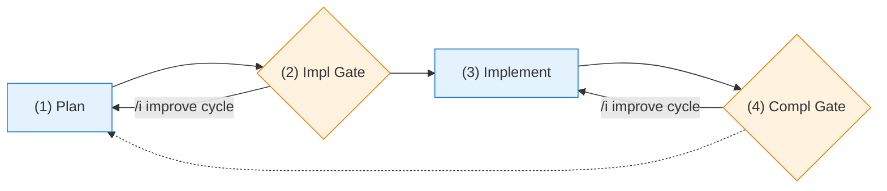
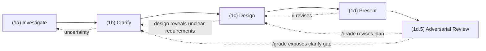
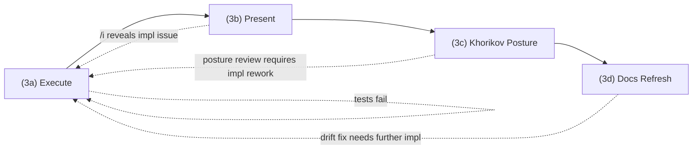

# Tandem Protocol v0.14

Structured checkpoints for Claude Code. You approve each step, Claude checks in along the way.

## Slash Commands

On any invocation, locate your current protocol stage and act within it.

- `/begin` — start planning
- `/i` — "improve" - self-assess + fix
- `/grade` — adversarial review
- `/c` — compliance with guidelines

---

# The Protocol


```mermaid
flowchart LR
    S1["(1) Plan"] --> S2{"(2) Impl Gate"}
    S2 -->|"/i improve cycle"| S1
    S2 --> S3["(3) Implement"]
    S3 --> S4{"(4) Compl Gate"}
    S4 -->|"/i improve cycle"| S3
    S4 -.-> S1

    style S1 fill:#e3f2fd,stroke:#1976d2
    style S3 fill:#e3f2fd,stroke:#1976d2
    style S2 fill:#fff3e0,stroke:#f57c00
    style S4 fill:#fff3e0,stroke:#f57c00
```

Before `ExitPlanMode`, the plan must have:
- Executable bash at **At Implementation Gate**: `evtctl contract`, `evtctl plan`, `evtctl task` (if new), `evtctl claim`, `era store`
- A **Phase 3c Khorikov Posture** checkpoint after 3b Present: review the cycle's tests/code through Khorikov's classical-school lens, refactor if needed (see §3).
- A **Phase 3d Documentation Refresh** checkpoint after 3c with **two passes** (scope-internal + scope-external per #6191): re-read affected normative docs, amend any drift, commit + push amendments BEFORE attestation. Evidence on the `docs refreshed` criterion is one of five literal forms — see §3d for the canonical enumeration.
- A mandatory **🛑 GATE C STOP stanza** directly above `## At Completion Gate` (handshake to halt execution before the gate bash runs).
- Executable bash at **At Completion Gate**: `evtctl complete`, `evtctl done`, `era store`, `git commit`. (Docs-review now lives in Phase 3d, not embedded in this gate bash.)
- For changes affecting **user-visible behavior or operator workflow**: a `docs refreshed` criterion (evidence per §3d's forms; evidence MUST cite the governing UC by `docs/use-cases.md` path or `UC-N` for stream-visible linkage). If no UC exists, Commit 1 in Phase 3a creates it. (Optional drift detection: run `bash tests/doc-lint.sh` after touching this checklist or §3a's table to verify vocabulary alignment — see UC14.)

Do not exit plan mode without the gate sections, the GATE C STOP stanza, the Phase 3c Khorikov checkpoint, and the Phase 3d docs-review checkpoint when applicable.

**Doc-level WHAT/HOW separation.** Use cases = **WHAT** (behavioral contracts, observable postconditions, stakeholder interests). Design docs = **HOW** (mechanisms, wire formats, schemas, retry strategies). Keep design-level details out of UCs — they drift faster; a UC's contract should survive re-implementation. Technology variations belong in design, not the UC body.

## Stream as source of truth

Streams are append-only. Plans and attestations **reference** stream ids (event ids, task ids, commit SHAs); they do **not memoize** payload content.

### Do not copy payloads into plans

A plan that restates contract/attestation/interaction content drifts the moment either side is edited. Quote the event id; let the reader run `evtctl` against the stream.

### Use bash substitution to enforce adherence at gate time

Plans can diverge from reality; `$(...)` substitutions in the gate bash cannot — they evaluate against the current stream. Same trick `validate-attestation` uses. Use wherever the LLM's claim could diverge from stream state.

| Stage | Pattern | Bash |
|---|---|---|
| Planning 1a | surface pending tasks | `OPEN=$(evtctl open); [[ -z $OPEN ]] \|\| cat <<<"$OPEN"` |
| Impl Gate | refuse double-claim (`evtctl claims` prints `#<id>  <date>  <claimer>  <desc>` or `no active claims`) | `evtctl claims \| grep -qE "^#$TASK_ID\b" && { echo "task $TASK_ID already claimed"; exit 1; }` |
| Completion Gate | confirm task is open (`evtctl open` prints `#<id>  <date>  task  <desc>`) | `evtctl open \| grep -qE "^#$TASK_ID\b" \|\| { echo "task $TASK_ID not in open list"; exit 1; }` |

### Reconciliation audit

Audit each project's stream for **contracts without a satisfying completion**. Canonical join: criterion-name string-equality between `contract.criteria[]` and `complete.criteria[].name` (superset rule — completion's names ⊇ contract's criteria).

The audit filters out contracts that have been explicitly superseded by a later contract (i.e., any contract whose `id` appears as the `supersedes` field of another contract). The intent of publishing a supersession event is to declare the precursor's criteria dead; treating it as unmatched would contradict that intent. See `design.md` §"Supersedes-field schema" for the field definitions and the deferred validate-attestation work in tasks.era #7901.

```bash
contracts=$(era query "tasks.$PROJECT" 'type = "contract"' --json)
completes=$(era query "tasks.$PROJECT" 'type = "complete"' --json)
jq -n --argjson C "$contracts" --argjson D "$completes" '
  def parse_contract: {id, created: .created_at,
    criteria: (try (.payload|fromjson|.criteria // []) catch []),
    supersedes: (try (.payload|fromjson|.supersedes // null) catch null)};
  def parse_complete: {id, created: .created_at,
    names: (try (.payload|fromjson|.criteria // []|map(.name)) catch [])};
  ($C|map(parse_contract)) as $cs |
  ($D|map(parse_complete)) as $ds |
  ($cs | map(select(.supersedes != null) | .supersedes) | unique) as $precursors |
  $cs
  | map(select(.id as $cid | $precursors | index($cid) | not))
  | map(. as $c |
      ($ds | map(select(.created > $c.created
                     and (.names as $n | $c.criteria|length > 0
                          and ($c.criteria|all(. as $k | ($n|index($k))!=null)))))
          | first) as $m |
      {contract:$c.id, matched:($m.id // null), criteria:$c.criteria})
  | map(select(.matched == null))'
```

To inspect supersession chains (e.g., audit trail of criterion-renames), query the stream for events with a supersedes field: `era query "tasks.$PROJECT" 'payload ~ "supersedes"' --json`. These chains are intentionally excluded from the reconciliation audit but remain visible in the stream.

Unmatched contracts are *candidates* for WIP, not confirmations. See `design.md` §"Reconciliation audit — interpreting unmatched contracts" for causes + reconcile-against checklist.

## 1. Plan


```mermaid
flowchart LR
    A["(1a) Investigate"] --> B["(1b) Clarify"] --> C["(1c) Design"] --> D["(1d) Present"] --> E["(1d.5) Adversarial Review"]
    B -.->|"uncertainty"| A
    C -.->|"design reveals unclear requirements"| B
    D -.->|"/i revises"| C
    E -.->|"/grade revises plan"| C
    E -.->|"/grade exposes clarify gap"| B
```

*Diagram shows standard-tier flow. Trivial-tier cycles collapse 1a/1b and skip 1d/1d.5/3c. High-risk-tier cycles run the same flow plus per-phase-entry `evtctl interaction` events.*

**Phase regression is normal.** Real cycles loop along these edges:

| From | To | Trigger |
|---|---|---|
| 1b | 1a | clarify-answers surface new uncertainty |
| 1c | 1b | design reveals unclear requirements |
| 1d | 1c | /i reveals plan issue |
| 1d.5 | 1c | /grade reveals plan issue |
| 1d.5 | 1b | /grade exposes a clarification gap *deeper than 1c can fix* |
| 3a | 3a | tests fail and need re-edits |
| 3b | 3a | /i reveals an impl issue |
| 3c | 3a | posture review requires impl rework |
| 3d | 3a | drift fix requires further implementation |

Log each regression: `evtctl interaction "/loopback <from>-><to>: <reason>"`.

Log each in-cycle scope-fold: `evtctl interaction "/scope-fold <task-id>: <reason>"`. When unexpected work surfaces mid-impl, see `design.md` §"Alternatives without full re-entry" for the four-option decision tree (scope-fold / defer / new cycle / /loopback).

**1a Investigate:**
- Read codebase, identify affected files + line refs; `era search` for prior context; web search if needed.
- **Verify load-bearing static-analysis findings with a runtime experiment** (static reads have FP/FN rates a discriminating experiment doesn't).
- For debugging: complete differential diagnosis — enumerate every actor in the failing flow (client process, OS service, browser cookie jar, identity provider, network path, server policy, recent commits); each is a candidate until evidence rules it out. **If it's not in the differential, it can't be in the diagnosis.**
- Adversarial review *narrows* the differential, doesn't expand it. When review keeps confirming the same conclusion across rounds, the differential is suspect, not the testing.

**Scope check.** If 1a reveals work below Tandem's ceremony floor (single-function fix, ~< 100 LOC, no UC implications, no architectural consequence), propose **dropping the cycle** — direct commit + one `evtctl interaction` event is the substitute. Signal: when adversarial /grade reviewers converge across rounds on "plan too large for fix," the redirect is ceremony-is-wrong-framing, not "the plan needs more polish." (Empirical anchor: era #4997.)

**Tier classification.** After Scope check (if the cycle isn't dropped), classify the cycle into one of three tiers; agent self-classifies based on the eligibility rules below; user can override at 1b. **Tier may escalate mid-cycle** when a high-risk predicate (multi-repo / public API change / data migration) is discovered post-classification — log `evtctl interaction "/tier-escalate <from>-><to>: <reason>"` and apply the new tier's scaffolding from that point. **Downgrade is forbidden** mid-cycle (prevents ceremony gaming).

| Tier | Eligibility (apply first matching from top) | Scaffolding |
|---|---|---|
| **Drop** | (Scope check above; below ceremony floor) | Cycle dropped; direct commit + interaction event |
| **Trivial** | single-file diff ≤20 lines AND no API contract change | 1a/1b collapsed into one quick step; `/i` at 1d exempted; `/grade` at 1d.5 exempted; minimum plan sections only (Contract + Impl Gate bash + Completion Gate bash + Verification — no Context, no /i log, no scope justification) |
| **Standard** | (default — everything not matching the above or below) | Current full ceremony: 1a/1b/1c/1d/1d.5 as documented; `/i` per Gate Grading rule; `/grade` required at 1d.5; 3c Khorikov posture; 3d docs refresh |
| **High-risk** | multi-repo OR public API change OR data migration (any one) | All standard ceremony PLUS: stream-based evidence ledger via granular `evtctl interaction` events at each phase entry (`/phase 1a entered`, `/phase 1b entered`, ...) and at each major decision point (`/decision: X chosen over Y because Z`). No new file types; the event stream IS the ledger. (#3881 will decide separately about plan.md content cleanup.) |

Waterfall: apply the first matching tier from least to most ceremony (drop → trivial → standard → high-risk). When work qualifies for multiple tiers (e.g., a 15-line single-function fix qualifies for both drop and trivial), pick the one with less ceremony. See `design.md` for tier-mechanics detail.

**1b Clarify:** Ask user about uncertainties. User controls scope — Claude MAY suggest deferring, MAY NOT unilaterally defer. Claude MAY also suggest **dropping** the cycle entirely when 1a's scope check identifies the work as below-floor. Tier classification from §1a can also be overridden at 1b (user controls ceremony level). You MUST ask at least one question.

**1c Design:** `EnterPlanMode`. If existing plan found: quote verbatim, grade analysis ("Do I understand this?"), grade quality ("Is this sound?"), STOP for user direction. Otherwise create new plan:

Plan = HOW (approach, changes). Contract = WHAT (criteria, published via `evtctl contract` at gate).
Substitute `<plan-name>` and `<task-id>` with actual values. Do NOT use `ls -t` to find plans.

Plan filenames follow `<prefix>-<random>.md` where `<prefix>` is the first whitespace-separated token of `/begin`'s arguments when that token matches `^[1-9][0-9]*$`, else `$(date -u +%Y%m%dT%H%M%S)-$RANDOM`. The convention reduces but does not eliminate the silent-overwrite class — see `design.md` §"Plan filename uniqueness — convention" for the fail-loud rename mechanism, residual risks, and bootstrap exception.

Plans MAY adopt stricter-than-protocol conventions for local discipline, but MUST identify them as plan-local and MUST specify breach-handling using protocol mechanisms. See `design.md` §"Alternatives without full re-entry" for the canonical breach-handling taxonomy.

```markdown
# [Project Name]

## Changes
[files + approach]

## At Implementation Gate

    ```bash
    src=~/.claude/plans/<claude-code-assigned>.md
    dst=~/.claude/plans/<plan-name>.md
    if [[ -f $src && -f $dst && $src != $dst ]]; then
      echo "FAIL: collision on $dst; manually resolve (rm $dst or mv $dst $dst.bak)" >&2; exit 1
    elif [[ -f $src && ! -f $dst ]]; then
      mv "$src" "$dst"                                 # first-time rename, common case
    elif [[ $src == $dst ]]; then
      :                                                # source IS target (bootstrap or already-conv pre-assign); no-op
    elif [[ ! -f $src && -f $dst ]]; then
      :                                                # idempotent re-entry (rename already happened); no-op
    else
      echo "FAIL: neither $src nor $dst exists" >&2; exit 1
    fi
    evtctl contract <<'EOF'
    {"phase":"objective","criteria":["criterion1","criterion2","docs refreshed"]}
    EOF
    evtctl plan ~/.claude/plans/<plan-name>.md
    # <task-id>: originating task ID if continuing existing task, or empty to create new
    TASK_ID=<task-id>
    if [ -z "$TASK_ID" ]; then
      TASK_ID=$(evtctl task "objective")
    fi
    evtctl claim "$TASK_ID" claude
    era store --type session -t "<project-basename>,plan" <<'MEMO'
    <1-3 sentences: objective and key design decisions>
    MEMO
    ```

**🛑 GATE C — Before executing the bash block below:**

1. Compose the actual attestation JSON inline in the gate bash heredoc (criterion name + status + evidence + SHAs from the impl phase). Use `--from-file /tmp/<cycle>-attestation.json` for multi-criterion (per #4070). **Do NOT write back to the plan file** — the plan is immutable post-final-1d.5-exit (see §1d.5 Plan immutability).
2. Compose the actual session memory inline in the `era store` heredoc. Do NOT write back to the plan file.
3. Substitute the actual file list into `git add` inline (the plan template's `git add file1.go file2.go` placeholder stays literal in the plan file).
4. Confirm Phase 3c Khorikov posture review has been performed
   (tests output-based / state-based via captured stdout; mocks at
   inter-system boundary only; refactor logged via /i if applied).
5. Confirm Phase 3d Documentation Refresh has been performed
   (BOTH scope-internal pass — deep re-read of modified docs — AND
   scope-external pass — scan of adjacent normative docs — per #6191;
   all affected docs re-read; drift amended + committed + pushed
   BEFORE this gate; evidence form set on `docs refreshed` criterion
   per §3d's canonical enumeration).
6. Print this updated plan file to the user.
7. Show the completion-gate bash block as it now reads.
8. Ask "May I proceed?" and **wait for explicit approval** before
   executing.

(GATE C is a behavioral safeguard for the operator; mechanical plan-file invariants are enforced by `validate-plan` as a blocking pre-publish hook on `evtctl plan` — see `design.md` §"GATE C STOP stanza — rationale" and §"validate-plan invariants — mechanism".)

## At Completion Gate

    ```bash
    validate-plan ~/.claude/plans/<plan-name>.md || exit 1  # runtime smoke-test (markers already guaranteed by plan-immutability byte-match)

    # Phase 3c (Khorikov posture review) and Phase 3d (docs refresh)
    # have completed before this gate. Docs-drift evidence is already
    # set; amendments (if any) already committed and pushed.

    # Every contract criterion must appear: "delivered"+evidence, "dropped"+reason, or "added"+evidence.
    evtctl complete <<'EOF'
    <compose: {"criteria":[{"name":"...","status":"...","evidence":"..."},...]}>
    EOF
    # <task-id>: originating task ID if continuing existing task, or ID from evtctl task if created new
    evtctl done <task-id> "complete"
    era store --type session -t "<project-basename>,completion" <<'MEMO'
    <what delivered/dropped, /i lessons, technical insights, decision points and rationales>
    MEMO
    git add file1.go file2.go  # actual files at completion time
    git commit -m "description

    Co-Authored-By: Claude <noreply@anthropic.com>"
    ```

## Verification
[commands to verify]
```

**1d Present:** Auto `/i` (≥2 passes; exceed 3 only while finding new defect classes; log each; see Gate Grading; waived for trivial-tier cycles). Validate plan file (`~/.claude/plans/<plan-name>.md`) has both gate sections with required executable commands.

**1d.5 Adversarial Review (required for standard / high-risk; waived for trivial-tier cycles):**

Workflow:
1. Invoke `/grade` (no argument; grades the current plan).
2. **Paste to a fresh model context** to avoid frame-expansion (era memory `088bf6c5c08a`: same-frame graders confirm rather than challenge).
3. Paste grader response back; absorb findings via `/i` (per Gate Grading).
4. Re-grade if absorption changed *substantive content* (semantic changes affecting gates, topology, evidence forms, or workflow; typos don't count).

Exit conditions (any one):
- (a) Grader verdict approves
- (b) Successive rounds plateau on novelty
- (c) Hard cap: 5 rounds (log `/loopback 1d.5->1c: review unbounded`; return to 1c — cycle is wrong-sized or grader uncalibrated; parallel to §1a Scope check's "ceremony-is-wrong-framing" signal from era #4997)

Required grader-response shape (deterministic parsing): `Grade: <letter>` / `Findings: <numbered, probe-tagged + line refs>` / `Verdict: <one paragraph beginning APPROVE / SEND BACK / GAP REMAINS>`. Agent parses verdict's first sentence for loop exit.

Log each round: `evtctl interaction "/grade r<N>: <letter>, <findings count>, <verdict-summary>"`.

After loop exit: `ExitPlanMode`. Then surface the plan file and impl-gate bash. Ask "May I proceed?" **STOP until approved.**

**Plan immutability.** Plan file is mutable during plan mode (1a/1b/1c/1d/1d.5 /grade SEND BACK loops); immutable at each 1d.5-final-exit. Post-final-exit, runtime data (attestation JSON, session memos, git-add file list) is composed inline at gate-time; do NOT write back. Phase regression to plan mode supported via `/loopback` + plan-event + contract-event supersession chains (Tier 1 #4070 pattern). Plan-file invariants are mechanically enforced by `validate-plan` (blocking pre-publish hook on `evtctl plan`); see `design.md` §"Plan immutability" for full mechanics and §"validate-plan invariants — mechanism" for the enforced invariant set.

**Attestation payload shape.** For single-line or single-criterion evidence, inline `<<'EOF' ... EOF` is fine. For multi-criterion or multi-paragraph evidence, prefer composing the JSON in a file and publishing with `evtctl complete --from-file path.json` — pure JSON proofreads more reliably than JSON mixed with shell heredoc indentation, and parse errors point at the actual offending line. Discovered during era task #4052: a missing closing `}` inside an inline heredoc surfaced as a misleading "expected }" error at the wrong line.

## Gate Grading

At either gate if there are guides for compliance, issue a single `/c` for compliance first and fix, prior to doing the current presentation step (1d or 3b).

- `/i`: find opportunities to improve and execute on them. `/i` passes remain useful while each surfaces a materially new defect class. **Run at least two passes. Three is the normal cap; exceed it only when each additional pass finds genuinely new issues.** When passes mostly reshuffle previously-identified feedback, stop iterating and proceed.
- `/c`: grade vs guides + fix; ask "Can I fix this now?" — yes → fix, no → capture in guide
- `/grade`: invoke at any gate to compose a grading request (clipboard via `wl-copy`); mandatory at §1d.5 before `ExitPlanMode`.
- Log: `evtctl interaction "/X -> what found and fixed"`

## 2. Implementation Gate

**On user acceptance:** execute the "At Implementation Gate" executable bash block from the plan file.

**STOP: do not implement until the gate bash block has executed.**

## 3. Implement


```mermaid
flowchart LR
    A["(3a) Execute"] --> B["(3b) Present"] --> C["(3c) Khorikov Posture"] --> D["(3d) Docs Refresh"]
    A -.->|"tests fail"| A
    B -.->|"/i reveals impl issue"| A
    C -.->|"posture review requires impl rework"| A
    D -.->|"drift fix needs further impl"| A
```

*Diagram shows standard-tier flow. Trivial-tier cycles collapse 1a/1b and skip 1d/1d.5/3c. High-risk-tier cycles run the same flow plus per-phase-entry `evtctl interaction` events.*

**3a Execute:** Implement each contract criterion, **docs-first**. Cycles affecting user-visible behavior land doc commits BEFORE code:

| Commit | Layer | Contents |
|---|---|---|
| 1 | WHAT — use case | amend `docs/use-cases.md` (Cockburn shape: scope, level, primary actor, stakeholders, postconditions, minimal guarantee, MSS, extensions, framing) |
| 2 | HOW — design doc | amend `design.md` (mechanism, schemas, thresholds, error semantics) |
| 3 | operator-facing | amend `README.md` operational-surface + `CLAUDE.md` workflow sections |
| 4..N | implementation | code + tests (TDD recommended for new behavioral surface) |

**The UC is canonical WHAT.** Keep mechanism/technology specifics OUT of UC body — cite the design doc for them (doc-level WHAT/HOW separation, enforced).

Internal refactors skip doc commits and proceed straight to code; §3d still re-reads (evidence: `not applicable (internal refactor)`). See `design.md` §"Docs-first commit ordering — rationale" for reviewer-experience rationale.

**3b Present:** Auto `/i` (≥2 passes; exceed 3 only while finding new defect classes; log each; see Gate Grading). Show results + verification per criterion. **Do NOT update the plan file** — the plan is immutable post-final-1d.5-exit per §1d.5 Plan immutability. Compose the cycle's runtime data inline at the Completion Gate bash:
- Attestation JSON: inline heredoc for single-criterion; `evtctl complete --from-file /tmp/<cycle>-attestation.json` for multi-criterion (per #4070)
- Session memo: inline heredoc in `era store`
- `git add` file list: substituted inline in the gate bash (the plan template's `git add file1.go file2.go` placeholder stays literal)

**Criterion names are the join key.** `validate-attestation` matches completion → contract by **superset rule** on criterion names: completion's names ⊇ contract's criteria (the completion may carry added criteria like `docs refreshed`; every contract criterion MUST appear in the completion). Contract publishes `criteria: ["name1", "name2", ...]`; completion publishes `criteria: [{"name": "name1", ...}, ...]`. Names must match exactly — at validate time *and* at after-the-fact audit time (see "Reconciliation audit" below). Diverging names produce `info: no matching contract found in stream, skipping validation` at completion, and they leave a permanent unmatched contract in the stream that audits cannot tell apart from genuinely-unfinished work. (era validator delivered this rule via #5295; tandem-protocol's §Reconciliation audit jq at line 65 documents the same rule for the after-the-fact audit side.)

If `/i` reveals a criterion needs renaming, publish a corrected contract before completion (`supersedes` chain per Tier 1 #4070 pattern). See `design.md` §"Criterion rename via republish-contract — rationale" for the full justification.

**3c Khorikov Posture (rebalance / refactor; intensified for high-risk-tier; N/A for trivial-tier):** review the cycle's code through Khorikov's classical-school lens before attestation:
- **Quadrant**: classify each new SUT (Domain Model / Controller / Algorithm / Overcomplicated). Extract domain logic from controllers.
- **Style**: output-based; bash CLI controllers use captured stdout (state-based via `$()`).
- **Mock boundary**: only at inter-system edges. Internal helpers exercised through the public interface.
- **Granularity**: integration tests on the controller (Khorikov §6275).
- **FAIL-stub-as-assertion**: communication-based assertion only for "MUST NOT be called" — mock errors if reached.
- **Refactor opportunities**: extract semantic helpers (e.g., `rejectAllPositionals` not `parseFlags`).
- **Don't pin known-broken behavior**: violates resistance-to-refactoring; use `xfail`/pending or explicit compatibility contract instead.

If the review surfaces structural issues, refactor before 3d. Log a `/i` entry: `evtctl interaction "/i 3c Khorikov: <finding + fix>"`.

**3d Documentation Refresh:** re-read every normative doc affected by this cycle's changes; amend any drift; commit + push the amendments BEFORE the attestation publishes. The `docs refreshed` contract criterion's evidence MUST be one of these literal forms (UC11 verbatim):
- `docs drift detected: yes (<SHA>[, <SHA>...])` — amendments landed; one or more SHAs, comma-separated (precedent era #3826)
- `docs drift detected: no (reviewed: <doc-list>)` — all docs re-read; no drift
- `docs refreshed: not applicable (internal refactor)` — pure refactor; no user-visible change
- `docs refreshed: not applicable (docs-only cycle)` — cycle was planned as docs-only at 1a (see design.md for plan-time-intent semantics and the incidental-fix boundary)
- `docs drift detected: deferred (task #<N>)` — drift acknowledged; deferred

**Two passes** (per #6191):
1. **Scope-internal**: deep re-read of every modified doc; verify amendments propagated through every subsection (UC In/Out, MSS, Extensions, Guard Conditions, Trigger, Preconditions, Stakeholders; README sub-steps; design.md tables + rationale). Goal: propagation-completeness, not drift-presence.
2. **Scope-external**: scan OTHER normative docs (FEATURES.md, evolution.md, guides, project-specific design docs, touched CLAUDE.md imports) for transitively-induced drift.

Re-read = actually reading sections, not grep + spot-check. Log per pass: `evtctl interaction "/i 3d scope-internal: <evidence-form>"` and `/i 3d scope-external: <evidence-form>`. See `design.md` §"Two-pass 3d audit" for rationale (two-events-vs-combined, empirical anchor).

After 3d: print plan file, show the completion bash block. Ask "May I proceed?" **STOP until approved.**

## 4. Completion Gate

**On "proceed":** execute the "At Completion Gate" executable bash block from the plan file.

## Install

```bash
cd ~ && git clone https://codeberg.org/binaryphile/tandem-protocol.git
mkdir -p ~/.claude/commands && ln -sf ~/tandem-protocol/commands/*.md ~/.claude/commands/
```

This README is the protocol.  That's it.  Add `@~/tandem-protocol/README.md` to your project's CLAUDE.md.

## Compliance references

The protocol relies on several external guides for cycle discipline. For details on how to apply each, see:

- **Cockburn — Use Cases:** [www.binaryphile.com/.../cockburn-use-cases-guide](https://www.binaryphile.com/software-engineering/requirements/use-cases/2026/05/10/cockburn-use-cases-guide.html) — template, goal levels (Boss/EBP tests), 12 step-writing guidelines, stakeholder-interest discipline. Use for `use-cases.md` shape and `docs refreshed` compliance.
- **Khorikov — Unit Testing:** [www.binaryphile.com/.../khorikov-unit-testing-guide](https://www.binaryphile.com/testing/go/software-engineering/2026/01/07/khorikov-unit-testing-guide.html) — classical-school posture, quadrants (Domain Model / Controller / Algorithm / Overcomplicated), mock-at-boundary, four pillars (resistance to refactoring, protection against regressions, fast feedback, maintainability). Use in Phase 3c.
- **Shostack — Threat Modeling:** [www.binaryphile.com/.../shostack-threat-modeling-guide](https://www.binaryphile.com/security/software-engineering/threat-modeling/2026/05/10/shostack-threat-modeling-guide.html) — STRIDE, data flow diagrams, four-question framework. Use when a cycle touches a security boundary.
- **Ousterhout — Software Design:** [www.binaryphile.com/.../ousterhout-software-design-guide](https://www.binaryphile.com/2026/01/09/ousterhout-software-design-guide.html) — deep modules, complexity-as-cost, design discipline.
- **Tran — Functional Programming:** [www.binaryphile.com/.../tran-functional-programming-guide](https://www.binaryphile.com/functional-programming/go/software-engineering/2026/01/09/tran-functional-programming-guide.html) — Calculations / Actions / Data separation, used for `/c` compliance grading.
- **Bash Style Guide:** [www.binaryphile.com/.../bash-style-guide](https://www.binaryphile.com/2026/02/27/bash-style-guide.html) — IFS+noglob discipline, naming, quoting, `(( ))` vs `[[ ]]`. Use for bash-touching cycles. **Note**: the published mirror may lag the canonical version at `~/projects/jeeves/guides/bash-style-guide.md`; consult the canonical source when authoring against this protocol.
