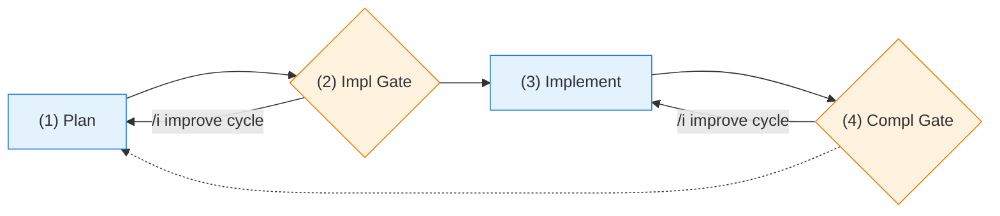
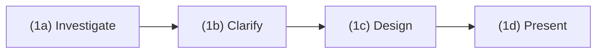
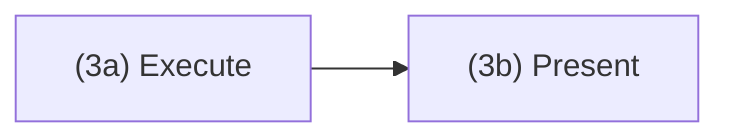

# Tandem Protocol v0.14

Structured checkpoints for Claude Code. You approve each step, Claude checks in along the way.

## Slash Commands

On any invocation, locate your current protocol stage and act within it.

- `/begin` — start planning
- `/i` — "improve" - self-assess + fix
- `/g` — adversarial review
- `/c` — compliance with guidelines

---

# The Protocol


```mermaid
flowchart LR
    S1["(1) Plan"] --> S2{"(2) Impl Gate"}
    S2 -->|"/i improve cycle"| S1
    S2 --> S3["(3) Implement"]
    S3 --> S4{"(4) Compl Gate"}
    S4 -->|"/i improve cycle"| S3
    S4 -.-> S1

    style S1 fill:#e3f2fd,stroke:#1976d2
    style S3 fill:#e3f2fd,stroke:#1976d2
    style S2 fill:#fff3e0,stroke:#f57c00
    style S4 fill:#fff3e0,stroke:#f57c00
```

Before `ExitPlanMode`, the plan must have:
- Executable bash at **At Implementation Gate**: `evtctl contract`, `evtctl plan`, `evtctl task` (if new), `evtctl claim`, `era store`
- Completion-gate flow: a mandatory **🛑 GATE C STOP stanza** directly above `## At Completion Gate`, then executable bash including a **pre-attestation docs-review step** before `evtctl complete` (re-read README, use-cases.md, design.md; amend + commit + push first if drift), followed by `evtctl complete`, `evtctl done`, `era store`, `git commit`.
- For changes affecting **user-visible behavior or operator workflow**: a `docs refreshed` entry in the contract criteria list. Evidence MUST be one of the literal forms: `docs drift detected: yes (<SHA>)`, `docs drift detected: no (reviewed: README, use-cases.md, design.md)`, `docs refreshed: not applicable (internal refactor)`, or `docs drift detected: deferred (task #<N>)`.

Do not exit plan mode without the gate sections, the GATE C STOP stanza, and the docs-review discipline when applicable.

## Stream as source of truth

Streams are append-only journals of what happened. Plans and attestations
**reference** stream-derived ids (event ids, task ids, commit SHAs) but
must **not memoize** payload content. The stream is the record. Two
implications for plan authoring:

### Do not copy payloads into plans

A plan that restates a contract, an attestation, or an interaction's
content drifts from the stream the moment either side is edited. Quote
the event id; let the reader run `evtctl` against the stream to fetch
the current payload.

### Use bash substitution to enforce adherence at gate time

LLMs can write declarative plans that diverge from reality. Plans
*can't* diverge from a `$(...)` substitution that runs in the gate
bash — the substitution evaluates against the current stream, not
against what the plan claims. This is the same trick
`validate-attestation` uses at the Completion Gate; it generalizes.

Concrete patterns (output formats verified live):

- **Planning stage 1a**: surface what's already pending so it gets considered:
  ```bash
  OPEN=$(evtctl open)
  [[ -z $OPEN ]] || cat <<<"$OPEN"
  ```
- **Implementation Gate**: refuse double-claim on a task already claimed
  by another agent. `evtctl claims` (delegating to `task-audit claims`)
  prints lines `#<id>  <date>  <claimer>  <desc>` or the literal
  `no active claims`:
  ```bash
  evtctl claims | grep -qE "^#$TASK_ID\b" && {
    echo "task $TASK_ID already claimed; resolve before claiming"; exit 1
  }
  ```
- **Completion Gate**: confirm the task being closed is in fact open.
  `evtctl open` prints `#<id>  <date>  task  <desc>`:
  ```bash
  evtctl open | grep -qE "^#$TASK_ID\b" || {
    echo "task $TASK_ID not in open list"; exit 1
  }
  ```

Plans should include such substitutions wherever the LLM's claim could
diverge from stream state. The cost is a few lines of bash; the
benefit is enforcement that doesn't depend on attestation prose.

## 1. Plan


```mermaid
flowchart LR
    A["(1a) Investigate"] --> B["(1b) Clarify"] --> C["(1c) Design"] --> D["(1d) Present"]
```

**1a Investigate:** Read codebase, identify affected files, note line refs, `mcp__era__search` for prior context, web search if needed. For debugging/issue investigation, first perform a complete differential diagnosis — enumerate every actor in the failing flow (client process, OS service, browser cookie jar, identity provider, network path, server policy, your own recent commits) and treat each as a candidate cause until evidence rules it out. **If it's not in the differential, it can't be in the diagnosis.** Adversarial review narrows the differential; it does not expand it — when review keeps confirming the same conclusion across rounds, the differential is suspect, not the testing.

**1b Clarify:** Ask user about uncertainties. User controls scope — Claude MAY suggest deferring, MAY NOT unilaterally defer.  You MUST ask at least one question.

**1c Design:** `EnterPlanMode`. If existing plan found: quote verbatim, grade analysis ("Do I understand this?"), grade quality ("Is this sound?"), STOP for user direction. Otherwise create new plan:

Plan = HOW (approach, changes). Contract = WHAT (criteria, published via `evtctl contract` at gate).
Substitute `<plan-name>` and `<task-id>` with actual values. Do NOT use `ls -t` to find plans.

```markdown
# [Project Name]

## Changes
[files + approach]

## At Implementation Gate

    ```bash
    evtctl contract <<'EOF'
    {"phase":"objective","criteria":["criterion1","criterion2","docs refreshed"]}
    EOF
    evtctl plan ~/.claude/plans/<plan-name>.md
    # <task-id>: originating task ID if continuing existing task, or empty to create new
    TASK_ID=<task-id>
    if [ -z "$TASK_ID" ]; then
      TASK_ID=$(evtctl task "objective" | grep -o 'id=[0-9]*' | cut -d= -f2)
    fi
    evtctl claim "$TASK_ID" claude
    era store --type session -t "<project-basename>,plan" <<'MEMO'
    <1-3 sentences: objective and key design decisions>
    MEMO
    ```

**🛑 GATE C — Before executing the bash block below:**

1. Update `<compose>` placeholder with the actual attestation JSON
   (criterion name + status + evidence + SHAs from the impl phase).
2. Update `<MEMO>` placeholder with the composed session memory.
3. Replace `git add file1.go file2.go` with the actual files changed.
4. Confirm pre-attestation docs-review will execute INSIDE the
   bash block below, BEFORE `evtctl complete` runs (re-reads
   README.md, use-cases.md, design.md; amendments commit + push
   before attestation publishes; evidence form is
   `docs drift detected: yes (<SHA>)` or `no (reviewed: ...)`).
5. Print this updated plan file to the user.
6. Show the completion-gate bash block as it now reads.
7. Ask "May I proceed?" and **wait for explicit approval** before
   executing.

The stanza is a behavioral safeguard, not a mechanical enforcement
mechanism — its purpose is execution-time locality: the halt
instruction sits adjacent to the executable bash in the artifact
the agent traverses. Mechanical enforcement (validate-plan) is
deferred (#3883). Backward compatibility: legacy plans without the
stanza are valid for in-flight cycles already past 1d; new plans
MUST include it.

## At Completion Gate

    ```bash
    # Perform pre-attestation docs review (UC11) and set DOCS_DRIFT_EVIDENCE
    DOCS_DRIFT_EVIDENCE='docs drift detected: no (reviewed: README, use-cases.md, design.md)'

    # Every contract criterion must appear: "delivered"+evidence, "dropped"+reason, or "added"+evidence.
    evtctl complete <<'EOF'
    <compose: {"criteria":[{"name":"...","status":"...","evidence":"..."},...]}>
    EOF
    # <task-id>: originating task ID if continuing existing task, or ID from evtctl task if created new
    evtctl done <task-id> "complete"
    era store --type session -t "<project-basename>,completion" <<'MEMO'
    <what delivered/dropped, /i lessons, technical insights, decision points and rationales>
    MEMO
    git add file1.go file2.go  # actual files at completion time
    git commit -m "description

    Co-Authored-By: Claude <noreply@anthropic.com>"
    ```

## Verification
[commands to verify]
```

**1d Present:** Auto `/i` (min 2, max 3, log each). Validate plan file (`~/.claude/plans/<plan-name>.md`) has both gate sections with required executable commands. `ExitPlanMode`. **STOP until user accepts.**

## Gate Grading

At either gate if there are guides for compliance, issue a single `/c` for compliance first and fix, prior to doing the current presentation step (1d or 3b).

- `/i`: find opportunities to improve and execute on them
- `/c`: grade vs guides + fix; ask "Can I fix this now?" — yes → fix, no → capture in guide
- `/g`: if this is a staff-level design, copy to the clipboard a grading request for the user to service with external resources.
- Log: `evtctl interaction "/X -> what found and fixed"`

## 2. Implementation Gate

**On user acceptance:** execute the "At Implementation Gate" executable bash block from the plan file.

**STOP: do not implement until the gate bash block has executed.**

## 3. Implement


```mermaid
flowchart LR
    A["(3a) Execute"] --> B["(3b) Present"]
```

**3a Execute:** Implement each contract criterion.

**3b Present:** Auto `/i` (min 2, max 3, log each). Show results + verification per criterion. Update plan file (`~/.claude/plans/<plan-name>.md`):
- Replace `git add` with actual files changed
- Compose attestation JSON (each criterion + status + evidence)
- Compose session memory (delivered/dropped, /i lessons, insights, decision points and rationales)

**Criterion names are the join key.** `validate-attestation` matches completion → contract by string-equality on criterion names: contract publishes `criteria: ["name1", "name2", ...]`; completion publishes `criteria: [{"name": "name1", ...}, ...]`. Names must match exactly. If `/i` reveals a criterion needs renaming, either (a) keep the attestation's name verbatim from the contract and explain the change in the evidence text, or (b) publish a corrected contract before completion. Diverging names produce `info: no matching contract found in stream, skipping validation` — completion publishes but is unvalidated.

Print plan file, show the completion bash block. Ask "May I proceed?" **STOP until approved.**

## 4. Completion Gate

**On "proceed":** execute the "At Completion Gate" executable bash block from the plan file.

## Install

```bash
cd ~ && git clone https://codeberg.org/binaryphile/tandem-protocol.git
mkdir -p ~/.claude/commands && ln -sf ~/tandem-protocol/commands/*.md ~/.claude/commands/
```

This README is the protocol.  That's it.  Add `@~/tandem-protocol/README.md` to your project's CLAUDE.md.
