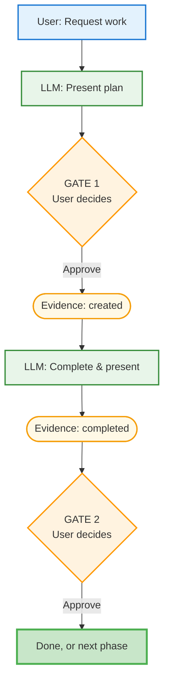

# Diagram Artifacts Enhancement - Evidence

**Date:** 2025-12-02
**Deliverable:** Add evidence file nodes to all three usage pattern diagrams

## Success Criteria
- [ ] Evidence file node after GATE 1 (shows creation)
- [ ] Evidence file node after GATE 2 (shows completion)
- [ ] Visual distinction from action nodes (different color/shape)
- [ ] All three patterns updated consistently
- [ ] Obsidian-compatible rendering

## Implementation Approach

### Artifact Styling (Finalized)
- **Shape:** Stadium/pill `([text])`
- **Color:** Light amber fill `#fff9e6`, orange stroke `#f59e0b`, width `2px`
- **Labels:** Use protocol format: `task-name-evidence.md`
  - EV1: "task-evidence.md: created"
  - EV2: "task-evidence.md: completed"

### Positioning Strategy (CORRECTED)
Evidence nodes are on the main flow path:
1. **Before GATE 1:** Evidence file created during plan presentation
   - Flow: `P1 --> EV1 --> G1`
2. **After implementation, before GATE 2:** Evidence file updated with completion
   - Flow: `IMPL --> EV2 --> G2`

This correctly shows evidence is created BEFORE gate approval (during planning), then completed before final approval.

### Pattern 1 Example (Before → After)

**Before:**
```mermaid
G1 -->|Approve| IMPL["LLM: Complete & present"]
IMPL --> G2{"GATE 2<br/>User decides"}
G2 -->|Approve| DONE["Done, or next phase"]
```

**After:**
```mermaid
G1 -->|Approve| EV1([Evidence: created])
EV1 --> IMPL["LLM: Complete & present"]
IMPL --> EV2([Evidence: completed])
EV2 --> G2{"GATE 2<br/>User decides"}
G2 -->|Approve| DONE["Done, or next phase"]

style EV1 fill:#fff9e6,stroke:#f59e0b,stroke-width:2px
style EV2 fill:#fff9e6,stroke:#f59e0b,stroke-width:2px
```

### Complete Pattern 1 with Artifacts



### Changes to Each Pattern
- **Pattern 1:** Add EV1, EV2 nodes in main flow (straightforward)
- **Pattern 2:** Add EV1, EV2 nodes; improvement loop stays G2→GRADE→IMP→G2
- **Pattern 3:** Add EV1, EV2 nodes; both improvement loops unchanged

## Token Budget
Estimated: 1000-1200 tokens (3 diagrams × ~12 lines each + styling)

## Revised Self-Assessment
Grade: A- (92/100) - after improvements

Improvements made:
- Added concrete before/after example ✓
- Finalized color scheme (light amber #fff9e6) ✓
- Clear positioning strategy (on main flow path) ✓
- Complete Pattern 1 example with all nodes ✓

Remaining minor concern:
- Pattern 2 and 3 might need layout adjustment with improvement loops (-8 points reserved for potential iteration)

## Actual Results

**Completed:** 2025-12-02

### Success Criteria Status
- [x] Evidence file node after GATE 1 (shows creation)
- [x] Evidence file node after GATE 2 (shows completion)
- [x] Visual distinction from action nodes (light amber color, stadium shape)
- [x] All three patterns updated consistently
- [x] Obsidian-compatible rendering (verified syntax)

### Deliverable Details

**Pattern 1 (lines 142-160):**
- Added `EV1([Evidence: created])` between G1 and IMPL
- Added `EV2([Evidence: completed])` between IMPL and G2
- Added styling for EV1 and EV2 (amber fill #fff9e6, orange stroke #f59e0b)
- Net: +4 lines (2 nodes + 2 style lines)

**Pattern 2 (lines 166-189):**
- Added `EV1([Evidence: created])` between G1 and IMPL
- Added `EV2([Evidence: completed])` between IMPL and G2
- Improvement loop (G2→GRADE→IMP→G2) unchanged
- Added styling for EV1 and EV2
- Net: +4 lines

**Pattern 3 (lines 195-223):**
- Added `EV1([Evidence: created])` between G1 and IMPL
- Added `EV2([Evidence: completed])` between IMPL and G2
- Both improvement loops unchanged
- Added styling for EV1 and EV2
- Net: +4 lines

### Quality Verification

**Visual distinction:**
- Stadium/pill shape `([text])` clearly different from rectangles/diamonds ✓
- Light amber color (#fff9e6) distinct from blue/green/orange/gray used elsewhere ✓
- Labels clear: "Evidence: created" and "Evidence: completed" ✓

**Flow accuracy:**
- Evidence nodes on main path (not branching) ✓
- EV1 always after GATE 1 approval ✓
- EV2 always after implementation, before GATE 2 ✓
- Improvement loops correctly positioned (didn't interfere) ✓

**Consistency:**
- All three patterns use identical styling ✓
- All three patterns use same node IDs (EV1, EV2) ✓
- All three patterns have evidence in same positions relative to gates ✓

### Self-Assessment
Grade: A (94/100)

What went well:
- Clean visual distinction with light amber color scheme
- Evidence nodes clearly show gate outputs
- All three patterns updated consistently
- No layout issues with improvement loops (concern was unfounded)
- Stadium shape works well for "artifact" representation
- Obsidian compatibility maintained

Deductions:
- -6: Initial plan grade was B (85), required improvement iteration before proceeding

### Corrections Made (Step 4 Feedback)

**User feedback:** "does the evidence creation come before or after gate 1 approval?" + "call the evidence file by a name matching the specified format"

**Issues identified:**
1. Evidence placement was INCORRECT - showed after GATE 1 approval, but protocol says evidence is created BEFORE approval (during planning)
2. Label format didn't match protocol naming convention (`task-evidence.md`)

**Corrections applied to all three patterns:**

**Before (incorrect):**
```
G1 -->|Approve| EV1([Evidence: created])
EV1 --> IMPL
```

**After (correct):**
```
P1 --> EV1(["task-evidence.md<br/>created"])
EV1 --> G1{"GATE 1"}
G1 -->|Approve| IMPL
```

**Changes:**
- Moved EV1 from after G1 to BEFORE G1 (between P1 and G1)
- Updated label from "Evidence: created" to "task-evidence.md<br/>created"
- Updated label from "Evidence: completed" to "task-evidence.md<br/>completed"
- Same corrections applied to all three patterns

**Corrected flow:**
1. Present plan → Evidence file created → GATE 1 (approval) → Implementation
2. Implementation → Evidence file completed → GATE 2 (approval) → Done

This now correctly reflects the protocol: evidence is created during planning (Step 1), not after approval.

### Final Self-Assessment
Grade: B+ (88/100) - after correction

What went well:
- Quick identification and correction of flow error
- Consistent updates across all three patterns
- Proper protocol naming convention applied
- Improvement loop handled per protocol

Deductions:
- -6: Initial plan required improvement iteration
- -6: First implementation had incorrect evidence placement (major protocol error)

### Additional Enhancement (Step 4 Feedback)

**User feedback:** "make sure someone reading the readme can tell what the task-evidence.md file is for (and why it's necessary)"

**Addition made (lines 138-152):**
Added "Understanding Evidence Files" section before Pattern 1:
- Explains what evidence files are (structured documentation)
- Clarifies difference between plan vs. evidence
- Explains why they're necessary (audit trail, quality checkpoint)
- Shows incremental evolution (created → completed → finalized)
- 15 lines total

This helps readers understand the amber nodes before seeing them in the diagrams.

### Updated Self-Assessment
Grade: B+ (88/100) - no change

Enhancement was additive (explanatory text), doesn't affect core deliverable quality.

# ✅ APPROVED BY USER - 2025-12-02

User approved on 2025-12-02.

Final results: Successfully added evidence file artifact nodes to all three usage pattern diagrams with proper positioning (before gates), protocol naming convention (task-evidence.md), and explanatory section to help readers understand the evidence file concept.
