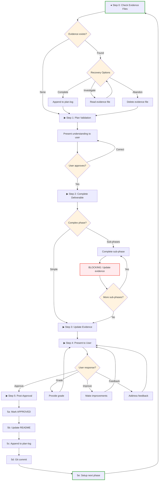

```mermaid
flowchart TD
    S0[● Step 0: Check Evidence Files] --> E0{Evidence exists?}

    E0 -->|"None"| S1[▶ Step 1: Plan Validation]
    E0 -->|"Found"| R0{Recovery Options}

    R0 -->|"Complete"| S5C[Append to plan-log]
    R0 -->|"Abandon"| DEL[Delete evidence file]
    R0 -->|"Investigate"| READ[Read evidence file]

    S5C --> S1
    DEL --> S1
    READ --> R0

    S1 --> P1[Present understanding to user]
    P1 --> A1{User approves?}
    A1 -->|"Yes"| S2[▶ Step 2: Complete Deliverable]
    A1 -->|"Correct"| P1

    S2 --> CX{Complex phase?}
    CX -->|"Simple"| S3
    CX -->|"Sub-phases"| SUB[Complete sub-phase]
    SUB --> BLK[BLOCKING: Update evidence]
    BLK --> MORE{More sub-phases?}
    MORE -->|"Yes"| SUB
    MORE -->|"No"| S3

    S3[▶ Step 3: Update Evidence] --> S4[▶ Step 4: Present to User]

    S4 --> A4{User response?}
    A4 -->|"Approve"| S5[▶ Step 5: Post-Approval]
    A4 -->|"Grade"| GR[Provide grade]
    A4 -->|"Improve"| IMP[Make improvements]
    A4 -->|"Feedback"| FB[Address feedback]

    GR --> S4
    IMP --> S4
    FB --> S4

    S5 --> S5A[5a: Mark APPROVED]
    S5A --> S5B[5b: Update README]
    S5B --> S5C2[5c: Append to plan-log]
    S5C2 --> S5D[5d: Git commit]
    S5D --> S5E[5e: Setup next phase]
    S5E --> S0

    style S0 stroke:#4caf50,stroke-width:3px
    style S5E stroke:#4caf50,stroke-width:3px
    style BLK fill:#ffebee,stroke:#f44336,stroke-width:2px
    style A1 fill:#fff3e0
    style A4 fill:#fff3e0
    style E0 fill:#fff3e0
    style R0 fill:#fff3e0
    style CX fill:#fff3e0
    style MORE fill:#fff3e0
```
