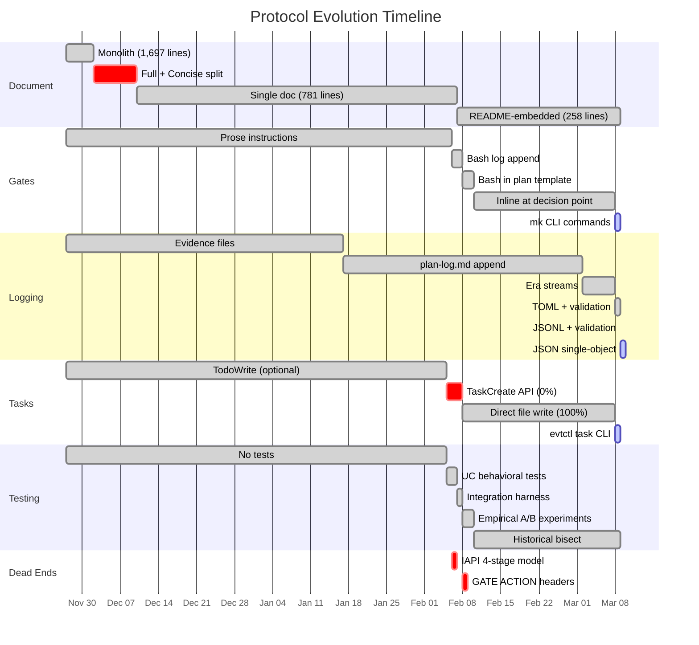
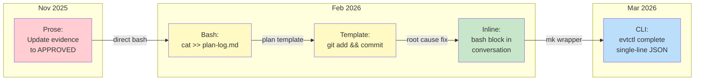
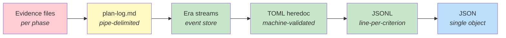
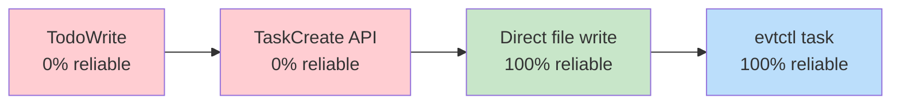
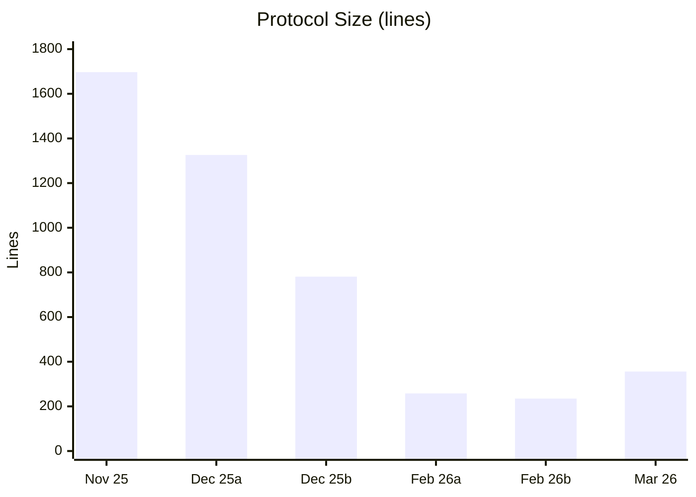
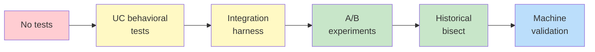

# The Making of Tandem Protocol

154 commits. 103 days. Built by structured experiment — A/B tests on LLM behavior, differential diagnosis across protocol versions, a strategy catalog of what works and what doesn't.

From a 1,697-line document to an executable protocol where every gate action is a bash command that runs or fails.



---

## How do you tell an LLM to do something at a gate?

**Nov 2025** — Ask nicely.

```
Step 5: Post-approval (after "yes"/"approved"/"proceed")
- Update evidence to APPROVED
- Log to plan-log (heredoc format)
- CRITICAL: Do NOT proceed without explicit approval
```

**Feb 6** — Append to a log file. Direct bash, no conditional tool invocation.

```bash
cat >> plan-log.md << 'EOF'
2026-02-06T10:34:56Z | Completion: Step 2 | [x] auth (done), [x] tests (pass)
EOF
```

**Feb 8** — Put executable bash in the plan template itself.

```bash
git add -A && git commit -m "Phase 1 complete

Co-Authored-By: Claude <noreply@anthropic.com>"
```

**Feb 10** — Root cause found. "Proceed" doesn't make the LLM re-read the plan file. The bash block must be **inline in the conversation** at the decision point.

> Commit `2d69a0f`: *Gate 2 diagnosis: root cause found*

**Mar 8** — Wrap it in a CLI.

```bash
evtctl complete << 'TOML'
[[criteria]]
name = "config loader"
status = "delivered"
evidence = "src/config.go"
TOML
```

*Dead ends along the way: `## GATE ACTION` section headers (0% trigger rate), numbered substeps (no effect on compliance), pre-approval checklists (no correlation with scores).*



---

## How do you record what was promised and what was delivered?

**Nov 2025** — Commit a separate evidence file per phase.

```
protocol-validation-evidence.md
diagram-simplification-evidence.md
evidence-color-change-evidence.md
diagram-artifacts-evidence.md
readme-clarification-evidence.md
usage-patterns-evidence.md
```

**Jan 2026** — First structured A/B experiment. Three trials. Direct bash beats conditional tool invocation every time.

> Commit `ac4dbd0`: *Replace plan-log with direct plan-history.md append*

**Feb 6** — Pipe-delimited log entries with checkbox criteria.

```
2026-02-06T10:34:56Z | Completion: Step 2 | [x] auth (done), [x] tests (pass)
```

**Mar 2** — Logging moves from local file append to a distributed event store. `plan-log.md` replaced by Era streams.

> Commit `b88c260`: *feat: publish protocol gate events to Era streams*

**Mar 8** — Contract and plan separated. Contract = WHAT (criteria). Plan = HOW (approach).

```bash
evtctl contract "Config loader | [ ] YAML parsing | [ ] default fallback"
```

**Mar 9** — One day later: TOML attestation with machine validation. Every criterion must be accounted for.

```bash
evtctl contract << 'TOML'
phase = "Phase 1 - config loader"

[[criteria]]
name = "YAML parsing"

[[criteria]]
name = "default fallback"
TOML
```

```bash
evtctl complete << 'TOML'
[[criteria]]
name = "YAML parsing"
status = "delivered"
evidence = "src/config.go:LoadYAML()"

[[criteria]]
name = "default fallback"
status = "delivered"
evidence = "src/config.go:applyDefaults()"
TOML
```

```
attestation valid: 2 criteria (2 from contract)
```

**Mar 9** — JSONL payloads replace TOML. One JSON object per line — eliminates Python `tomllib` dependency, enables `jq` processing from shell.

```bash
evtctl contract << 'JSONL'
{"phase":"Phase 1 - config loader"}
{"name":"YAML parsing"}
{"name":"default fallback"}
JSONL
```

**Mar 9** — Single-line JSON replaces JSONL heredocs. One event = one JSON object. Contract criteria become a string array, attestation criteria become an object array.

```bash
evtctl contract '{"phase":"Phase 1 - config loader","criteria":["YAML parsing","default fallback"]}'
```



---

## How do you track tasks?

**Nov 2025** — A polite suggestion.

```python
if tool_available("TodoWrite"):
    TaskCreate({"subject": "Step 1a: Present plan understanding",
                "activeForm": "Presenting plan understanding"})
```

**Feb 5** — Real API calls. Still instructions, not syntax. 0% invocation rate.

```python
TaskCreate({"subject": "Step 1a: Present plan understanding",
            "description": "Present understanding to user",
            "activeForm": "Presenting plan understanding"})
```

**Feb 8** — The breakthrough. Bypass the API. Write the file directly. 100% reliable.

```bash
cat > ~/.claude/tasks/$S/$T1.json << TASK
{"id": "$T1", "subject": "Task 1", "status": "in_progress"}
TASK
```

**Mar 8** — Wrap it in a CLI. One line.

```bash
evtctl task "Implement config loader"
evtctl claim <task-id> claude
```

> *The axiom discovered here: syntax triggers execution; instructions trigger interpretation.*



---

## How big is the protocol?



| Commit | Date | Lines | File | What happened |
|--------|------|------:|------|---------------|
| `57a27bb` | Nov 2025 | 1,697 | tandem-protocol.md | Original monolith |
| `6116960` | Dec 2025 | 1,326 | tandem-protocol.md | Concise version added alongside |
| `c6867f6` | Dec 2025 | 781 | tandem-protocol.md | Consolidated to single doc |
| `8d277f9` | Feb 2026 | 258 | README.md | PI model, merged into README |
| `f912267` | Feb 2026 | 235 | README.md | Inline bash blocks — the minimum |
| `2c0e93a` | Mar 2026 | 356 | README.md | JSON + evtctl commands — growing with purpose |

The arc: compress relentlessly until every line earns its place, then grow only when new capability demands it.

*Dead end: the Full + Concise split (Dec 2-10). Two protocol documents caused drift. Neither was authoritative. Single document won.*

At the split's peak, the repo had four protocol-related files:

```
tandem-protocol.md           # 1,326 lines — the "full" version
tandem-protocol-concise.md   # 563 lines — the "concise" version
tandem-protocol-plan-log.md  # audit trail
tandem.md                    # /tandem command reminder
```

After consolidation: one file.

*Also buried: the IAPI 4-stage cognitive model — Investigate, Analyze, Plan, Implement — with separate subagent execution per stage. Lasted one day (Feb 6-7) before being replaced by the simpler PI model.*

```
| Stage         | Guide                  | Execution          |
|---------------|------------------------|--------------------|
| Investigate   | investigation-guide.md | Subagent (Explore)  |
| Analyze       | analysis-guide.md      | Subagent (Plan)     |
| Plan          | planning-guide.md      | Subagent (Plan)     |
| Implement     | Domain guides          | Direct              |
```

Replaced by:

```
Plan → Implementation Gate → Implement → Completion Gate
```

---

## How do you know it works?

**Nov 2025** — You don't.

**Feb 5** — UC behavioral tests. Cockburn-style use cases with pass/fail assertions.

```
tests/uc2-plan-mode.sh
tests/uc3-plan-mode-entry.sh
tests/uc4-verbatim-archive.sh
tests/uc5-line-reference.sh
tests/uc10-plan-compliance.sh
```

**Feb 7** — Integration test harness. `common.sh` + validators + 33 tests.

```
tests/lib/criteria-matcher.sh
tests/lib/log-parser.sh
tests/lib/transcript-parser.sh
```

**Feb 8** — Structured hypothesis testing on LLM behavior. A/B experiments with controls.

> Commit `b49156e`: 5 experiments run, 1 strategy passes (direct file writes). The others: GATE ACTION headers, numbered substeps, bash blocks in template, pre-approval checklists — all fail.

**Feb 10** — Historical bisect across protocol versions. Differential diagnosis.

> Commit `bd93fd0`: *Historical bisect: empirical strategy catalog*
>
> 4 protocol versions tested. Gate 2 fails across ALL versions. Root cause is not structural — it's behavioral.

**Mar 9** — Machine-validated contracts. `validate-attestation` reads the last contract from Era, compares against the attestation JSON, exits non-zero on gaps.

```
attestation valid: 2 criteria (2 from contract)
```

The method that made this possible: treat LLM behavior as an empirical question. Hypothesize, test, measure, iterate.



---

What started as 1,697 lines of prose became an executable protocol.

Today: 356 lines of README. 12 mk commands. 39 test files. 16 use cases. Machine-validated JSON contracts. Every gate action is a bash block that runs or fails.

The core discovery: **syntax triggers execution; instructions trigger interpretation.**

Make it bash. Make it run. Make it fail if it's wrong.
