# Tandem Protocol - Concise Reference

## Protocol Flow

```mermaid
flowchart TD
    S0[● Step 0: Check Evidence Files] --> E0{Evidence exists?<br/>Check for incomplete work}

    E0 -->|"None - Clean slate"| S1[▶ Step 1: Plan Validation]
    E0 -->|"Found - Protocol violation"| R0{Recovery Options<br/>Complete/Abandon/Investigate}

    R0 -->|"Complete previous work"| S5C[Append evidence to log]
    R0 -->|"Abandon previous work"| DEL[Delete evidence file]
    R0 -->|"Investigate first"| READ[Read evidence file]

    S5C --> S1
    DEL --> S1
    READ --> R0

    S1 --> P1[Present understanding to user]
    P1 --> A1{User approves plan?<br/>GATE 1}
    A1 -->|"Yes - proceed"| S2[▶ Step 2: Complete Deliverable]
    A1 -->|"Correct understanding"| P1

    S2 --> CX{Complex with<br/>sub-phases?}
    CX -->|"Simple task"| S3
    CX -->|"Multiple sub-phases"| SUB[Complete one sub-phase]
    SUB --> BLK[⛔ BLOCKING: Update evidence<br/>Cannot proceed without this]
    BLK --> MORE{More sub-phases<br/>remaining?}
    MORE -->|"Yes - continue"| SUB
    MORE -->|"No - all done"| S3

    S3[▶ Step 3: Update Evidence] --> S4[▶ Step 4: Present to User]

    S4 --> A4{User response?<br/>GATE 2}
    A4 -->|"Approve - finalize"| S5[▶ Step 5: Post-Approval]
    A4 -->|"Grade first"| GR[Provide honest grade]
    A4 -->|"Improve work"| IMP[Make improvements]
    A4 -->|"Address feedback"| FB[Respond to comments]

    GR --> S4
    IMP --> S4
    FB --> S4

    S5 --> S5A[5a: Mark APPROVED]
    S5A --> S5B[5b: Commit deliverable]
    S5B --> S5C2[5c: Append/output evidence]
    S5C2 --> S5D[5d: Setup next phase]
    S5D --> S0

    style S0 stroke:#4caf50,stroke-width:3px
    style S5D stroke:#4caf50,stroke-width:3px
    style BLK fill:#ffebee,stroke:#f44336,stroke-width:3px
    style A1 fill:#fff3e0,stroke:#ff9800,stroke-width:2px
    style A4 fill:#fff3e0,stroke:#ff9800,stroke-width:2px
    style E0 fill:#fff3e0
    style R0 fill:#fff3e0
    style CX fill:#fff3e0
    style MORE fill:#fff3e0
```



---

## Step 0: Check Evidence Files
**Only required for persistent filesystem (Claude Code, Cursor, etc.) - skip for web UI**

```python
# Check for leftover evidence from previous incomplete work
evidence_files = ls("*-evidence.md", "*-completion-evidence.md")

if len(evidence_files) > 0:
    # Protocol violation detected - previous work incomplete
    print(f"Found {len(evidence_files)} evidence files from incomplete work:")
    print(evidence_files)

    options = ["complete", "abandon", "investigate"]
    choice = prompt_user(options)

    if choice == "complete":
        # Review evidence, verify APPROVED status
        review(evidence_file)
        if approved:
            commit_to_git(evidence_file)  # or output to chat
            rm(evidence_file)
        proceed_to_step_1()

    elif choice == "abandon":
        rm(evidence_file)
        print("Evidence deleted. Previous work abandoned.")
        proceed_to_step_1()

    elif choice == "investigate":
        read(evidence_file)
        # Loop back to options after investigation

else:
    # Clean slate - proceed normally
    proceed_to_step_1()
```

---

## Step 1: Plan Validation

```python
# Present understanding to user
present("I understand the plan as: [summary]")
present("Target files: [paths with line numbers]")
present("Approach: [specific actions]")

# Create evidence file
evidence_file = create_file("phase-X-evidence.md")

# Write initial evidence structure
write_to_evidence("""
# Phase X Evidence

## Success Criteria
- [ ] Criterion 1
- [ ] Criterion 2
...

## Implementation Approach
Step 1: [action] (estimated tokens, time)
Step 2: [action] (estimated tokens, time)
...

## Token Budget
Estimated: XX-XXK tokens

# ⏸️ AWAITING STEP 1 APPROVAL
""")

# Optional: Create TodoWrite structure (if tool available)
if tool_available("TodoWrite"):
    create_todos([
        "Phase X Step 1: Validate plan (in_progress)",
        "Phase X Step 2: Complete deliverable (pending)",
        "Phase X Step 3: Update evidence (pending)",
        "Phase X Step 4: Present and await approval (pending)",
        "Phase X Step 5: Post-approval actions (pending)"
    ])

# Wait for explicit approval
wait_for("proceed", "yes", "approved")

# After approval, update evidence
update_evidence_footer("⏸️ AWAITING STEP 1 APPROVAL", "")
proceed_to_step_2()
```

---

## Step 2: Complete Deliverable

```python
# Execute the work
create_deliverable()

# For multi-phase tasks with sub-phases
if has_sub_phases:
    for sub_phase in sub_phases:
        complete_sub_phase(sub_phase)

        # BLOCKING: Must update evidence after each sub-phase
        update_evidence_checkboxes(sub_phase)
        present_progress(f"Completed {sub_phase}. Evidence updated.")

        # Cannot proceed without completing evidence update
        wait_for_evidence_confirmation()

# For simple tasks
else:
    complete_task()

proceed_to_step_3()
```

---

## Step 3: Update Evidence

```python
# Update evidence file with actual results
update_evidence("""
## Actual Results

**Deliverable:** [filename] ([size])
**Completed:** [date]

### Success Criteria Status
- [x] Criterion 1 - COMPLETE (evidence: lines X-Y)
- [x] Criterion 2 - COMPLETE (evidence: specific details)
...

### Deliverable Details
- Path: [full path]
- Size: [lines/words/MB]
- Key sections: [line numbers]
""")

# Consult verification templates if task type matches
task_types = [
    "file_download",
    "code_implementation",
    "documentation",
    "batch_operations",
    "test_suite"
]

if task_type in task_types:
    template = select_template_from_appendix(task_type)
    verification_results = run_template_commands(template)
    append_to_evidence(verification_results)

# Add quality verification section
append_to_evidence("""
### Quality Verification
[Spot-check results]
[Error pattern checks]
[Completeness verification]
""")

# Add self-assessment
append_to_evidence("""
### Self-Assessment
Grade: [A-F] ([score]/100)

What went well:
- [specific accomplishment]

Deductions:
- [issue]: -X points
""")

# Update footer
update_evidence_footer("", "# ⏸️ AWAITING USER APPROVAL")

proceed_to_step_4()
```

---

## Step 4: Present and Await Approval

```python
# Present completion to user
present(f"""
## Phase X Complete

**Deliverable:** [filename] ([size])
**Evidence:** [evidence filename]

### Key Highlights
1. [Major accomplishment with evidence]
2. [Critical insight]
3. [Notable outcome]

**Upon your approval, I will:**
1. Mark evidence as APPROVED
2. Commit to git (or output to chat if web UI)
3. Setup next phase

**May I proceed?**
""")

# Wait for user review
user_response = wait_for_response()

if user_response == "approve":
    proceed_to_step_5()

elif user_response == "grade":
    provide_grade_assessment()
    # Loop back to wait for approval

elif user_response == "improve":
    make_improvements()
    update_evidence()
    re_present()
    # Loop back to wait for approval

elif user_response == "feedback":
    address_feedback()
    update_evidence()
    re_present()
    # Loop back to wait for approval
```

---

## Step 5: Post-Approval Actions

```python
# 5a: Mark evidence as APPROVED
update_evidence_footer(
    "# ⏸️ AWAITING USER APPROVAL",
    f"# ✅ APPROVED BY USER - {date}"
)

append_to_evidence(f"""
User approved on {date}.
Final results: [summary]
""")

# 5b: Commit to version control (if available)
if has_git:
    git_add(deliverable_file)
    git_commit(f"""Phase X complete: [title]

[Summary of work]
[Key results]

Evidence: {evidence_filename}

🤖 Generated with AI assistance
""")

# 5c: Append evidence to plan-log and delete temp file (if using plan-log)
# Use bash -c with heredoc for safe concatenation:
if has_plan_log:
    bash_command = """
    bash -c '{
      cat <<'\''EOF'\''
    # Phase X Complete: [Title]

    User approved Phase X on [date].

    ## Progress
    [Summary of accomplishments]

    ## Evidence

    EOF
      cat phase-X-evidence.md
      cat <<'\''EOF'\''

    ## Plan

    Phase X+1: [Next phase tasks]
    EOF
    } | plan-log'
    """
    execute(bash_command)
    rm("phase-X-evidence.md")  # Delete temp file after appending

# For web UI: output evidence to chat
elif web_ui:
    output_to_chat(evidence_file_contents)

# For git-only: commit evidence file
else:
    git_add(evidence_file)
    git_commit("Add Phase X evidence")

# 5d: Setup next phase
if tool_available("TodoWrite"):
    update_todos([
        "Phase X: [complete status]",
        "Phase X+1 Step 1: Validate plan (in_progress)",
        "Phase X+1 Step 2-5: [pending]"
    ])

proceed_to_step_0()  # For next phase
```

---

## Appendix: Verification Templates

### Template 1: File Download/Generation

```bash
# Check file count
find output_dir -type f -name "*.ext" | wc -l

# Check size distribution (spot outliers)
find output_dir -type f -exec wc -l {} + | sort -n | head -20
find output_dir -type f -exec wc -l {} + | sort -n | tail -20

# Check for error patterns
grep -r "404\|Error\|Not Found" output_dir/ | head -20

# Spot-check samples
ls output_dir/section1/ | head -1 | xargs -I {} head -30 "output_dir/section1/{}"

# Verify no empty files
find output_dir -type f -size 0

# Count by subdirectory
for dir in output_dir/*/; do
    echo "$(basename $dir): $(find $dir -type f | wc -l)"
done
```

**Checklist:**
- [ ] Total file count matches expected
- [ ] No suspicious sizes
- [ ] No error patterns
- [ ] Spot-checks valid
- [ ] All sections present

---

### Template 2: Code Implementation

```bash
# Build/compile check
npm run build  # or: cargo build, python -m py_compile *.py

# Run tests
npm test  # or: cargo test, pytest

# Check warnings
npm run build 2>&1 | grep -i "warning"

# Run specific tests
npm test -- --grep "edge case"

# Verify execution
node script.js  # or: python script.py

# Check output
node script.js > output.txt
diff output.txt expected_output.txt
```

**Checklist:**
- [ ] Code compiles without errors
- [ ] All tests pass
- [ ] No critical warnings
- [ ] Edge cases handled
- [ ] Output matches expected

---

### Template 3: Documentation/Writing

```bash
# Check structure
grep "^#" document.md  # All headings
grep "^## " document.md | wc -l  # Count sections

# Check for placeholders
grep -i "TODO\|TBD\|FIXME" document.md
grep "\[.*\]" document.md  # Bracket placeholders

# Check for empty sections
grep -A 5 "^## " document.md | grep -B 1 "^$"

# Word count per section
awk '/^## / {if (NR>1) print section, words; section=$0; words=0; next}
     {words+=NF} END {print section, words}' document.md

# Verify cross-references
grep -o "\[.*\](.*.md)" document.md | cut -d'(' -f2 | cut -d')' -f1 | \
while read file; do
    [ -f "$file" ] && echo "✓ $file" || echo "✗ Missing: $file"
done

# Spot-read sections
head -50 document.md  # Beginning
awk 'NR==100,NR==150' document.md  # Middle
tail -50 document.md  # End
```

**Checklist:**
- [ ] All sections exist
- [ ] No placeholders
- [ ] No empty sections
- [ ] Cross-references valid
- [ ] Quality content confirmed

---

### Template 4: Batch Operations

```bash
# Sample items from each category
find category1/ -type f | shuf -n 3
find category2/ -type f | shuf -n 3

# Check operation applied correctly
for file in $(find output/ -type f | shuf -n 5); do
    echo "=== $file ==="
    grep "expected_pattern" "$file" && echo "✓" || echo "✗ MISSING"
done

# Verify consistency
find output/ -type f -exec grep -l "operation_marker" {} \; | wc -l

# Count completions
total=$(find input/ -type f | wc -l)
completed=$(find output/ -type f | wc -l)
echo "Completed: $completed / $total"

# Check for failures
[ -f failed_items.txt ] && wc -l failed_items.txt

# Verify output integrity
find output/ -type f -exec file {} \; | grep -v "expected_type"
```

**Checklist:**
- [ ] Samples show correct operation
- [ ] All categories processed
- [ ] Operation consistent
- [ ] Completion count correct
- [ ] Failures logged

---

### Template 5: Test Suite

```bash
# Run with coverage
npm test -- --coverage  # or: pytest --cov=src tests/

# Count tests
grep -r "^test(" tests/ | wc -l  # or: grep -r "it(" tests/

# Verify features tested
echo "Features implemented:"
grep -r "function " src/ | cut -d' ' -f2 | cut -d'(' -f1 | sort -u
echo "Features tested:"
grep -r "test.*function_name" tests/ | wc -l

# Check exit code
npm test
echo "Exit code: $?"  # Should be 0

# Check for skipped tests
grep -r "skip\|xit(\|xdescribe(" tests/

# Timing check
npm test 2>&1 | grep "Time:"
```

**Checklist:**
- [ ] All tests pass
- [ ] Coverage meets threshold
- [ ] All features tested
- [ ] No skipped tests
- [ ] Execution time reasonable

---

## Protocol Principles

**Evidence documents are the primary artifact:**
- Create at Step 1, update at Step 3, finalize at Step 5
- Commit to git or output to chat (for web UI)
- Serves as phase completion history

**User approval gates:**
- Step 1: Approve plan before starting
- Step 4: Approve results before finalizing
- Never proceed without explicit "yes"/"approved"/"proceed"

**BLOCKING checkpoints:**
- Multi-phase tasks: Update evidence after EACH sub-phase
- Cannot proceed without evidence update + user confirmation

**Platform flexibility:**
- Works with or without git
- Works with or without TodoWrite
- Works on web UI (no persistent filesystem)
- Works with non-Claude tools
