# Tandem Protocol - Concise Reference

## Protocol Flow

```mermaid
flowchart TD
    S0[● Step 0: Check Contract Files] --> E0{Contract exists?<br/>Check for incomplete work}

    E0 -->|"None - Clean slate"| S1[▶ Step 1: Plan Validation]
    E0 -->|"Found - Protocol violation"| R0{Recovery Options<br/>Complete/Abandon/Investigate}

    R0 -->|"Complete previous work"| S5C[Append contract to log]
    R0 -->|"Abandon previous work"| DEL[Delete contract file]
    R0 -->|"Investigate first"| READ[Read contract file]

    S5C --> S1
    DEL --> S1
    READ --> R0

    S1 --> S1a[Step 1a: Present understanding]
    S1a --> S1b[⛔ Step 1b: Clarifying questions<br/>BLOCKING - must ask]
    S1b --> S1bw{Answers received?}
    S1bw -->|"No - wait"| S1b
    S1bw -->|"Yes"| S1c[Step 1c: Create contract]
    S1c --> S1d[Step 1d: Request approval]
    S1d --> A1{User approves?<br/>GATE 1}
    A1 -->|"Yes - proceed"| S2[▶ Step 2: Complete Deliverable]
    A1 -->|"Correct understanding"| S1a

    S2 --> CX{Complex with<br/>sub-phases?}
    CX -->|"Simple task"| S3
    CX -->|"Multiple sub-phases"| SUB[Complete one sub-phase]
    SUB --> BLK[⛔ BLOCKING: Update contract<br/>Cannot proceed without this]
    BLK --> MORE{More sub-phases<br/>remaining?}
    MORE -->|"Yes - continue"| SUB
    MORE -->|"No - all done"| S3

    S3[▶ Step 3: Update Contract] --> S4[▶ Step 4: Present and Await]

    S4 --> S4a[Step 4a: Present results]
    S4a --> S4b[⛔ Step 4b: Await approval<br/>BLOCKING]
    S4b --> A4{User response?<br/>GATE 2}
    A4 -->|"Approve - finalize"| S5[▶ Step 5: Post-Approval]
    A4 -->|"Grade first"| GR[Provide honest grade]
    A4 -->|"Improve work"| IMP[Make improvements]
    A4 -->|"Address feedback"| FB[Respond to comments]
    A4 -->|"Change plan"| S1

    GR --> S4a
    IMP --> S4a
    FB --> S4a

    S5 --> S5A[5a: Mark APPROVED]
    S5A --> S5B[5b: Commit deliverable]
    S5B --> S5C2[5c: Append/output contract]
    S5C2 --> S5D[5d: Setup next phase]
    S5D --> S0

    style S0 stroke:#4caf50,stroke-width:3px
    style S5D stroke:#4caf50,stroke-width:3px
    style BLK fill:#ffebee,stroke:#f44336,stroke-width:3px
    style S1b fill:#ffebee,stroke:#f44336,stroke-width:3px
    style S4b fill:#ffebee,stroke:#f44336,stroke-width:3px
    style A1 fill:#fff3e0,stroke:#ff9800,stroke-width:2px
    style A4 fill:#fff3e0,stroke:#ff9800,stroke-width:2px
    style E0 fill:#fff3e0
    style R0 fill:#fff3e0
    style S1bw fill:#fff3e0
    style CX fill:#fff3e0
    style MORE fill:#fff3e0
```



---

## Step 0: Check Contract Files
**Only required for persistent filesystem (Claude Code, Cursor, etc.) - skip for web UI**

```python
# Check for leftover contracts from previous incomplete work
# Look in the current project directory (where deliverables will be created)
contract_files = ls("*-contract.md", "*-completion-contract.md")

if len(contract_files) > 0:
    # Protocol violation detected - previous work incomplete
    print(f"Found {len(contract_files)} contract files from incomplete work:")
    print(contract_files)

    response = AskUserQuestion({
        "questions": [{
            "question": "What would you like to do with the incomplete work?",
            "header": "Recovery",
            "options": [
                {
                    "label": "Complete",
                    "description": "Review and finalize the previous work"
                },
                {
                    "label": "Abandon",
                    "description": "Delete contract and start fresh"
                },
                {
                    "label": "Investigate",
                    "description": "Read contract file first"
                }
            ],
            "multiSelect": false
        }]
    })
    choice = response["Recovery"].lower()

    if choice == "complete":
        # Review contract, verify APPROVED status
        review(contract_file)
        if approved:
            commit_to_git(contract_file)  # or output to chat
            rm(contract_file)
        proceed_to_step_1()

    elif choice == "abandon":
        rm(contract_file)
        print("Contract deleted. Previous work abandoned.")
        proceed_to_step_1()

    elif choice == "investigate":
        read(contract_file)
        # Loop back to options after investigation

else:
    # Clean slate - proceed normally
    proceed_to_step_1()
```

---

## Step 1: Plan Validation

Step 1 is broken into atomic sub-steps to prevent skimming. Execute each sub-step fully before proceeding.

**Sub-steps:**
- **1a:** Present plan understanding
- **1b:** ⛔ BLOCKING: Ask clarifying questions (wait for answers)
- **1c:** Create contract file → `phase-N-contract.md` in working directory
- **1d:** Request approval (wait for "proceed")

---

### Step 1a: Present Understanding

```python
# Present understanding to user
present("I understand the plan as: [summary]")
present("Target files: [paths with line numbers]")
present("Approach: [specific actions]")
```

**NEXT ACTION:** Proceed to Step 1b (Clarifying Questions)

---

### Step 1b: Clarifying Questions ⛔ BLOCKING

```python
# ⛔ BLOCKING: Ask clarifying questions before creating contract
questions = identify_ambiguities()  # Assumptions, alternatives, edge cases

# Always ask at least one question - if no ambiguities, ask about:
# - Scope boundaries ("Should X be included or excluded?")
# - Success criteria ("How will we verify completion?")
# - Edge cases ("What happens if Y?")

present(f"""
**Clarifying Questions:**
{format_questions(questions)}
""")

# WAIT - do not proceed until user answers
wait_for_answers()
update_understanding_with_answers()
```

**NEXT ACTION:** After receiving answers, proceed to Step 1c (Create Contract)

---

### Step 1c: Create Contract

**Filename format:** `phase-N-contract.md` (e.g., `phase-1-contract.md`, `phase-2-contract.md`)
**Location:** Project directory (where the deliverable will be created, to make it git-able)

```python
# Create contract file in project directory (where deliverables will be created)
# This makes it git-able and collocated with the work
contract_file = create_file("phase-1-contract.md")  # phase-N-contract.md in project dir

write_to_contract("""
# Phase X Contract

**Created:** [date]

## Step 1 Checklist
- [x] 1a: Presented understanding
- [x] 1b: Asked clarifying questions
- [x] 1b-answer: Received answers
- [x] 1c: Contract created (this file)
- [ ] 1d: Approval received

## Objective
[What this phase accomplishes]

## Success Criteria
- [ ] Criterion 1
- [ ] Criterion 2

## Approach
[Specific implementation steps]

## Token Budget
Estimated: XX-XXK tokens
""")

# Create TodoWrite with hierarchical structure: current substeps + remaining steps
if tool_available("TodoWrite"):
    TodoWrite({
        "todos": [
            # Current step (Step 1) blown out to substeps
            {"content": "Step 1a: Present plan understanding", "status": "completed", "activeForm": "Presenting plan understanding"},
            {"content": "Step 1b: Ask clarifying questions", "status": "completed", "activeForm": "Asking clarifying questions"},
            {"content": "Step 1c: Create contract file", "status": "in_progress", "activeForm": "Creating contract file"},
            {"content": "Step 1d: Request approval to proceed", "status": "pending", "activeForm": "Requesting approval to proceed"},
            # Remaining steps (collapsed)
            {"content": "Step 2: Complete deliverable", "status": "pending", "activeForm": "Completing deliverable"},
            {"content": "Step 3: Update contract", "status": "pending", "activeForm": "Updating contract"},
            {"content": "Step 4: Present and await approval", "status": "pending", "activeForm": "Presenting for approval"},
            {"content": "Step 5: Post-approval actions", "status": "pending", "activeForm": "Post-approval actions"}
        ]
    })
    # After Step 1 complete: telescope (remove substeps, mark Step 1 complete, blow out Step 2)
```

**NEXT ACTION:** Proceed to Step 1d (Request Approval)

---

### Step 1d: Request Approval

```python
# Present plan summary
present(f"""
## Plan Ready for Approval

**Contract:** {contract_file}
**Objective:** [from contract]
**Success criteria:** [count] items

**Upon your approval, I will:**
1. Mark Step 1 checklist complete (1d checked)
2. Proceed to Step 2 (implementation)

**May I proceed?**
""")

# WAIT for explicit approval
wait_for("proceed", "yes", "approved")

# After approval
update_contract_checklist("1d: Approval received", checked=True)
proceed_to_step_2()
```

**NEXT ACTION:** After receiving "proceed"/"yes"/"approved", go to Step 2

---

## Step 2: Complete Deliverable

```python
# Execute the work
create_deliverable()

# For multi-phase tasks with sub-phases
if has_sub_phases:
    for sub_phase in sub_phases:
        complete_sub_phase(sub_phase)

        # BLOCKING: Must update contract after each sub-phase
        update_contract_checkboxes(sub_phase)
        present_progress(f"Completed {sub_phase}. Contract updated.")

        # Cannot proceed without completing contract update
        wait_for_contract_confirmation()

# For simple tasks
else:
    complete_task()

proceed_to_step_3()
```

---

## Step 3: Update Contract

```python
# Update contract file with actual results
update_contract("""
## Actual Results

**Deliverable:** [filename] ([size])
**Completed:** [date]

### Success Criteria Status
- [x] Criterion 1 - COMPLETE (reference: lines X-Y)
- [x] Criterion 2 - COMPLETE (reference: specific details)
...

### Deliverable Details
- Path: [full path]
- Size: [lines/words/MB]
- Key sections: [line numbers]
""")

# Consult verification templates if task type matches
task_types = [
    "file_download",
    "code_implementation",
    "documentation",
    "batch_operations",
    "test_suite"
]

if task_type in task_types:
    template = select_template_from_appendix(task_type)
    verification_results = run_template_commands(template)
    append_to_contract(verification_results)

# Add quality verification section
append_to_contract("""
### Quality Verification
[Spot-check results]
[Error pattern checks]
[Completeness verification]
""")

# Add self-assessment
append_to_contract("""
### Self-Assessment
Grade: [A-F] ([score]/100)

What went well:
- [specific accomplishment]

Deductions:
- [issue]: -X points
""")

# Add Step 4 Checklist (tracks approval state)
append_to_contract("""
## Step 4 Checklist
- [ ] 4a: Results presented to user
- [ ] 4b: Approval received
""")

proceed_to_step_4()
```

---

## Step 4: Present and Await Approval

Step 4 is broken into atomic sub-steps. Execute each sub-step fully before proceeding.

---

### Step 4a: Present Results

```python
# Mark checklist item
update_contract_checklist("4a: Results presented to user", checked=True)

# Present completion to user
present(f"""
## Phase X Complete

**Deliverable:** [filename] ([size])
**Contract:** [contract filename]

### Key Highlights
1. [Major accomplishment with reference]
2. [Critical insight]
3. [Notable outcome]

**Upon your approval, I will:**
1. Mark Step 4 checklist complete (4b checked)
2. Proceed to Step 5 (commit and finalize)

**May I proceed?**
""")
```

**NEXT ACTION:** Wait for user response, then proceed to Step 4b or handle feedback

---

### Step 4b: Await Approval ⛔ BLOCKING

```python
# WAIT for user response
user_response = wait_for_response()

if user_response in ["approve", "proceed", "yes"]:
    update_contract_checklist("4b: Approval received", checked=True)
    proceed_to_step_5()

elif user_response == "grade":
    provide_grade_assessment()
    # Loop back to Step 4a (re-present)

elif user_response == "improve":
    make_improvements()
    update_contract()
    # Loop back to Step 4a (re-present)

elif user_response == "feedback":
    address_feedback()
    update_contract()
    # Loop back to Step 4a (re-present)
```

**NEXT ACTION:** After receiving "proceed"/"yes"/"approved", go to Step 5

---

## Step 5: Post-Approval Actions

Step 5 has sub-steps (5a-5d) shown in the mermaid diagram. Execute sequentially.

---

### Step 5a: Mark Approved

```python
# Add approval record to contract
append_to_contract(f"""
## Approval
✅ APPROVED BY USER - {date}
Final results: [summary]
""")
```

**NEXT ACTION:** Proceed to Step 5b (Commit deliverable)

---

### Step 5b: Commit Deliverable

```python
# Commit to version control (if available)
if has_git:
    git_add(deliverable_file)
    git_commit(f"""Phase X complete: [title]

[Summary of work]
[Key results]

Contract: {contract_filename}

🤖 Generated with AI assistance
""")
```

**NEXT ACTION:** Proceed to Step 5c (Handle contract)

---

### Step 5c: Handle Contract

```python
# Optional: Log contract to plan-log for history (if plan-log available)
if plan_log_available:
    plan_log(contract_file_contents)

if web_ui:
    # For web UI: output contract to chat
    output_to_chat(contract_file_contents)
else:
    # For git environments: delete contract file
    rm(contract_file)
```

**NEXT ACTION:** Proceed to Step 5d (Setup next phase)

---

### Step 5d: Setup Next Phase

```python
# Clear Step 5 sub-steps, prepare for next phase
if tool_available("TodoWrite"):
    # Clear current phase todos, start Step 0/1 for next phase
    TodoWrite({
        "todos": []  # Empty - will be populated at Step 1 of next phase
    })
    # Note: Next phase will blow out Step 1's sub-steps (1a, 1b, 1c, 1d)

proceed_to_step_0()  # For next phase
```

**NEXT ACTION:** Return to Step 0 for next phase

---

## Appendix: Verification Templates

### Template 1: File Download/Generation

```bash
# Check file count
find output_dir -type f -name "*.ext" | wc -l

# Check size distribution (spot outliers)
find output_dir -type f -exec wc -l {} + | sort -n | head -20
find output_dir -type f -exec wc -l {} + | sort -n | tail -20

# Check for error patterns
grep -r "404\|Error\|Not Found" output_dir/ | head -20

# Spot-check samples
ls output_dir/section1/ | head -1 | xargs -I {} head -30 "output_dir/section1/{}"

# Verify no empty files
find output_dir -type f -size 0

# Count by subdirectory
for dir in output_dir/*/; do
    echo "$(basename $dir): $(find $dir -type f | wc -l)"
done
```

**Checklist:**
- [ ] Total file count matches expected
- [ ] No suspicious sizes
- [ ] No error patterns
- [ ] Spot-checks valid
- [ ] All sections present

---

### Template 2: Code Implementation

```bash
# Build/compile check
npm run build  # or: cargo build, python -m py_compile *.py

# Run tests
npm test  # or: cargo test, pytest

# Check warnings
npm run build 2>&1 | grep -i "warning"

# Run specific tests
npm test -- --grep "edge case"

# Verify execution
node script.js  # or: python script.py

# Check output
node script.js > output.txt
diff output.txt expected_output.txt
```

**Checklist:**
- [ ] Code compiles without errors
- [ ] All tests pass
- [ ] No critical warnings
- [ ] Edge cases handled
- [ ] Output matches expected

---

### Template 3: Documentation/Writing

```bash
# Check structure
grep "^#" document.md  # All headings
grep "^## " document.md | wc -l  # Count sections

# Check for placeholders
grep -i "TODO\|TBD\|FIXME" document.md
grep "\[.*\]" document.md  # Bracket placeholders

# Check for empty sections
grep -A 5 "^## " document.md | grep -B 1 "^$"

# Word count per section
awk '/^## / {if (NR>1) print section, words; section=$0; words=0; next}
     {words+=NF} END {print section, words}' document.md

# Verify cross-references
grep -o "\[.*\](.*.md)" document.md | cut -d'(' -f2 | cut -d')' -f1 | \
while read file; do
    [ -f "$file" ] && echo "✓ $file" || echo "✗ Missing: $file"
done

# Spot-read sections
head -50 document.md  # Beginning
awk 'NR==100,NR==150' document.md  # Middle
tail -50 document.md  # End
```

**Checklist:**
- [ ] All sections exist
- [ ] No placeholders
- [ ] No empty sections
- [ ] Cross-references valid
- [ ] Quality content confirmed

---

### Template 4: Batch Operations

```bash
# Sample items from each category
find category1/ -type f | shuf -n 3
find category2/ -type f | shuf -n 3

# Check operation applied correctly
for file in $(find output/ -type f | shuf -n 5); do
    echo "=== $file ==="
    grep "expected_pattern" "$file" && echo "✓" || echo "✗ MISSING"
done

# Verify consistency
find output/ -type f -exec grep -l "operation_marker" {} \; | wc -l

# Count completions
total=$(find input/ -type f | wc -l)
completed=$(find output/ -type f | wc -l)
echo "Completed: $completed / $total"

# Check for failures
[ -f failed_items.txt ] && wc -l failed_items.txt

# Verify output integrity
find output/ -type f -exec file {} \; | grep -v "expected_type"
```

**Checklist:**
- [ ] Samples show correct operation
- [ ] All categories processed
- [ ] Operation consistent
- [ ] Completion count correct
- [ ] Failures logged

---

### Template 5: Test Suite

```bash
# Run with coverage
npm test -- --coverage  # or: pytest --cov=src tests/

# Count tests
grep -r "^test(" tests/ | wc -l  # or: grep -r "it(" tests/

# Verify features tested
echo "Features implemented:"
grep -r "function " src/ | cut -d' ' -f2 | cut -d'(' -f1 | sort -u
echo "Features tested:"
grep -r "test.*function_name" tests/ | wc -l

# Check exit code
npm test
echo "Exit code: $?"  # Should be 0

# Check for skipped tests
grep -r "skip\|xit(\|xdescribe(" tests/

# Timing check
npm test 2>&1 | grep "Time:"
```

**Checklist:**
- [ ] All tests pass
- [ ] Coverage meets threshold
- [ ] All features tested
- [ ] No skipped tests
- [ ] Execution time reasonable

---

## Protocol Principles

**Contracts are single-phase scoped:**
- Each contract covers ONE phase only
- Planning for subsequent phases is deferred until the current phase is approved
- This structurally prevents skipping checkpoints between phases
- After Phase N approval → Step 1 for Phase N+1 (plan, clarify, get approval)
- Never pre-plan multiple phases in one contract

**Deliverable contracts are the primary artifact:**
- Create at Step 1, update at Step 3, finalize at Step 5
- Commit to git or output to chat (for web UI)
- Serves as phase completion history

**User approval gates:**
- Step 1: Approve plan before starting
- Step 4: Approve results before finalizing
- Never proceed without explicit "yes"/"approved"/"proceed"

**Feedback = Plan Change = Return to Step 1:**
- User feedback that changes scope, approach, or requirements = plan change
- Plan changes require returning to Step 1 for re-validation
- Distinguish: "fix this bug in my implementation" (stay at Step 4) vs "also add feature X" (return to Step 1)

**BLOCKING checkpoints:**
- Multi-phase tasks: Update contract after EACH sub-phase
- Cannot proceed without contract update + user confirmation

**TodoWrite hierarchical telescoping pattern:**
- Always show the full hierarchy: remaining phases → remaining steps → current substeps
- Blow out children at each level as you enter it
- Telescope up (remove children, mark parent complete) when a level finishes
- This maintains context of the overall plan while focusing on current atomic work

**Example: 2 phases, 2 steps/phase, 2 substeps/step**

Phase 1, Step 1 start (blow out substeps):
```
[ ] Phase 1, Step 1, Substep 1a  ← in_progress
[ ] Phase 1, Step 1, Substep 1b
[ ] Phase 1, Step 2
[ ] Phase 2
```

After completing 1a:
```
[x] Phase 1, Step 1, Substep 1a
[ ] Phase 1, Step 1, Substep 1b  ← in_progress
[ ] Phase 1, Step 2
[ ] Phase 2
```

After completing Step 1 (telescope: remove substeps, mark Step 1 complete):
```
[x] Phase 1, Step 1
[ ] Phase 1, Step 2  ← in_progress
[ ] Phase 2
```

Phase 1, Step 2 start (blow out substeps):
```
[x] Phase 1, Step 1
[ ] Phase 1, Step 2, Substep 2a  ← in_progress
[ ] Phase 1, Step 2, Substep 2b
[ ] Phase 2
```

After completing Phase 1 (telescope: remove steps, mark Phase 1 complete):
```
[x] Phase 1
[ ] Phase 2  ← in_progress
```

Phase 2 start (blow out steps and substeps):
```
[x] Phase 1
[ ] Phase 2, Step 1, Substep 1a  ← in_progress
[ ] Phase 2, Step 1, Substep 1b
[ ] Phase 2, Step 2
```

**Platform flexibility:**
- Works with or without git
- Works with or without TodoWrite
- Works with or without plan-log (optional contract archiving)
- Works on web UI (no persistent filesystem)
- Works with non-Claude tools

**Protocol modification consistency:**
- When adding/changing a pattern in one step, review ALL steps for consistent application
- Example: Adding sub-steps to Step 1 → check if Steps 2-5 need similar treatment
