# Tandem Protocol - Concise Reference

## Protocol Flow

```mermaid
flowchart TD
    PLAN[● Enter Plan Mode] --> S1[▶ Step 1: Plan Validation]

    S1 --> S1a[Step 1a: Present understanding]
    S1a --> S1b[⛔ Step 1b: Clarifying questions<br/>BLOCKING - must ask]
    S1b --> S1bw{Answers received?}
    S1bw -->|"No - wait"| S1b
    S1bw -->|"Yes"| S1c[Step 1c: Request approval]
    S1c --> A1{User approves?<br/>GATE 1}
    A1 -->|"Yes - proceed"| EXIT[Step 1c-exit: Exit Plan Mode]
    EXIT --> S1d[Step 1d: Create contract]
    S1d --> S1e[Step 1e: Archive plan + contract]
    S1e --> S2[▶ Step 2: Complete Deliverable]
    A1 -->|"Correct understanding"| S1a

    S2 --> CX{Complex with<br/>sub-phases?}
    CX -->|"Simple task"| S3
    CX -->|"Multiple sub-phases"| SUB[Step 2a: Complete one sub-phase]
    SUB --> BLK[⛔ Step 2b: Update contract<br/>BLOCKING - cannot proceed without]
    BLK --> MORE{More sub-phases<br/>remaining?}
    MORE -->|"Yes - continue"| SUB
    MORE -->|"No - all done"| S3

    S3[▶ Step 3: Update Contract] --> S4[▶ Step 4: Present and Await]

    S4 --> S4a[Step 4a: Present results]
    S4a --> S4b[⛔ Step 4b: Await approval<br/>BLOCKING]
    S4b --> A4{User response?<br/>GATE 2}
    A4 -->|"Approve - finalize"| S5[▶ Step 5: Post-Approval]
    A4 -->|"Grade first"| GR[Step 4c: Provide honest grade]
    A4 -->|"Improve work"| IMP[Step 4d: Make improvements]
    A4 -->|"Address feedback"| FB[Step 4e: Respond to comments]
    A4 -->|"Change plan"| PLAN

    GR --> S4a
    IMP --> S4a
    FB --> S4a

    S5 --> S5A[Step 5a: Mark APPROVED]
    S5A --> S5B[Step 5b: Archive to plan-log.md]
    S5B --> S5C[Step 5c: Commit deliverable + archive]
    S5C --> S5D[Step 5d: Setup next phase]
    S5D --> PLAN

    style PLAN stroke:#4caf50,stroke-width:3px
    style S5D stroke:#4caf50,stroke-width:3px
    style S1e fill:#e8f5e9,stroke:#4caf50
    style BLK fill:#ffebee,stroke:#f44336,stroke-width:3px
    style S1b fill:#ffebee,stroke:#f44336,stroke-width:3px
    style S4b fill:#ffebee,stroke:#f44336,stroke-width:3px
    style A1 fill:#fff3e0,stroke:#ff9800,stroke-width:2px
    style A4 fill:#fff3e0,stroke:#ff9800,stroke-width:2px
    style S1bw fill:#fff3e0
    style CX fill:#fff3e0
    style MORE fill:#fff3e0
    style EXIT fill:#e3f2fd,stroke:#2196f3
```



---

## Step 1: Plan Validation

```python
# Enter plan mode for exploration and design
if tool_available("EnterPlanMode"):
    EnterPlanMode()

# Check for existing plan file
plan_file = find_plan("~/.claude/plans/")
if plan_file:
    # Quote VERBATIM once - no summarizing, no interpreting
    present(f"```\n{read(plan_file)}\n```")

    while True:
        # Grade analysis FIRST: "Do I understand this?"
        grade_analysis()  # /a skill

        # Grade plan SECOND: "Is this plan sound?"
        grade_plan()  # /p skill

        # BLOCKING: wait for direction
        direction = wait_for("improve", "proceed")

        if direction == "improve":
            # Address ALL actionable deductions (analysis + plan)
            address_deductions()
            # Loop back to re-grade
        else:
            break  # proceed to Step 1a
```

Step 1 is broken into atomic sub-steps to prevent skimming. Execute each sub-step fully before proceeding.

**Sub-steps:**
- **1a:** Present plan understanding
- **1b:** ⛔ BLOCKING: Ask clarifying questions (wait for answers)
- **1c:** Request approval → call `ExitPlanMode()` (wait for "proceed")
- **1d:** Create contract file → `phase-N-contract.md` in working directory
- **1e:** Archive approved plan + contract to plan-log.md

**Note:** Contract creation (1d) comes AFTER approval (1c). The two files serve different purposes:
- **Plan file** (`~/.claude/plans/`): HOW - approach, methodology, research strategy
- **Contract file** (`project-dir/phase-N-contract.md`): WHAT - scope, deliverables, success criteria

Iterate on the plan until approved, then lock scope into a contract.

---

### Step 1a: Present Understanding

```python
# Present understanding to user
present("I understand the plan as: [summary]")
present("Target files: [paths with line numbers]")
present("Approach: [specific actions]")
```

---

### Step 1b: Clarifying Questions ⛔ BLOCKING

Questions must be ASKED (via conversation or AskUserQuestion tool), not embedded in plan file.
The plan file should contain ANSWERS, not open questions.

```python
# ⛔ BLOCKING: Ask clarifying questions before creating contract
questions = identify_ambiguities()  # Assumptions, alternatives, edge cases

if not questions:
    present("No clarifying questions—understanding is complete.")
else:
    if tool_available("AskUserQuestion"):
        AskUserQuestion(questions)
    else:
        present(f"**Clarifying Questions:**\n{format_questions(questions)}")

    # ANTI-PATTERNS (plan file must NOT contain):
    # - "TBD", "to be determined", "open question"
    # - "assuming X" without having asked about X
    # - Questions formatted as statements

    wait_for_answers()

update_understanding_with_answers()
```

---

### Step 1c: Request Approval (Exit Plan Mode)

```python
# Present plan summary for approval
present(f"""
## Plan Ready for Approval

**Objective:** [from understanding]
**Success criteria:** [count] items
**Approach:** [summary]

**Upon your approval, I will:**
1. Create contract file capturing this scope
2. Archive plan + contract
3. Proceed to Step 2 (implementation)

**May I proceed?**
""")

# WAIT for explicit approval
wait_for("proceed", "yes", "approved")

# Exit plan mode - enables write operations for contract creation
if tool_available("ExitPlanMode"):
    ExitPlanMode()
    # FILE DISTINCTION (HOW vs WHAT):
    # Plan file (~/.claude/plans/): HOW - approach, methodology, phasing
    # Contract file (project dir): WHAT - scope, deliverables, success criteria
    # Plan persists across phases; contract is per-phase working doc
```

---

### Step 1d: Create Contract

**Filename format:** `phase-N-contract.md` (e.g., `phase-1-contract.md`, `phase-2-contract.md`)
**Location:** Project directory (where the deliverable will be created, to make it git-able)

```python
# Create contract file in project directory (where deliverables will be created)
# This makes it git-able and collocated with the work
contract_file = create_file("phase-1-contract.md")  # phase-N-contract.md in project dir

write_to_contract("""
# Phase X Contract

**Created:** [date]

## Step 1 Checklist
- [x] 1a: Presented understanding
- [x] 1b: Asked clarifying questions
- [x] 1b-answer: Received answers
- [x] 1c: Approval received
- [x] 1d: Contract created (this file)
- [ ] 1e: Plan + contract archived

## Objective
[What this phase accomplishes]

## Success Criteria
1. [ ] Step 2: Complete deliverable
2. [ ] Step 3: Update contract with results
3. [ ] Step 5d: Archive contract and log progress

## Approach
[Specific implementation steps]

## Token Budget
Estimated: XX-XXK tokens
""")

# Create tasks with hierarchical structure: current substeps + remaining steps
if tool_available("TaskCreate"):
    # Current step (Step 1) blown out to substeps
    TaskCreate({"subject": "Step 1a: Present plan understanding", "description": "Present understanding to user", "activeForm": "Presenting plan understanding"})
    TaskCreate({"subject": "Step 1b: Ask clarifying questions", "description": "BLOCKING - ask questions", "activeForm": "Asking clarifying questions"})
    TaskCreate({"subject": "Step 1c: Request approval", "description": "Present and await approval", "activeForm": "Requesting approval"})
    TaskCreate({"subject": "Step 1d: Create contract file", "description": "Create phase contract", "activeForm": "Creating contract file"})
    TaskCreate({"subject": "Step 1e: Archive plan + contract", "description": "Archive to plan-log.md", "activeForm": "Archiving plan and contract"})
    # Remaining steps (collapsed)
    TaskCreate({"subject": "Step 2: Complete deliverable", "description": "Execute the work", "activeForm": "Completing deliverable"})
    TaskCreate({"subject": "Step 3: Update contract", "description": "Record results", "activeForm": "Updating contract"})
    TaskCreate({"subject": "Step 4: Present and await approval", "description": "Present for user approval", "activeForm": "Presenting for approval"})
    TaskCreate({"subject": "Step 5: Post-approval actions", "description": "Archive and commit", "activeForm": "Post-approval actions"})

    # Wire sequential dependencies
    TaskUpdate({"taskId": "2", "addBlockedBy": ["1"]})
    TaskUpdate({"taskId": "3", "addBlockedBy": ["2"]})
    TaskUpdate({"taskId": "4", "addBlockedBy": ["3"]})
    TaskUpdate({"taskId": "5", "addBlockedBy": ["4"]})
    TaskUpdate({"taskId": "6", "addBlockedBy": ["5"]})
    TaskUpdate({"taskId": "7", "addBlockedBy": ["6"]})
    TaskUpdate({"taskId": "8", "addBlockedBy": ["7"]})
    TaskUpdate({"taskId": "9", "addBlockedBy": ["8"]})

    # Mark completed and in-progress
    TaskUpdate({"taskId": "1", "status": "completed"})
    TaskUpdate({"taskId": "2", "status": "completed"})
    TaskUpdate({"taskId": "3", "status": "completed"})
    TaskUpdate({"taskId": "4", "status": "in_progress"})

    # After Step 1 complete: telescope (delete substeps, blow out Step 2)

# Plan file is todo source of truth - sync tasks from plan
# Expand current phase in plan file, collapse completed phases
update_plan_file(expand_current_phase=True)
```

---

### Guide Compliance Invariants

When generating a phase plan for code implementation, automatically extract verification invariants from applicable guides and include them as tasks. This ensures compliance checkpoints are never forgotten.

**Process:**
1. Identify which guides apply to this phase (Go Dev, FP, ES, Khorikov, etc.)
2. Read each guide and extract invariants that require verification
3. Generate tasks for each invariant at the appropriate step
4. Insert these as substeps within Step 2 (implementation) or Step 3 (verification)

**Common Guide Invariants (extract when applicable):**

| Guide | Invariant | When | Task API |
|-------|-----------|------|----------------|
| Go Dev | Benchmarks for calculations | After implementing calculations | `TaskCreate({"subject": "Add benchmarks", "description": "...", "activeForm": "Adding benchmarks"})` |
| Go Dev | Coverage check | Before presenting | `TaskCreate({"subject": "Run coverage", "description": "...", "activeForm": "Running coverage"})` |
| Go Dev | Race detection | Before presenting | `TaskCreate({"subject": "Run race detector", "description": "...", "activeForm": "Running race detector"})` |
| Khorikov | Quadrant analysis | After tests written | `TaskCreate({"subject": "Classify Khorikov quadrants", "description": "...", "activeForm": "Classifying quadrants"})` |
| Khorikov | Prune trivial tests | After quadrant analysis | `TaskCreate({"subject": "Prune trivial tests", "description": "...", "activeForm": "Pruning tests"})` |
| Khorikov | Identify overcomplicated tests | After quadrant analysis | `TaskCreate({"subject": "Identify code smell tests", "description": "Tests in overcomplicated quadrant", "activeForm": "Finding code smells"})` |
| FP | ACD classifications | During implementation | `TaskCreate({"subject": "Add ACD classifications", "description": "...", "activeForm": "Adding ACD"})` |
| FP | Raw loop vs fluentfp | During implementation | `TaskCreate({"subject": "Verify loop patterns", "description": "...", "activeForm": "Verifying loops"})` |
| ES | Idempotency test | After projection code | `TaskCreate({"subject": "Add idempotency test", "description": "...", "activeForm": "Adding test"})` |
| ES | Events are facts | During event design | `TaskCreate({"subject": "Verify event semantics", "description": "...", "activeForm": "Verifying events"})` |

**Integration with Telescoping Pattern:**

Guide invariants stay collapsed as "Step 2b: Verify compliance" until implementation substeps complete. This keeps the main todo list uncluttered while ensuring verification isn't forgotten.

**Example: Entering Step 3 for Go implementation with Khorikov testing**

Step 3 blowout shows implementation substeps + collapsed verification:

```
[x] Step 1: Plan validation
[ ] Step 2a: Write failing tests (TDD)  ← in_progress
[ ] Step 2a: Implement production code
[ ] Step 2a: Add benchmarks for calculation functions
[ ] Step 2a: Add ACD classification comments
[ ] Step 2b: Verify compliance (5 items)  ← collapsed
[ ] Step 3: Update contract
[ ] Step 4: Present and await approval
[ ] Step 5: Post-approval actions
```

After implementation completes, blow out Step 2b:

```
[x] Step 1: Plan validation
[x] Step 2a: Implementation complete
[ ] Step 2b: Classify Khorikov quadrants  ← in_progress
[ ] Step 2b: Prune trivial tests
[ ] Step 2b: Run coverage (document in contract)
[ ] Step 2b: Run race detector
[ ] Step 2b: Run full test suite
[ ] Step 3: Update contract
[ ] Step 4: Present and await approval
[ ] Step 5: Post-approval actions
```

After verification completes, telescope up:

```
[x] Step 1: Plan validation
[x] Step 2: Complete deliverable
[ ] Step 3: Update contract  ← in_progress
[ ] Step 4: Present and await approval
[ ] Step 5: Post-approval actions
```

**Tasks API - Phase 1 (implementation):**

```python
if tool_available("TaskCreate"):
    # Create tasks for implementation phase
    TaskCreate({"subject": "Step 1: Plan validation", "description": "...", "activeForm": "Validating plan"})
    TaskCreate({"subject": "Write failing tests (TDD)", "description": "...", "activeForm": "Writing failing tests"})
    TaskCreate({"subject": "Implement production code", "description": "...", "activeForm": "Implementing"})
    TaskCreate({"subject": "Add benchmarks", "description": "...", "activeForm": "Adding benchmarks"})
    TaskCreate({"subject": "Add ACD classifications", "description": "...", "activeForm": "Adding ACD"})
    TaskCreate({"subject": "Verify compliance (5 checks)", "description": "...", "activeForm": "Verifying compliance"})
    TaskCreate({"subject": "Step 3: Update contract", "description": "...", "activeForm": "Updating contract"})
    TaskCreate({"subject": "Step 4: Present and await", "description": "...", "activeForm": "Presenting"})
    TaskCreate({"subject": "Step 5: Post-approval", "description": "...", "activeForm": "Post-approval"})

    # Wire dependencies and set status
    TaskUpdate({"taskId": "1", "status": "completed"})
    TaskUpdate({"taskId": "2", "status": "in_progress"})
```

**Tasks API - Phase 2 (verification blowout):**

```python
# Delete implementation substeps, expand verification
for task_id in ["2", "3", "4", "5"]:
    TaskUpdate({"taskId": task_id, "status": "deleted"})

TaskCreate({"subject": "Classify Khorikov quadrants", "description": "...", "activeForm": "Classifying"})
TaskCreate({"subject": "Prune trivial tests", "description": "...", "activeForm": "Pruning"})
TaskCreate({"subject": "Run coverage", "description": "...", "activeForm": "Running coverage"})
TaskCreate({"subject": "Run race detector", "description": "...", "activeForm": "Running race detector"})
TaskCreate({"subject": "Run full test suite", "description": "...", "activeForm": "Running tests"})

# Wire dependencies
TaskUpdate({"taskId": "10", "status": "in_progress"})
TaskUpdate({"taskId": "11", "addBlockedBy": ["10"]})
TaskUpdate({"taskId": "12", "addBlockedBy": ["11"]})
```

**Key principle:** The plan document should specify which guides apply. Verification items stay collapsed as a single "Verify compliance" todo during implementation, then blow out when that phase is reached. This keeps the main list clean while ensuring compliance isn't forgotten.

---

### Step 1e: Archive Approved Plan + Contract

Archive the approved plan and contract BEFORE starting implementation. This captures "what we agreed to."

```python
# After approval received and contract created
update_contract_checklist("1c: Approval received", checked=True)
update_contract_checklist("1d: Contract created", checked=True)

# Archive VERBATIM - no summarizing, no reformatting
if plan_mode_file_exists:
    echo("\n---\n")                      >> "plan-log.md"
    echo(f"## Approved Plan: {date}\n")  >> "plan-log.md"
    cat(plan_file)                       >> "plan-log.md"
    # Don't delete - Claude Code manages plan file automatically

echo("\n---\n")                          >> "plan-log.md"
echo(f"## Approved Contract: {date}\n")  >> "plan-log.md"
cat(contract_file)                       >> "plan-log.md"
# Don't delete - contract is working document for Steps 2-4

update_contract_checklist("1e: Plan + contract archived", checked=True)
```

**Bash equivalent:**
```bash
# If plan file exists (from plan mode)
if [ -f "$PLAN_FILE" ]; then
    echo -e "\n---\n## Approved Plan: $(date -I)\n" >> plan-log.md
    cat "$PLAN_FILE" >> plan-log.md
fi

echo -e "\n---\n## Approved Contract: $(date -I)\n" >> plan-log.md
cat phase-N-contract.md >> plan-log.md
```

---

## Step 2: Complete Deliverable

```python
# Execute the work
create_deliverable()

# For multi-phase tasks with sub-phases
if has_sub_phases:
    for sub_phase in sub_phases:
        complete_sub_phase(sub_phase)

        # BLOCKING: Must update contract after each sub-phase
        update_contract_checkboxes(sub_phase)
        present_progress(f"Completed {sub_phase}. Contract updated.")

        # Cannot proceed without completing contract update
        wait_for_contract_confirmation()

# For simple tasks
else:
    complete_task()
```

---

## Step 3: Update Contract

```python
# After edits: verify line references still accurate (numbers shift)
update_contract("""
## Actual Results

**Deliverable:** [filename] ([size])
**Completed:** [date]

### Success Criteria Status
1. [x] Step 2: Complete deliverable - DONE (reference: lines X-Y)
2. [x] Step 3: Update contract - DONE (this section)
3. [ ] Step 5d: Archive contract and log progress

### Deliverable Details
- Path: [full path]
- Size: [lines/words/MB]
- Key sections: [line numbers]
""")

# Consult verification templates if task type matches
task_types = [
    "file_download",
    "code_implementation",
    "documentation",
    "batch_operations",
    "test_suite"
]

if task_type in task_types:
    template = select_template_from_appendix(task_type)
    verification_results = run_template_commands(template)
    append_to_contract(verification_results)

# Add quality verification section
append_to_contract("""
### Quality Verification
[Spot-check results]
[Error pattern checks]
[Completeness verification]
""")

# Add self-assessment
append_to_contract("""
### Self-Assessment
Grade: [A-F] ([score]/100)

What went well:
- [specific accomplishment]

Deductions:
- [issue]: -X points
""")

# Add interaction log for behavioral analysis
append_to_contract("""
### Interactions

| Action | Response | Outcome |
|--------|----------|---------|
""")

# Add Step 5 Checklist (tracks approval state)
append_to_contract("""
## Step 4 Checklist
- [ ] 4a: Results presented to user
- [ ] 4b: Approval received
""")
```

---

## Step 4: Present and Await Approval

Step 4 is broken into atomic sub-steps. Execute each sub-step fully before proceeding.

---

### Step 4a: Present Results

```python
# Mark checklist item
update_contract_checklist("4a: Results presented to user", checked=True)

# Present completion to user
present(f"""
## Phase X Complete

**Deliverable:** [filename] ([size])
**Contract:** [contract filename]

### Key Highlights
1. [Major accomplishment with reference]
2. [Critical insight]
3. [Notable outcome]

**Upon your approval, I will:**
1. Mark Step 5 checklist complete (5b checked)
2. Proceed to Step 5 (commit and finalize)

**May I proceed?**
""")
```

---

### Step 4b: Await Approval ⛔ BLOCKING

```python
# WAIT for user response
user_response = wait_for_response()

if user_response in ["approve", "proceed", "yes"]:
    update_contract_checklist("4b: Approval received", checked=True)

elif user_response == "grade":
    provide_grade_assessment()
    # Loop back to Step 4a (re-present)

elif user_response == "improve":
    make_improvements()
    update_contract()
    # Loop back to Step 4a (re-present)

elif user_response == "feedback":
    address_feedback()
    update_contract()
    # Loop back to Step 4a (re-present)
```

---

## Step 5: Post-Approval Actions

Step 5 has sub-steps (5a-5d) shown in the mermaid diagram. Execute sequentially.

---

### Step 5a: Mark Approved

```python
# Add approval record to contract
append_to_contract(f"""
## Approval
✅ APPROVED BY USER - {date}
Final results: [summary]
""")
```

---

### Step 5b: Archive Contract + Write Log Entry

Archive the contract BEFORE committing so the history is included in the commit. Also write a standalone log entry for readers unfamiliar with the conversation.

```python
# Archive VERBATIM - no summarizing, no reformatting
if web_ui:
    output_to_chat(contract_file_contents)
else:
    # Append separator + timestamp + contract to history file
    echo("\n---\n")              >> "plan-log.md"
    echo(f"## Archived: {date}") >> "plan-log.md"
    cat(contract_file)           >> "plan-log.md"
    rm(contract_file)

# Write standalone log entry for external readers (same file, after contract)
log_entry = f"""
---

## Log: {date} - [Phase title]

**What was done:**
[1-3 sentence summary for someone unfamiliar with the conversation]

**Key files changed:**
- [file1]: [brief description]
- [file2]: [brief description]

**Why it matters:**
[1 sentence on purpose/impact]
"""
echo(log_entry) >> "plan-log.md"
```

**Bash equivalent:**
```bash
echo -e "\n---\n## Archived: $(date -I)\n" >> plan-log.md
cat phase-N-contract.md >> plan-log.md
rm phase-N-contract.md

# Log entry for external readers
cat >> plan-log.md << 'EOF'

---

## Log: YYYY-MM-DD - Phase title

**What was done:**
[Summary for unfamiliar readers]

**Key files changed:**
- file1: changes
- file2: changes

**Why it matters:**
[Purpose/impact]
EOF
```

---

### Step 5c: Commit Deliverable

Commit deliverable AND the updated plan-log.md together.

```python
# Commit to version control (if available)
if has_git:
    git_add(deliverable_file)
    git_add("plan-log.md")  # Contains archived contract + log entry
    git_commit(f"""Phase X complete: [title]

[Summary of work]
[Key results]

Contract: archived to plan-log.md

🤖 Generated with AI assistance
""")
```

---

### Step 5d: Setup Next Phase

```python
# Telescope tasks: delete all completed tasks for clean slate
if tool_available("TaskList"):
    for task in TaskList():
        TaskUpdate({"taskId": task.id, "status": "deleted"})
    # Tasks will be re-created at Step 1 of next phase

# Update plan file: mark completed phases, remove detail from finished work
update_plan_file(mark_phase_complete=True, collapse_completed=True)

# Transition to Step 1 for next phase (triggers plan mode entry)
```

---

## Appendix: Verification Templates

### Template 1: File Download/Generation

```bash
# Check file count
find output_dir -type f -name "*.ext" | wc -l

# Check size distribution (spot outliers)
find output_dir -type f -exec wc -l {} + | sort -n | head -20
find output_dir -type f -exec wc -l {} + | sort -n | tail -20

# Check for error patterns
grep -r "404\|Error\|Not Found" output_dir/ | head -20

# Spot-check samples
ls output_dir/section1/ | head -1 | xargs -I {} head -30 "output_dir/section1/{}"

# Verify no empty files
find output_dir -type f -size 0

# Count by subdirectory
for dir in output_dir/*/; do
    echo "$(basename $dir): $(find $dir -type f | wc -l)"
done
```

**Checklist:**
- [ ] Total file count matches expected
- [ ] No suspicious sizes
- [ ] No error patterns
- [ ] Spot-checks valid
- [ ] All sections present

---

### Template 2: Code Implementation

```bash
# Build/compile check
npm run build  # or: cargo build, python -m py_compile *.py

# Run tests
npm test  # or: cargo test, pytest

# Check warnings
npm run build 2>&1 | grep -i "warning"

# Run specific tests
npm test -- --grep "edge case"

# Verify execution
node script.js  # or: python script.py

# Check output
node script.js > output.txt
diff output.txt expected_output.txt
```

**Checklist:**
- [ ] Code compiles without errors
- [ ] All tests pass
- [ ] No critical warnings
- [ ] Edge cases handled
- [ ] Output matches expected

---

### Template 3: Documentation/Writing

```bash
# Check structure
grep "^#" document.md  # All headings
grep "^## " document.md | wc -l  # Count sections

# Check for placeholders
grep -i "TODO\|TBD\|FIXME" document.md
grep "\[.*\]" document.md  # Bracket placeholders

# Check for empty sections
grep -A 5 "^## " document.md | grep -B 1 "^$"

# Word count per section
awk '/^## / {if (NR>1) print section, words; section=$0; words=0; next}
     {words+=NF} END {print section, words}' document.md

# Verify cross-references
grep -o "\[.*\](.*.md)" document.md | cut -d'(' -f2 | cut -d')' -f1 | \
while read file; do
    [ -f "$file" ] && echo "✓ $file" || echo "✗ Missing: $file"
done

# Spot-read sections
head -50 document.md  # Beginning
awk 'NR==100,NR==150' document.md  # Middle
tail -50 document.md  # End
```

**Checklist:**
- [ ] All sections exist
- [ ] No placeholders
- [ ] No empty sections
- [ ] Cross-references valid
- [ ] Quality content confirmed

---

### Template 4: Batch Operations

```bash
# Sample items from each category
find category1/ -type f | shuf -n 3
find category2/ -type f | shuf -n 3

# Check operation applied correctly
for file in $(find output/ -type f | shuf -n 5); do
    echo "=== $file ==="
    grep "expected_pattern" "$file" && echo "✓" || echo "✗ MISSING"
done

# Verify consistency
find output/ -type f -exec grep -l "operation_marker" {} \; | wc -l

# Count completions
total=$(find input/ -type f | wc -l)
completed=$(find output/ -type f | wc -l)
echo "Completed: $completed / $total"

# Check for failures
[ -f failed_items.txt ] && wc -l failed_items.txt

# Verify output integrity
find output/ -type f -exec file {} \; | grep -v "expected_type"
```

**Checklist:**
- [ ] Samples show correct operation
- [ ] All categories processed
- [ ] Operation consistent
- [ ] Completion count correct
- [ ] Failures logged

---

### Template 5: Test Suite

```bash
# Run with coverage
npm test -- --coverage  # or: pytest --cov=src tests/

# Count tests
grep -r "^test(" tests/ | wc -l  # or: grep -r "it(" tests/

# Verify features tested
echo "Features implemented:"
grep -r "function " src/ | cut -d' ' -f2 | cut -d'(' -f1 | sort -u
echo "Features tested:"
grep -r "test.*function_name" tests/ | wc -l

# Check exit code
npm test
echo "Exit code: $?"  # Should be 0

# Check for skipped tests
grep -r "skip\|xit(\|xdescribe(" tests/

# Timing check
npm test 2>&1 | grep "Time:"
```

**Checklist:**
- [ ] All tests pass
- [ ] Coverage meets threshold
- [ ] All features tested
- [ ] No skipped tests
- [ ] Execution time reasonable

---

## Appendix: Grading Rubric

Use this rubric for self-assessment (Step 4) and when user requests grading.

**Actionability test:** Before each deduction, ask "Can I fix this now?"
- YES (in scope, fixable this session) → Include as deduction
- NO (future work, process improvement) → Capture in guide, don't deduct

### Grade Scale

| Grade | Score | Meaning |
|-------|-------|---------|
| A+ | 97-100 | Exceptional - exceeds requirements, no issues |
| A | 93-96 | Excellent - meets all requirements, minor issues only |
| A- | 90-92 | Very good - meets requirements, few small gaps |
| B+ | 87-89 | Good - meets most requirements, some gaps |
| B | 83-86 | Satisfactory - meets core requirements, notable gaps |
| B- | 80-82 | Acceptable - minimum requirements met |
| C | 70-79 | Needs improvement - significant gaps |
| D | 60-69 | Poor - major issues |
| F | <60 | Failing - requirements not met |

### Scoring Categories

Start at 100 and deduct points for issues:

**Completeness (up to -30)**
| Issue | Deduction |
|-------|-----------|
| Success criterion not met | -5 to -10 per criterion |
| Missing required section | -5 per section |
| Incomplete implementation | -3 to -10 depending on scope |
| Placeholder content remaining | -2 per placeholder |

**Correctness (up to -30)**
| Issue | Deduction |
|-------|-----------|
| Factual error | -3 to -5 per error |
| Logic error in code | -5 to -10 per bug |
| Misunderstood requirement | -5 to -15 depending on impact |
| Wrong file/location modified | -5 |

**Quality (up to -20)**
| Issue | Deduction |
|-------|-----------|
| Poor organization/structure | -3 to -5 |
| Missing error handling | -2 to -5 |
| No verification performed | -5 |
| Insufficient depth | -3 to -10 |
| Missing context/examples | -2 to -5 |

**Process (up to -20)**
| Issue | Deduction |
|-------|-----------|
| Skipped protocol step | -5 per step |
| Contract not updated | -5 |
| No self-assessment | -3 |
| Scope creep (unauthorized additions) | -3 to -5 |
| Scope shrink (unauthorized deferrals) | -5 to -10 |

### Grading Principles

**Grade the deliverable, not the journey:**
- Focus on final results, not development history
- Earlier mistakes that were fixed don't count against the grade
- Process deductions only for protocol violations in final state

**Be honest, not generous:**
- Users benefit from accurate assessment
- Identify real issues even if minor
- Don't inflate grades to avoid difficult conversations

**Cite specific evidence:**
- Reference line numbers, file paths, or specific content
- "Missing X" not "could be better"
- Quantify where possible ("3 of 5 criteria met")

**Distinguish severity:**
- Critical: Blocks the goal entirely (-10 to -15)
- Major: Significant impact on quality (-5 to -10)
- Minor: Small issues, easily fixed (-1 to -3)
- Nitpick: Stylistic, optional (-0 to -1)

### Example Self-Assessment

```markdown
### Self-Assessment
Grade: A- (91/100)

What went well:
- All 5 success criteria met with evidence
- Code compiles and tests pass
- Documentation complete with examples

Deductions:
- Missing edge case test for empty input: -3
- One TODO comment left in code: -2
- Verification section brief: -2
- Error message could be clearer: -2

Total: 100 - 9 = 91
```

### Grading vs Improving Loop

When user requests grading (/w), then improvement (/i):

1. **Grade** - Honest assessment with specific deductions
2. **Improve** - Address each deduction systematically
3. **Re-grade** - Verify improvements, adjust score
4. **Repeat** - Until user satisfied or A+ achieved

Track improvements:
```markdown
### Previously Addressed
- ~~Missing edge case test~~ → Added in lines 45-52
- ~~TODO comment~~ → Removed, implemented feature
```

---

## Protocol Principles

**Contracts are single-phase scoped:**
- Each contract covers ONE phase only
- Planning for subsequent phases is deferred until the current phase is approved
- This structurally prevents skipping checkpoints between phases
- After Phase N approval → Step 1 for Phase N+1 (plan, clarify, get approval)
- Never pre-plan multiple phases in one contract

**Deliverable contracts are the primary artifact:**
- Create at Step 1, update at Step 3, finalize at Step 5
- Commit to git or output to chat (for web UI)
- Serves as phase completion history

**User approval gates:**
- Step 1: Approve plan before starting
- Step 4: Approve results before finalizing
- Never proceed without explicit "yes"/"approved"/"proceed"

**Scope management - user controls deferrals:**
- User MAY defer work to a future phase
- Claude MAY NOT unilaterally defer work out of scope
- Claude MAY reorder work within the phase to handle dependency ordering
- Claude MAY suggest deferring work by asking the user (e.g., "This requires X first - should we defer Y to a later phase?")
- If work is necessary to meet success criteria, it stays in scope regardless of complexity
- "Deferred" in a contract means "user approved moving this out of scope" - never "Claude decided to skip this"
- Marking work as "deferred" without user approval is a protocol violation

**Feedback = Plan Change = Return to Step 1:**
- User feedback that changes scope, approach, or requirements = plan change
- Plan changes require returning to Step 1 for re-validation
- Distinguish: "fix this bug in my implementation" (stay at Step 4) vs "also add feature X" (return to Step 1)

**BLOCKING checkpoints:**
- Multi-phase tasks: Update contract after EACH sub-phase
- Cannot proceed without contract update + user confirmation

**Tasks API hierarchical telescoping pattern:**
- Always show the full hierarchy: remaining phases → remaining steps → current substeps
- Blow out children at each level as you enter it
- Telescope up (remove children, mark parent complete) when a level finishes
- This maintains context of the overall plan while focusing on current atomic work

**Example: 2 phases, 2 steps/phase, 2 substeps/step**

Phase 1, Step 1 start (blow out substeps):
```
[ ] Phase 1, Step 1, Substep 1a  ← in_progress
[ ] Phase 1, Step 1, Substep 1b
[ ] Phase 1, Step 2
[ ] Phase 2
```

After completing 1a:
```
[x] Phase 1, Step 1, Substep 1a
[ ] Phase 1, Step 1, Substep 1b  ← in_progress
[ ] Phase 1, Step 2
[ ] Phase 2
```

After completing Step 1 (telescope: remove substeps, mark Step 1 complete):
```
[x] Phase 1, Step 1
[ ] Phase 1, Step 2  ← in_progress
[ ] Phase 2
```

Phase 1, Step 2 start (blow out substeps):
```
[x] Phase 1, Step 1
[ ] Phase 1, Step 2, Substep 2a  ← in_progress
[ ] Phase 1, Step 2, Substep 2b
[ ] Phase 2
```

After completing Phase 1 (telescope: remove steps, mark Phase 1 complete):
```
[x] Phase 1
[ ] Phase 2  ← in_progress
```

Phase 2 start (blow out steps and substeps):
```
[x] Phase 1
[ ] Phase 2, Step 1, Substep 1a  ← in_progress
[ ] Phase 2, Step 1, Substep 1b
[ ] Phase 2, Step 2
```

**Platform flexibility:**
- Works with or without git
- Works with or without Tasks API
- Contract history appended to `plan-log.md` at Step 5b
- Works on web UI (no persistent filesystem)
- Works with non-Claude tools

**Protocol modification consistency:**
- When adding/changing a pattern in one step, review ALL steps for consistent application
- Example: Adding sub-steps to Step 1 → check if Steps 2-5 need similar treatment

**Diagram is source of truth for transitions:**
- The mermaid flowchart defines all step transitions
- Do not duplicate transition info in prose or code blocks
- Refer to diagram for "what comes next"

**Two-checkpoint archiving:**
- Checkpoint 1 (Step 1e): Copies approved plan + contract as "what we agreed to"
- Checkpoint 2 (Step 5b): Archives completed contract as "what we delivered", then deletes
- Plan file: Managed by Claude Code, protocol just copies for history
- Contract file: Kept as working document until completion

**Plan mode precedes Step 1:**
- Always enter plan mode before Step 1 (Plan Validation)
- Plan mode enables read-only exploration: codebase, patterns, dependencies
- Exit plan mode upon approval (Step 1c) via ExitPlanMode
- This applies to every phase, ensuring proper analysis before commitment
- Multi-phase work naturally gets plan mode at each phase transition (Step 5d → Plan Mode → Step 1)
