# Tandem Protocol - Concise Reference

## Protocol Flow

```mermaid
flowchart TD
    PLAN[● Enter Plan Mode] --> S1[▶ Step 1: Plan Validation]

    S1 --> S1a[Step 1a: Present understanding]
    S1a --> S1b[⛔ Step 1b: Clarifying questions<br/>BLOCKING - must ask]
    S1b --> S1bw{Answers received?}
    S1bw -->|"No - wait"| S1b
    S1bw -->|"Yes"| S1c[Step 1c: Request approval]
    S1c --> A1{User approves?<br/>GATE 1}
    A1 -->|"Yes - proceed"| EXIT[Step 1c-exit: Exit Plan Mode]
    EXIT --> S1d[Step 1d: Log Contract entry]
    S1d --> S1e[Step 1e: Log Completion]
    S1e --> S2[▶ Step 2: Complete Deliverable]
    A1 -->|"Correct understanding"| S1a

    S2 --> CX{Complex with<br/>sub-phases?}
    CX -->|"Simple task"| S2B
    CX -->|"Multiple sub-phases"| SUB[Step 2a: Complete one sub-phase]
    SUB --> MORE{More sub-phases<br/>remaining?}
    MORE -->|"Yes - continue"| SUB
    MORE -->|"No - all done"| S2B[Step 2b: Log Completion]
    S2B --> S3

    S3[▶ Step 3: Present and Await] --> S3a[Step 3a: Present results]
    S3a --> S3b[⛔ Step 3b: Await approval<br/>BLOCKING]
    S3b --> A3{User response?<br/>GATE 2}
    A3 -->|"Approve - finalize"| S4[▶ Step 4: Post-Approval]
    A3 -->|"Grade first"| GR[Step 3c: Provide honest grade]
    A3 -->|"Improve work"| IMP[Step 3d: Make improvements]
    A3 -->|"Address feedback"| FB[Step 3e: Respond to comments]
    A4 -->|"Change plan"| PLAN

    GR --> S3a
    IMP --> S3a
    FB --> S3a

    S4 --> S4A[Step 4a: Log Approval]
    S4A --> S4B[Step 4b: Commit deliverable]
    S4B --> S4C[Step 4c: Setup next phase]
    S4C --> PLAN

    style PLAN stroke:#4caf50,stroke-width:3px
    style S4C stroke:#4caf50,stroke-width:3px
    style S1e fill:#e8f5e9,stroke:#4caf50
    style S1b fill:#ffebee,stroke:#f44336,stroke-width:3px
    style S3b fill:#ffebee,stroke:#f44336,stroke-width:3px
    style A1 fill:#fff3e0,stroke:#ff9800,stroke-width:2px
    style A3 fill:#fff3e0,stroke:#ff9800,stroke-width:2px
    style S1bw fill:#fff3e0
    style CX fill:#fff3e0
    style MORE fill:#fff3e0
    style EXIT fill:#e3f2fd,stroke:#2196f3
```



---

## Event Logging

All protocol events are logged directly to plan-log.md using timestamped entries.

**Format:**
```
YYYY-MM-DDTHH:MM:SSZ | Type: description
```

**Entry Types:**

| Type | When | Example |
|------|------|---------|
| Contract | Step 1d (phase start) | `Contract: Phase 1 - implement auth, 3 success criteria` |
| Completion | Results delivered against contract | `Completion: Step 2 - auth.go created, 45 lines` |
| Interaction | User feedback (any step) | `Interaction: grade → B/84, missing edge case` |

---

## IAPI Stage Model

| Stage | Step | Guide | Execution |
|-------|------|-------|-----------|
| **I**nvestigate | Plan Mode | investigation-guide.md | Subagent (Explore) |
| **A**nalyze | 1a-1b | analysis-guide.md | Subagent (Plan) |
| **P**lan | 1c-1e | planning-guide.md | Subagent (Plan) |
| **I**mplement | 2 | Domain guides | Direct |

```python
# I/A/P stages: subagent reads guide, returns structured output
result = Task(subagent_type="Explore", prompt=f"""
Read docs/guides/{stage}-guide.md. Then do {task}.
Return: ### Lessons Applied\n- "[title]": [how]
        ### Lessons Missed\n- "[title]": [why]
""")
```

---

## Step 1: Plan Validation

```python
# Enter plan mode for exploration and design
if tool_available("EnterPlanMode"):
    EnterPlanMode()

# Check for existing plan file
plan_file = find_plan("~/.claude/plans/")
if plan_file:
    # Quote VERBATIM once - no summarizing, no interpreting
    present(f"```\n{read(plan_file)}\n```")

    while True:
        # Grade analysis FIRST: "Do I understand this?"
        grade_analysis()

        # Grade plan SECOND: "Is this plan sound?"
        grade_plan()

        # BLOCKING: wait for direction
        direction = wait_for("improve", "proceed")

        if direction == "improve":
            # Address ALL actionable deductions (analysis + plan)
            address_deductions()
            # Loop back to re-grade
        else:
            break  # proceed to Step 1a

# Create tasks for protocol steps (telescoped: Step 1 expanded, rest collapsed)
if tool_available("TaskCreate"):
    TaskCreate({"subject": "Step 1a: Present plan understanding", "activeForm": "Presenting understanding"})
    TaskCreate({"subject": "Step 1b: Ask clarifying questions", "activeForm": "Asking questions"})
    TaskCreate({"subject": "Step 1c: Request approval", "activeForm": "Requesting approval"})
    TaskCreate({"subject": "Step 1d: Log Contract entry", "activeForm": "Logging contract"})
    TaskCreate({"subject": "Step 1e: Log Completion entry", "activeForm": "Logging completion"})
    TaskCreate({"subject": "Step 2: Complete deliverable", "activeForm": "Completing deliverable"})
    TaskCreate({"subject": "Step 3: Present and await approval", "activeForm": "Presenting for approval"})
    TaskCreate({"subject": "Step 4: Post-approval actions", "activeForm": "Post-approval actions"})
```

Step 1 is broken into atomic sub-steps to prevent skimming. Execute each sub-step fully before proceeding.

**Sub-steps:**
- **1a:** Present plan understanding
- **1b:** ⛔ BLOCKING: Ask clarifying questions (wait for answers)
- **1c:** Request approval → call `ExitPlanMode()` (wait for "proceed")
- **1d:** Log Contract entry to plan-log.md (scope/deliverables)
- **1e:** Log Completion entry for Step 1

**Note:** Contract logging (1d) comes AFTER approval (1c). Plan file and log entries serve different purposes:
- **Plan file** (`~/.claude/plans/`): HOW - approach, methodology, research strategy
- **Contract entry** (plan-log.md): WHAT - scope, deliverables, success criteria

Iterate on the plan until approved, then log scope as Contract entry.

---

### Step 1a: Present Understanding

```python
# Present understanding to user
present("I understand the plan as: [summary]")
present("Target files: [paths with line numbers]")
present("Approach: [specific actions]")
```

---

### Step 1b: Clarifying Questions ⛔ BLOCKING

Questions must be ASKED (via conversation or AskUserQuestion tool), not embedded in plan file.
The plan file should contain ANSWERS, not open questions.

```python
# ⛔ BLOCKING: Ask clarifying questions before logging Contract entry
questions = identify_ambiguities()  # Assumptions, alternatives, edge cases

if not questions:
    present("No clarifying questions—understanding is complete.")
else:
    if tool_available("AskUserQuestion"):
        AskUserQuestion(questions)
    else:
        present(f"**Clarifying Questions:**\n{format_questions(questions)}")

    # ANTI-PATTERNS (plan file must NOT contain):
    # - "TBD", "to be determined", "open question"
    # - "assuming X" without having asked about X
    # - Questions formatted as statements

    wait_for_answers()

update_understanding_with_answers()
```

---

### Step 1c: Request Approval (Exit Plan Mode)

```python
# Present plan summary for approval
present(f"""
## Plan Ready for Approval

**Objective:** [from understanding]
**Success criteria:** [count] items
**Approach:** [summary]

**Upon your approval, I will:**
1. Log Contract entry capturing this scope
2. Log Completion entry for Step 1
3. Proceed to Step 2 (implementation)

**May I proceed?**
""")

# WAIT for explicit approval
wait_for("proceed", "yes", "approved")

# Exit plan mode - enables write operations
if tool_available("ExitPlanMode"):
    ExitPlanMode()
    # DISTINCTION (HOW vs WHAT):
    # Plan file (~/.claude/plans/): HOW - approach, methodology, phasing
    # Contract entry (plan-log.md): WHAT - scope, deliverables, success criteria
    # Plan persists across phases; Contract entry captures per-phase scope
```

---

### Step 1d: Log Contract Entry

Log the phase scope directly to plan-log.md as a Contract entry.

```python
# Log Contract entry to plan-log.md with checkboxes for each criterion
timestamp = datetime.now().isoformat() + "Z"
criteria_checkboxes = ", ".join([f"[ ] {c}" for c in success_criteria])
contract_entry = f"{timestamp} | Contract: Phase {N} - {objective} | {criteria_checkboxes}"
append_to_log("plan-log.md", contract_entry)

# Example entry:
# 2026-02-06T14:30:00Z | Contract: Phase 1 - auth middleware | [ ] middleware, [ ] tests, [ ] docs

# Plan file: future phases need IAPI skeleton (I/A/P substeps) + TaskCreate calls
```

---

### Guide Compliance Invariants

When generating a phase plan for code implementation, automatically extract verification invariants from applicable guides and include them as tasks. This ensures compliance checkpoints are never forgotten.

**Process:**
1. Identify which guides apply to this phase (Go Dev, FP, ES, Khorikov, etc.)
2. Read each guide and extract invariants that require verification
3. Generate tasks for each invariant at the appropriate step
4. Insert these as substeps within Step 2 (implementation/verification)

**Common Guide Invariants (extract when applicable):**

| Guide | Invariant | When | Task API |
|-------|-----------|------|----------------|
| Go Dev | Benchmarks for calculations | After implementing calculations | `TaskCreate({"subject": "Add benchmarks", "description": "...", "activeForm": "Adding benchmarks"})` |
| Go Dev | Coverage check | Before presenting | `TaskCreate({"subject": "Run coverage", "description": "...", "activeForm": "Running coverage"})` |
| Go Dev | Race detection | Before presenting | `TaskCreate({"subject": "Run race detector", "description": "...", "activeForm": "Running race detector"})` |
| Khorikov | Quadrant analysis | After tests written | `TaskCreate({"subject": "Classify Khorikov quadrants", "description": "...", "activeForm": "Classifying quadrants"})` |
| Khorikov | Prune trivial tests | After quadrant analysis | `TaskCreate({"subject": "Prune trivial tests", "description": "...", "activeForm": "Pruning tests"})` |
| Khorikov | Identify overcomplicated tests | After quadrant analysis | `TaskCreate({"subject": "Identify code smell tests", "description": "Tests in overcomplicated quadrant", "activeForm": "Finding code smells"})` |
| FP | ACD classifications | During implementation | `TaskCreate({"subject": "Add ACD classifications", "description": "...", "activeForm": "Adding ACD"})` |
| FP | Raw loop vs fluentfp | During implementation | `TaskCreate({"subject": "Verify loop patterns", "description": "...", "activeForm": "Verifying loops"})` |
| ES | Idempotency test | After projection code | `TaskCreate({"subject": "Add idempotency test", "description": "...", "activeForm": "Adding test"})` |
| ES | Events are facts | During event design | `TaskCreate({"subject": "Verify event semantics", "description": "...", "activeForm": "Verifying events"})` |

**Integration with Telescoping Pattern:**

Guide invariants stay collapsed as "Step 2a: Verify compliance" until implementation substeps complete. This keeps the main todo list uncluttered while ensuring verification isn't forgotten.

**Example: Entering Step 2 for Go implementation with Khorikov testing**

Step 2 expansion shows implementation substeps + collapsed verification:

```
[completed] Step 1: Plan validation
[in_progress] Step 2a: Write failing tests (TDD)
[pending] Step 2a: Implement production code
[pending] Step 2a: Add benchmarks for calculation functions
[pending] Step 2a: Add ACD classification comments
[pending] Step 2a: Verify compliance (5 items)  ← collapsed
[pending] Step 3: Present and await approval
[pending] Step 4: Post-approval actions
```

After implementation completes, expand Step 2a (verification):

```
[completed] Step 1: Plan validation
[completed] Step 2a: Implementation complete
[in_progress] Step 2a: Classify Khorikov quadrants
[pending] Step 2a: Prune trivial tests
[pending] Step 2a: Run coverage
[pending] Step 2a: Run race detector
[pending] Step 2a: Run full test suite
[pending] Step 2b: Log Completion (criteria met)
[pending] Step 3: Present and await approval
[pending] Step 4: Post-approval actions
```

After verification completes, telescope up:

```
[completed] Step 1: Plan validation
[completed] Step 2: Complete deliverable
[in_progress] Step 3: Present and await approval
[pending] Step 4: Post-approval actions
```

**Tasks API - Phase 1 (implementation):**

```python
if tool_available("TaskCreate"):
    # Create tasks for implementation phase
    TaskCreate({"subject": "Step 1: Plan validation", "description": "...", "activeForm": "Validating plan"})
    TaskCreate({"subject": "Write failing tests (TDD)", "description": "...", "activeForm": "Writing failing tests"})
    TaskCreate({"subject": "Implement production code", "description": "...", "activeForm": "Implementing"})
    TaskCreate({"subject": "Add benchmarks", "description": "...", "activeForm": "Adding benchmarks"})
    TaskCreate({"subject": "Add ACD classifications", "description": "...", "activeForm": "Adding ACD"})
    TaskCreate({"subject": "Verify compliance (5 checks)", "description": "...", "activeForm": "Verifying compliance"})
    TaskCreate({"subject": "Step 3: Present and await", "description": "...", "activeForm": "Presenting"})
    TaskCreate({"subject": "Step 4: Post-approval", "description": "...", "activeForm": "Post-approval"})

    # Wire dependencies and set status
    TaskUpdate({"taskId": "1", "status": "completed"})
    TaskUpdate({"taskId": "2", "status": "in_progress"})
```

**Tasks API - Phase 2 (verification expansion):**

```python
# Delete implementation substeps, expand verification
for task_id in ["2", "3", "4", "5"]:
    TaskUpdate({"taskId": task_id, "status": "deleted"})

TaskCreate({"subject": "Classify Khorikov quadrants", "description": "...", "activeForm": "Classifying"})
TaskCreate({"subject": "Prune trivial tests", "description": "...", "activeForm": "Pruning"})
TaskCreate({"subject": "Run coverage", "description": "...", "activeForm": "Running coverage"})
TaskCreate({"subject": "Run race detector", "description": "...", "activeForm": "Running race detector"})
TaskCreate({"subject": "Run full test suite", "description": "...", "activeForm": "Running tests"})

# Wire dependencies
TaskUpdate({"taskId": "10", "status": "in_progress"})
TaskUpdate({"taskId": "11", "addBlockedBy": ["10"]})
TaskUpdate({"taskId": "12", "addBlockedBy": ["11"]})
```

**Key principle:** The plan document should specify which guides apply. Verification items stay collapsed as a single "Verify compliance" todo during implementation, then expand when that phase is reached. This keeps the main list clean while ensuring compliance isn't forgotten.

---

### Step 1e: Log Completion Entry

Log Step 1 completion to plan-log.md.

```python
# Log Completion entry for Step 1
timestamp = datetime.now().isoformat() + "Z"
completion_entry = f"{timestamp} | Completion: Step 1 - plan validated, approval received"
append_to_log("plan-log.md", completion_entry)

# Example entry:
# 2026-02-06T14:35:00Z | Completion: Step 1 - plan validated, approval received
```

---

## Step 2: Complete Deliverable

```python
# Execute the work
create_deliverable()

# Step 2a: For multi-phase tasks with sub-phases
if has_sub_phases:
    for sub_phase in sub_phases:
        complete_sub_phase(sub_phase)

# Step 2a: For simple tasks
else:
    complete_task()

# Log Interaction on any user feedback (grade, improve, questions)
if user_feedback:
    log_interaction(f"{feedback_type} → {outcome}")

# Step 2b: Log Completion - copy Contract criteria, fill checkboxes with evidence
timestamp = datetime.now().isoformat() + "Z"
# Read Contract entry, copy criteria, fill [x]/[-]/[+] with evidence
criteria_filled = ", ".join([f"[x] {c} ({evidence[c]})" for c in completed_criteria])
completion_entry = f"{timestamp} | Completion: Step 2 | {criteria_filled}"
append_to_log("plan-log.md", completion_entry)

# Example:
# 2026-02-06T15:30:00Z | Completion: Step 2 | [x] middleware (auth.go:45), [x] tests (auth_test.go), [x] docs (README:12)

# Markers: [x]=completed, [ ]=not completed, [-]=removed (reason), [+]=added (reason)

# Run verification if task type matches (see Appendix: Verification Templates)
if task_type in ["file_download", "code_implementation", "documentation", "batch_operations", "test_suite"]:
    run_verification_template(task_type)
```

---

## Step 3: Present and Await Approval

Step 3 is broken into atomic sub-steps. Execute each sub-step fully before proceeding.

---

### Step 3a: Present Results

```python
# Mark checklist item
# Mark Step 3a complete

# Present completion to user
present(f"""
## Phase X Complete

**Deliverable:** [filename] ([size])
**Log:** plan-log.md

### Key Highlights
1. [Major accomplishment with reference]
2. [Critical insight]
3. [Notable outcome]

**Upon your approval, I will:**
1. Log Completion entry for Step 3
2. Step 4a: Log phase approval to plan-log.md
3. Step 4b: Commit deliverable + plan-log.md
4. Step 4c: Setup next phase (groom plan file, route lessons)

**May I proceed?**
""")
```

---

### Step 3b: Await Approval ⛔ BLOCKING

```python
# WAIT for user response
user_response = wait_for_response()

if user_response in ["approve", "proceed", "yes"]:
    # Proceed to Step 4

elif user_response == "grade":
    provide_grade_assessment()
    log_interaction(f"grade → {grade}")

elif user_response == "improve":
    make_improvements()
    log_interaction(f"improve → {changes_made}")

elif user_response == "feedback":
    address_feedback()
    log_interaction(f"feedback → {response}")

# After any of the above: loop back to Step 3a
# - Quote this step: "**Current Step:** Step 3b: Await Approval"
#   followed by the loop-back instruction from this section
# - Re-present results per Step 3a pattern
# - End with "**May I proceed?**"
```

---

## Step 4: Post-Approval Actions

Step 4 has sub-steps (4a-4c) shown in the mermaid diagram. Execute sequentially.

---

### Step 4a: Log Approval

```python
# Log Completion entry for phase approval
timestamp = datetime.now().isoformat() + "Z"
approval_entry = f"{timestamp} | Completion: Phase {N} approved - {summary}"
append_to_log("plan-log.md", approval_entry)

# Example:
# 2026-02-06T16:00:00Z | Completion: Phase 1 approved - auth middleware complete
```

---

### Step 4b: Commit Deliverable

Commit deliverable AND the updated plan-log.md together.

```python
# Commit to version control (if available)
if has_git:
    git_add(deliverable_file)
    git_add("plan-log.md")  # Contains event log entries
    git_commit(f"""Phase X complete: [title]

[Summary of work]
[Key results]

Contract: archived to plan-log.md

🤖 Generated with AI assistance
""")
```

---

### Step 4c: Setup Next Phase

```python
# Route non-actionable lessons to stage guides
for stage, text in non_actionable_lessons:
    guide = {
        "I": "investigation-guide.md",
        "A": "analysis-guide.md",
        "P": "planning-guide.md",
    }.get(stage, f"{stage}-guide.md")

    if not lesson_already_covered(guide, text):
        append_lesson(guide, text)

# Telescope tasks: delete all completed tasks for clean slate
if tool_available("TaskList"):
    for task in TaskList():
        TaskUpdate({"taskId": task.id, "status": "deleted"})
    # Tasks will be re-created at Step 1 of next phase

# Collapse completed phase in plan file:
# - Remove substeps (Step 1a, 1b, etc.)
# - Keep parent with [x] checkmark
# Example: "[x] Phase 1: Auth middleware" (substeps removed)
update_plan_file(collapse_completed_phase=True)

# Expand next phase in plan file:
# - Add substeps with [ ] checkboxes
# Example: "[ ] Phase 2: Event logging\n    [ ] Step 1a: Present understanding\n    ..."
update_plan_file(expand_next_phase=True)

# Transition to Step 1 for next phase (triggers plan mode entry)
```

---

## Appendix: Verification Templates

### Template 1: File Download/Generation

```bash
# Check file count
find output_dir -type f -name "*.ext" | wc -l

# Check size distribution (spot outliers)
find output_dir -type f -exec wc -l {} + | sort -n | head -20
find output_dir -type f -exec wc -l {} + | sort -n | tail -20

# Check for error patterns
grep -r "404\|Error\|Not Found" output_dir/ | head -20

# Spot-check samples
ls output_dir/section1/ | head -1 | xargs -I {} head -30 "output_dir/section1/{}"

# Verify no empty files
find output_dir -type f -size 0

# Count by subdirectory
for dir in output_dir/*/; do
    echo "$(basename $dir): $(find $dir -type f | wc -l)"
done
```

**Checklist:**
- [ ] Total file count matches expected
- [ ] No suspicious sizes
- [ ] No error patterns
- [ ] Spot-checks valid
- [ ] All sections present

---

### Template 2: Code Implementation

```bash
# Build/compile check
npm run build  # or: cargo build, python -m py_compile *.py

# Run tests
npm test  # or: cargo test, pytest

# Check warnings
npm run build 2>&1 | grep -i "warning"

# Run specific tests
npm test -- --grep "edge case"

# Verify execution
node script.js  # or: python script.py

# Check output
node script.js > output.txt
diff output.txt expected_output.txt
```

**Checklist:**
- [ ] Code compiles without errors
- [ ] All tests pass
- [ ] No critical warnings
- [ ] Edge cases handled
- [ ] Output matches expected

---

### Template 3: Documentation/Writing

```bash
# Check structure
grep "^#" document.md  # All headings
grep "^## " document.md | wc -l  # Count sections

# Check for placeholders
grep -i "TODO\|TBD\|FIXME" document.md
grep "\[.*\]" document.md  # Bracket placeholders

# Check for empty sections
grep -A 5 "^## " document.md | grep -B 1 "^$"

# Word count per section
awk '/^## / {if (NR>1) print section, words; section=$0; words=0; next}
     {words+=NF} END {print section, words}' document.md

# Verify cross-references
grep -o "\[.*\](.*.md)" document.md | cut -d'(' -f2 | cut -d')' -f1 | \
while read file; do
    [ -f "$file" ] && echo "✓ $file" || echo "✗ Missing: $file"
done

# Spot-read sections
head -50 document.md  # Beginning
awk 'NR==100,NR==150' document.md  # Middle
tail -50 document.md  # End
```

**Checklist:**
- [ ] All sections exist
- [ ] No placeholders
- [ ] No empty sections
- [ ] Cross-references valid
- [ ] Quality content confirmed

---

### Template 4: Batch Operations

```bash
# Sample items from each category
find category1/ -type f | shuf -n 3
find category2/ -type f | shuf -n 3

# Check operation applied correctly
for file in $(find output/ -type f | shuf -n 5); do
    echo "=== $file ==="
    grep "expected_pattern" "$file" && echo "✓" || echo "✗ MISSING"
done

# Verify consistency
find output/ -type f -exec grep -l "operation_marker" {} \; | wc -l

# Count completions
total=$(find input/ -type f | wc -l)
completed=$(find output/ -type f | wc -l)
echo "Completed: $completed / $total"

# Check for failures
[ -f failed_items.txt ] && wc -l failed_items.txt

# Verify output integrity
find output/ -type f -exec file {} \; | grep -v "expected_type"
```

**Checklist:**
- [ ] Samples show correct operation
- [ ] All categories processed
- [ ] Operation consistent
- [ ] Completion count correct
- [ ] Failures logged

---

### Template 5: Test Suite

```bash
# Run with coverage
npm test -- --coverage  # or: pytest --cov=src tests/

# Count tests
grep -r "^test(" tests/ | wc -l  # or: grep -r "it(" tests/

# Verify features tested
echo "Features implemented:"
grep -r "function " src/ | cut -d' ' -f2 | cut -d'(' -f1 | sort -u
echo "Features tested:"
grep -r "test.*function_name" tests/ | wc -l

# Check exit code
npm test
echo "Exit code: $?"  # Should be 0

# Check for skipped tests
grep -r "skip\|xit(\|xdescribe(" tests/

# Timing check
npm test 2>&1 | grep "Time:"
```

**Checklist:**
- [ ] All tests pass
- [ ] Coverage meets threshold
- [ ] All features tested
- [ ] No skipped tests
- [ ] Execution time reasonable

---

## Appendix: Grading Rubric

Use this rubric for self-assessment (Step 3) and when user requests grading.

**Actionability test:** Before each deduction, ask "Can I fix this now?"
- YES (in scope, fixable this session) → Include as deduction
- NO (future work, process improvement) → Capture in guide, don't deduct

### Grade Scale

| Grade | Score | Meaning |
|-------|-------|---------|
| A+ | 97-100 | Exceptional - exceeds requirements, no issues |
| A | 93-96 | Excellent - meets all requirements, minor issues only |
| A- | 90-92 | Very good - meets requirements, few small gaps |
| B+ | 87-89 | Good - meets most requirements, some gaps |
| B | 83-86 | Satisfactory - meets core requirements, notable gaps |
| B- | 80-82 | Acceptable - minimum requirements met |
| C | 70-79 | Needs improvement - significant gaps |
| D | 60-69 | Poor - major issues |
| F | <60 | Failing - requirements not met |

### Scoring Categories

Start at 100 and deduct points for issues:

**Completeness (up to -30)**
| Issue | Deduction |
|-------|-----------|
| Success criterion not met | -5 to -10 per criterion |
| Missing required section | -5 per section |
| Incomplete implementation | -3 to -10 depending on scope |
| Placeholder content remaining | -2 per placeholder |

**Correctness (up to -30)**
| Issue | Deduction |
|-------|-----------|
| Factual error | -3 to -5 per error |
| Logic error in code | -5 to -10 per bug |
| Misunderstood requirement | -5 to -15 depending on impact |
| Wrong file/location modified | -5 |

**Quality (up to -20)**
| Issue | Deduction |
|-------|-----------|
| Poor organization/structure | -3 to -5 |
| Missing error handling | -2 to -5 |
| No verification performed | -5 |
| Insufficient depth | -3 to -10 |
| Missing context/examples | -2 to -5 |

**Process (up to -20)**
| Issue | Deduction |
|-------|-----------|
| Skipped protocol step | -5 per step |
| Log entries missing | -5 |
| No self-assessment | -3 |
| Scope creep (unauthorized additions) | -3 to -5 |
| Scope shrink (unauthorized deferrals) | -5 to -10 |

### Grading Principles

**Grade the deliverable, not the journey:**
- Focus on final results, not development history
- Earlier mistakes that were fixed don't count against the grade
- Process deductions only for protocol violations in final state

**Be honest, not generous:**
- Users benefit from accurate assessment
- Identify real issues even if minor
- Don't inflate grades to avoid difficult conversations

**Cite specific evidence:**
- Reference line numbers, file paths, or specific content
- "Missing X" not "could be better"
- Quantify where possible ("3 of 5 criteria met")

**Distinguish severity:**
- Critical: Blocks the goal entirely (-10 to -15)
- Major: Significant impact on quality (-5 to -10)
- Minor: Small issues, easily fixed (-1 to -3)
- Nitpick: Stylistic, optional (-0 to -1)

### Example Self-Assessment

```markdown
### Self-Assessment
Grade: A- (91/100)

What went well:
- All 5 success criteria met with evidence
- Code compiles and tests pass
- Documentation complete with examples

Deductions:
- Missing edge case test for empty input: -3
- One TODO comment left in code: -2
- Verification section brief: -2
- Error message could be clearer: -2

Total: 100 - 9 = 91
```

### Grading vs Improving Loop

When user requests grading, then improvement:

1. **Grade** - Honest assessment with specific deductions
2. **Improve** - Address each deduction systematically
3. **Re-grade** - Verify improvements, adjust score
4. **Repeat** - Until user satisfied or A+ achieved

Track improvements:
```markdown
### Previously Addressed
- ~~Missing edge case test~~ → Added in lines 45-52
- ~~TODO comment~~ → Removed, implemented feature
```

---

## Protocol Principles

**Phases are single-scoped:**
- Each phase covers ONE deliverable scope
- Planning for subsequent phases is deferred until the current phase is approved
- This structurally prevents skipping checkpoints between phases
- After Phase N approval → Step 1 for Phase N+1 (plan, clarify, get approval)

**Event logging is the primary record:**
- Log Contract entry at Step 1d (scope/deliverables)
- Log Completion entries as results are delivered against the contract
- Log Interaction entries on user feedback
- All events go directly to plan-log.md

**User approval gates:**
- Step 1: Approve plan before starting
- Step 3: Approve results before finalizing
- Never proceed without explicit "yes"/"approved"/"proceed"

**Scope management - user controls deferrals:**
- User MAY defer work to a future phase
- Claude MAY NOT unilaterally defer work out of scope
- Claude MAY reorder work within the phase to handle dependency ordering
- Claude MAY suggest deferring work by asking the user (e.g., "This requires X first - should we defer Y to a later phase?")
- If work is necessary to meet success criteria, it stays in scope regardless of complexity
- "Deferred" means "user approved moving this out of scope" - never "Claude decided to skip this"
- Marking work as "deferred" without user approval is a protocol violation

**Feedback = Plan Change = Return to Step 1:**
- User feedback that changes scope, approach, or requirements = plan change
- Plan changes require returning to Step 1 for re-validation
- Distinguish: "fix this bug in my implementation" (stay at Step 3) vs "also add feature X" (return to Step 1)

**BLOCKING checkpoints:**
- Step 2b: Log Completion entry with all criteria met before presenting
- Step 3b: Cannot proceed to Step 4 without user approval

**Tasks API hierarchical telescoping pattern:**
- Always show the full hierarchy: remaining phases → remaining steps → current substeps
- Expand children at each level as you enter it
- Telescope up (remove children, mark parent complete) when a level finishes
- This maintains context of the overall plan while focusing on current atomic work

**Example: 2 phases, 2 steps/phase, 2 substeps/step**

Phase 1, Step 1 start (expand substeps):
```
[in_progress] Phase 1, Step 1, Substep 1a
[pending] Phase 1, Step 1, Substep 1b
[pending] Phase 1, Step 2
[pending] Phase 2
```

After completing 1a:
```
[completed] Phase 1, Step 1, Substep 1a
[in_progress] Phase 1, Step 1, Substep 1b
[pending] Phase 1, Step 2
[pending] Phase 2
```

After completing Step 1 (telescope: remove substeps, mark Step 1 complete):
```
[completed] Phase 1, Step 1
[in_progress] Phase 1, Step 2
[pending] Phase 2
```

Phase 1, Step 2 start (expand substeps):
```
[completed] Phase 1, Step 1
[in_progress] Phase 1, Step 2, Substep 2a
[pending] Phase 1, Step 2, Substep 2b
[pending] Phase 2
```

After completing Phase 1 (telescope: remove steps, mark Phase 1 complete):
```
[completed] Phase 1
[in_progress] Phase 2
```

Phase 2 start (expand steps and substeps):
```
[completed] Phase 1
[in_progress] Phase 2, Step 1, Substep 1a
[pending] Phase 2, Step 1, Substep 1b
[pending] Phase 2, Step 2
```

**Platform flexibility:**
- Works with or without git
- Works with or without Tasks API
- Event history logged directly to `plan-log.md`
- Works on web UI (no persistent filesystem)
- Works with non-Claude tools

**Protocol modification consistency:**
- When adding/changing a pattern in one step, review ALL steps for consistent application
- Example: Adding sub-steps to Step 1 → check if Steps 2-5 need similar treatment

**Diagram is source of truth for transitions:**
- The mermaid flowchart defines all step transitions
- Do not duplicate transition info in prose or code blocks
- Refer to diagram for "what comes next"

**Direct event logging:**
- Contract entry at Step 1d: Captures "what we agreed to"
- Completion entries as results delivered: Captures progress against the contract
- Interaction entries on user feedback: Captures behavioral data
- All entries go directly to plan-log.md - no intermediate files

**Plan mode precedes Step 1:**
- Always enter plan mode before Step 1 (Plan Validation)
- Plan mode enables read-only exploration: codebase, patterns, dependencies
- Exit plan mode upon approval (Step 1c) via ExitPlanMode
- This applies to every phase, ensuring proper analysis before commitment
- Multi-phase work naturally gets plan mode at each phase transition (Step 4c → Plan Mode → Step 1)
